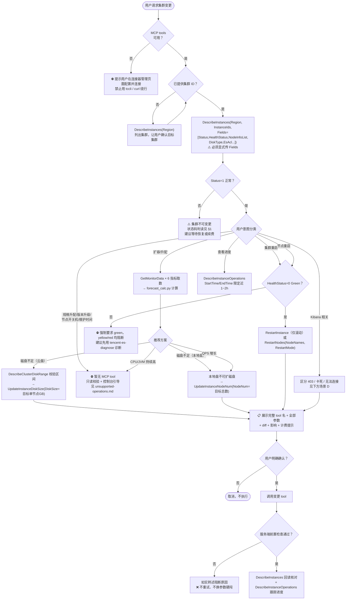
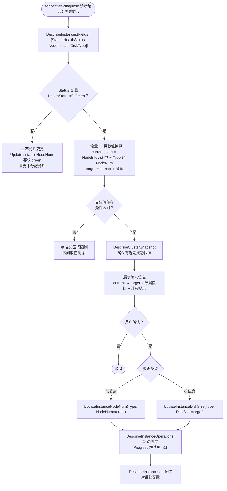
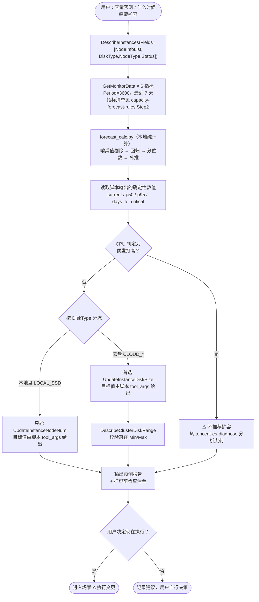
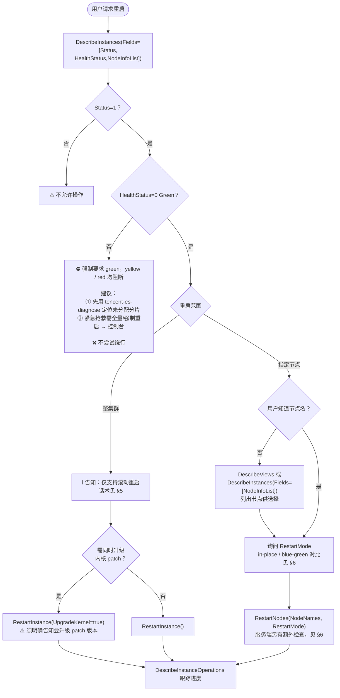
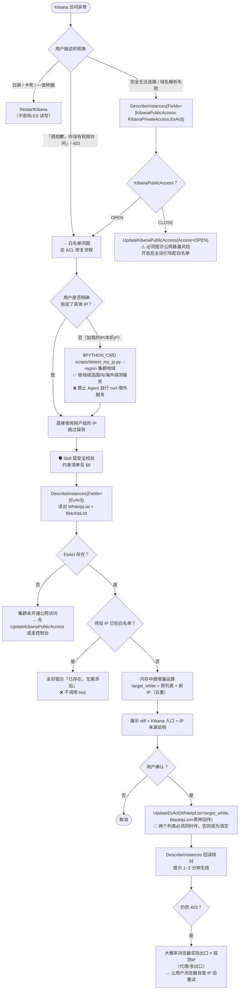

# 腾讯云 ES 集群变更执行工作流程指南

> 🔴 **本文档是执行流程、确认话术、流程层异常处理的唯一权威来源（SSOT）**。
>
> **本文档不重复 tool 参数与服务端约束** —— 参数语义、允许区间、服务端强制前置检查、状态码、错误码一律以 [`references/mcp-tools-reference.md`](references/mcp-tools-reference.md)（下称「tool 参考」）为准。文中 §N 指向该文档对应章节，**标注「必读」的必须真正读完再执行**。

## 核心原则

1. **先查询状态** — 任何变更前必须先 `DescribeInstances` 确认 `Status=1`（正常）
2. **增量必换算目标值** — 扩容类 tool 传的是**目标值**，不是增量。换算步骤见 [§3 **必读**](references/mcp-tools-reference.md#3-updateinstancenodenum节点数量扩容-)
3. **数据驱动决策** — 扩容前先做容量预测，基于监控数据给建议，而非凭感觉
4. **单次单一变更** — 腾讯云不允许一次同时变更多种类型（节点数 + 磁盘等），每次只做一种
5. **优先无搬迁操作** — 扩云硬盘容量 > 横向扩容（加节点）
6. **二次确认机制** — 展示完整 tool 名 + 全部参数 + 影响，获得用户明确确认。**无脚本层兜底，Agent 是唯一防线**
7. **禁止缩容** — 不执行任何缩容操作（减少节点数 / 降配规格 / 缩磁盘）
8. **不绕行** — MCP tools 不可用或能力缺失时引导控制台，**绝不用 tccli / curl 云 API / 自写签名脚本绕过**
9. **变更后回读核对** — 变更提交后回读实际状态，基于真实返回汇报，禁止凭空推测
10. **依赖服务端前置检查** — 被阻断时如实转述原因，不重试、不换参数硬闯

---

## 主流程决策树



---

## 四大典型场景流程图

### 场景 A：tencent-es-diagnose 诊断后调用（推荐路径）

> 适用：`tencent-es-diagnose` 已完成根因分析，结论是需要扩容，调用本 skill 执行变更。



### 场景 B：用户主动容量预测

> 适用：用户询问「什么时候需要扩容」「容量还能撑多久」「扩多少合适」。



### 场景 C：集群 / 节点重启



### 场景 D：Kibana 访问问题（含 403 修复）



---

## 步骤详解

### 步骤 1：查询集群状态（必须执行）

**任何变更前的必要步骤。⚠️ 必须显式传 `Fields`**，否则拿不到 `NodeInfoList` / `EsAcl`（默认精简字段集不含这些）。

```
# 扩容场景
DescribeInstances(Region="ap-guangzhou", InstanceIds=["es-xxxxxxxx"],
  Fields=["InstanceId","InstanceName","Status","HealthStatus",
          "NodeInfoList","NodeType","DiskType","DiskSize"])

# ACL 场景
DescribeInstances(Region="ap-guangzhou", InstanceIds=["es-xxxxxxxx"],
  Fields=["InstanceId","InstanceName","Status","EsAcl",
          "KibanaUrl","KibanaPublicAccess","KibanaPrivateAccess"])

# 集群列表（精简字段集足够，不传 Fields）
DescribeInstances(Region="ap-guangzhou", Limit=100)
```

> 🔴 **必读** [§1 关键检查项](references/mcp-tools-reference.md#1-describeinstances集群概览-)：`Status` / `HealthStatus` 各取值含义、`DiskType` 对扩容路径的影响、`NodeInfoList` 各字段用途。**禁止**凭印象判断状态码。

---

### 步骤 2：容量预测（扩容场景必须执行）

```
GetMonitorData(Region=<地域>, InstanceIds=[<集群ID>],
               MetricName="DiskUsageMax", Period=3600,
               StartTime="2026-08-11T00:00:00+08:00",
               EndTime="2026-08-18T00:00:00+08:00")
```

对 6 个指标分别取数，然后**把返回 JSON 喂给计算脚本**（脚本内部完成哨兵值剔除、回归、分位数、外推）：

```bash
echo '<GetMonitorData 返回（可为多指标数组）>' | $PYTHON_CMD scripts/forecast_calc.py \
  --node-num 3 --disk-size 300 --disk-type CLOUD_SSD --node-type ES.S1.LARGE16 --node-role hotData
```

> 🚫 **禁止 Agent 自行心算线性回归 / 百分位数**。上百个数据点求 Σxy/Σx² 不可靠，且算错不会报错。
> 脚本输出的 `recommendations[].tool_args` 已是**目标值**，可直接用于 MCP tool 入参。

> 🔴 **必读** [`references/capacity-forecast-rules.md`](references/capacity-forecast-rules.md)：6 个指标清单、阈值、判读口径、推荐分流规则、报告输出模板。阈值与算法的**唯一权威来源**，本文档不再复述。

---

### 步骤 3A：扩容节点（横向扩容）

> 🔴 **必读** [§3](references/mcp-tools-reference.md#3-updateinstancenodenum节点数量扩容-)：`NodeNum` 是**目标总数不是增量**、六步换算流程、允许区间、8 项服务端前置检查。**这是本 Skill 最高频的错误点，禁止跳过。**

流程骨架：查状态 → 换算目标值 → 校验区间 → `DescribeClusterSnapshot` 确认备份 → 展示确认信息 → 调用 tool → 跟踪进度。

**扩容节点数建议**：见 [capacity-planning-guide.md](references/capacity-planning-guide.md)「扩容节点数建议」。

**必须在确认信息中告知用户的影响**：蓝绿变更集群不重启 / 完成后分片 rebalance 属真实数据搬迁可能影响读写延迟 / 新增节点产生计费变化 / 预计约 15~30 分钟。

---

### 步骤 3B：磁盘扩容

> 🔴 **必读** [§4](references/mcp-tools-reference.md#4-updateinstancedisksize磁盘扩容-)：`DiskSize` 是**目标单节点容量**、本地盘不可扩、不支持 `dedicatedMaster`、云盘扩容不可逆、3 项服务端前置检查。

```
① DescribeInstances(..., Fields=["NodeInfoList","DiskType"])
   → 若 DiskType=LOCAL_SSD，本地盘不可扩磁盘，改走步骤 3A
② DescribeClusterDiskRange(Region, InstanceId) → 确认目标值落在 Min/Max
③ 展示「单节点 300GB → 500GB；集群总容量 900GB → 1500GB」→ 确认
④ UpdateInstanceDiskSize(Region, InstanceId, Type, DiskSize=500)
```

> ⚠️ 用户以「总容量」表述时（如「总容量扩到 1500G」）需换算 `1500 / NodeNum`，**换算过程必须展示给用户核对**。

---

### 步骤 3C：集群重启

> 🔴 **必读** [§5](references/mcp-tools-reference.md#5-restartinstance集群滚动重启-)：仅滚动重启、强制要求 green、标准应答话术。**不要询问用户「滚动还是全量」。**

```
① DescribeInstances(..., Fields=["Status","HealthStatus"])
② 按 §5 话术告知用户「仅支持滚动重启」及当前健康状态
③ RestartInstance(Region, InstanceId)                     # 普通滚动重启
   RestartInstance(Region, InstanceId, UpgradeKernel=true) # 同时升级内核 patch
```

**重启前检查清单（流程层要求）：**
- [ ] 集群 `Status=1`、`HealthStatus=0`（Green）
- [ ] 当前时间在维护时间窗口内（或业务低峰期）
- [ ] 已通知相关业务方
- [ ] `DescribeClusterSnapshot` 确认有近期成功快照

---

### 步骤 3D：节点重启

> 🔴 **必读** [§6](references/mcp-tools-reference.md#6-restartnodes节点重启-)：节点名称格式、`in-place` vs `blue-green` 对比、`ForceRestart` 使用规定、4 项服务端前置检查。

```
① 用户不知道节点名 → DescribeViews 或 DescribeInstances(Fields=["NodeInfoList"]) 列出供选择
② 按 §6 的对比表询问用户 RestartMode
③ RestartNodes(Region, InstanceId, NodeNames=["1774524330008786732"], RestartMode="in-place")
```

> ⚠️ 无论用户选哪种模式，**必须在确认信息中明示所用模式**。

---

### 步骤 4：跟踪变更进度

```
DescribeInstanceOperations(Region="ap-guangzhou", InstanceId="es-xxxxxxxx",
                          StartTime="2026-08-18 09:00:00",
                          EndTime="2026-08-18 10:00:00", Limit=20)
```

> ⚠️ **不传时间范围会拉取自 2017 年的全部记录**，务必限定近 1~2 小时。时间格式与 `GetMonitorData` 不同。
> 📌 变更提交后**不要立即查**（记录可能还没生成），提示用户约 1 分钟后可查。
> 🔴 **必读** [§11](references/mcp-tools-reference.md#11-describeinstanceoperations变更进度-)：`Progress` 取值解读、时间格式、长时间无进展的处理。

---

### 步骤 5：Kibana 公网访问策略管理（白 / 黑名单）🛡️

**核心场景：Kibana 报「很抱歉，你没有权限访问」** —— 绝大多数情况是**本机公网 IP 不在白名单**内。

> 🔴 **必读**（本节只给流程骨架，规则细节一律以下列章节为准）：
> - [§8 UpdateEsAcl](references/mcp-tools-reference.md#8-updateesaclkibana-访问白黑名单-) —— 全量覆盖语义、白/黑名单必须同时回传、硬性安全约束清单、ACL 场景异常处理
> - [§18 detect_my_ip.py](references/mcp-tools-reference.md#18-detect_my_ippy本机公网-ip-探测-) —— 为什么必须按地域选路、禁止 Agent 自行 curl 的原因、探测失败兜底话术

#### 完整两步流程

```bash
# ① 探测本机公网 IP（本地脚本，零云 API 调用）
$PYTHON_CMD scripts/detect_my_ip.py --region ap-guangzhou
# → {"ip":"182.140.153.35","region_kind":"国内","source":"...via https://myip.ipip.net"}
```

```
# ② 读现有 ACL → 内存中增量运算 → 安全校验 → 展示 diff 确认 → 提交
DescribeInstances(Region=..., InstanceIds=[id],
                  Fields=["EsAcl","Status","KibanaUrl","KibanaPublicAccess"])
  → WhiteIpList=["127.0.0.1"], BlackIpList=[]

UpdateEsAcl(Region=..., InstanceId=id,
            WhiteIpList=["127.0.0.1","182.140.153.35"],   # 全量目标列表
            BlackIpList=[])                                # 即使未改也必须原样回传
```

> 🚨 **两个列表必须同时回传**，未传的一侧视为清空。
> ✅ **必须**先跑 `detect_my_ip.py`，**禁止** Agent 自行 curl 探测。**唯一例外**：用户显式给出具体 IP（如「把 1.2.3.4 加进白名单」）时跳过探测。

#### 其他 Kibana 操作

```
UpdateKibanaPublicAccess(Region=..., InstanceId=..., Access="OPEN"|"CLOSE")
UpdateKibanaPrivateAccess(Region=..., InstanceId=..., Access="OPEN"|"CLOSE")
RestartKibana(Region=..., InstanceId=...)
```

> ⚠️ `UpdateKibanaPublicAccess(OPEN)` 会将 Kibana 暴露公网，**必须提示风险**并主动引导随后配置白名单。
> ⚠️ 三种 Kibana 异常现象（403 / 卡死 / 无法连接）的区分见 [§7](references/mcp-tools-reference.md#7-restartkibanakibana-重启-)。

---

## 确认交互规范（🔴 确认话术的唯一权威来源）

> 以下模板是**变更前的唯一防线**，必须完整展示 tool 名 + 全部参数 + diff + 影响，不得简化。

### 标准变更确认（扩容）

```
请确认是否执行以下变更：

Tool：UpdateInstanceNodeNum
参数：Region=ap-guangzhou, InstanceId=es-xxxxxxxx, Type=hotData, NodeNum=5

集群 ID：es-xxxxxxxx
集群名称：my-es-cluster
当前健康状态：Green ✅

变更详情：
  热数据节点数：3 → 5（增加 2 个）        ← 增量已换算为目标总数
  节点规格：ES.S1.LARGE16（4核16GB，保持不变）
  单节点磁盘：500GB（保持不变）
  当前总存储：1500 GB → 扩容后 2500 GB

预计影响：
  - 蓝绿变更（ScaleType=0），集群不重启
  - 完成后分片 rebalance 到新节点，属真实数据搬迁，可能影响读写延迟
  - 新增节点产生计费变化
  - 预计约 15~30 分钟

最近成功快照：snapshot-20260817（2026-08-17 02:15）✅

请回复「确认」执行，或回复其他内容取消。
```

### ACL 变更确认

```
请确认是否执行以下变更：

Tool：UpdateEsAcl
参数：Region=ap-guangzhou, InstanceId=es-xxxxxxxx,
      WhiteIpList=["127.0.0.1","182.140.153.35"], BlackIpList=[]

探测到的本机公网 IP：182.140.153.35
来源：集群地域 ap-guangzhou 识别为国内地域 → 国内直连出口（via myip.ipip.net）
安全校验：非 0.0.0.0 / 非 /0 掩码 / 非私网 → 通过 ✅

白名单 diff：
  当前：["127.0.0.1"]
  变更后：["127.0.0.1", "182.140.153.35"]   ← 保留原有，仅新增 1 条
黑名单：[] → []（原样回传，防止被视为清空）

影响：仅变更 Kibana 公网访问控制，不重启集群、不影响读写；约 1~2 分钟生效
生效后可访问：https://es-xxxxxxxx.kibana.tencentelasticsearch.com:5601

请回复「确认」执行。
```

### 高风险操作确认（Kibana 公网暴露）

```
🔴 高风险操作警告！

即将开启集群 es-xxxxxxxx 的 Kibana 公网访问。
开启后 Kibana 入口将暴露在公网上，任何知道地址的人都可以尝试访问。

强烈建议：开启后立即配置精确的 IP 白名单（UpdateEsAcl），
避免任意来源访问。我可以在开启后立刻帮你配置。

Tool：UpdateKibanaPublicAccess
参数：Region=ap-guangzhou, InstanceId=es-xxxxxxxx, Access=OPEN

如确认要继续，请回复「确认开启」。
```

---

## 异常处理指引（流程层）

> 云 API 错误码（`AuthFailure` / `ResourceNotFound.*` / `RequestLimitExceeded` / `InvalidParameter` 等）的处理见 [§附录 错误码](references/mcp-tools-reference.md#附录通用约定与错误码)，本表不重复。

| 异常场景 | 处理方式 |
|---------|---------|
| MCP tools 不可用 / 调用报连接错误 | 提示用户在连接器管理页面配置并连接；**禁止**用 tccli / curl / 自写签名脚本绕行 |
| 集群 `Status` 非 `1` | 按 [§1](references/mcp-tools-reference.md#1-describeinstances集群概览-) 判读具体状态码并告知用户对应处理（等待 / 续费 / 无法变更）|
| 集群 `HealthStatus` 非 Green | 重启类与加节点类 tool 均被阻断，建议先用 `tencent-es-diagnose` 诊断 |
| 服务端返回「存在 0 副本索引」| 告知用户需先给该索引加副本或删除，**不要绕过** |
| 服务端返回「存在 close 状态索引」| 告知用户需先 open 或删除该索引 |
| 服务端返回「目标节点数不大于当前」| 大概率是把增量当目标值传了 → 按 [§3](references/mcp-tools-reference.md#3-updateinstancenodenum节点数量扩容-) 重新换算 |
| `CheckUpdateInstance` 返回 `AllowUpdate=false` | 如实回显云端拒绝原因，不重试、不换参数硬闯 |
| 用户取消确认 | 不执行操作，提示可随时重新发起 |
| 进度长时间为 `-1` | 提示联系腾讯云支持并提供操作 ID，**不要重复提交** |
| 请求的能力无 MCP tool | 只读校验 + 明确告知 + 控制台引导，见 [unsupported-operations.md](references/unsupported-operations.md) |
