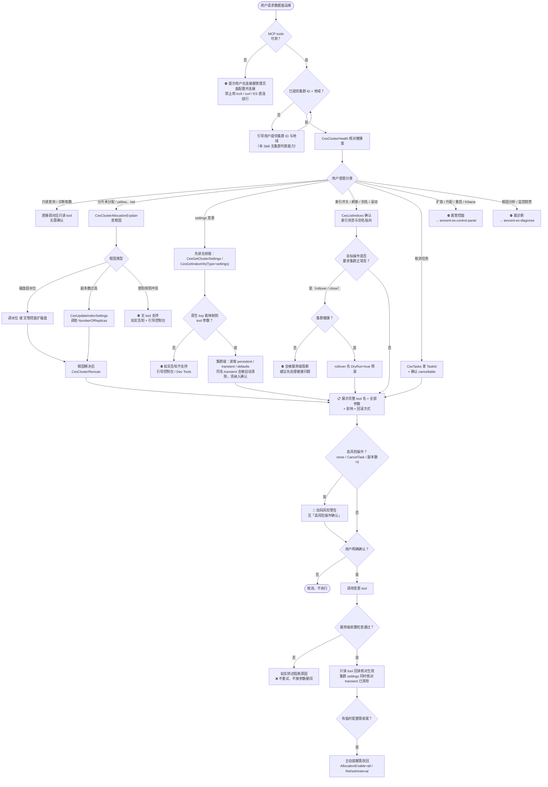
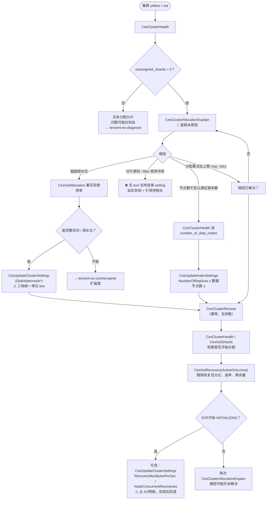
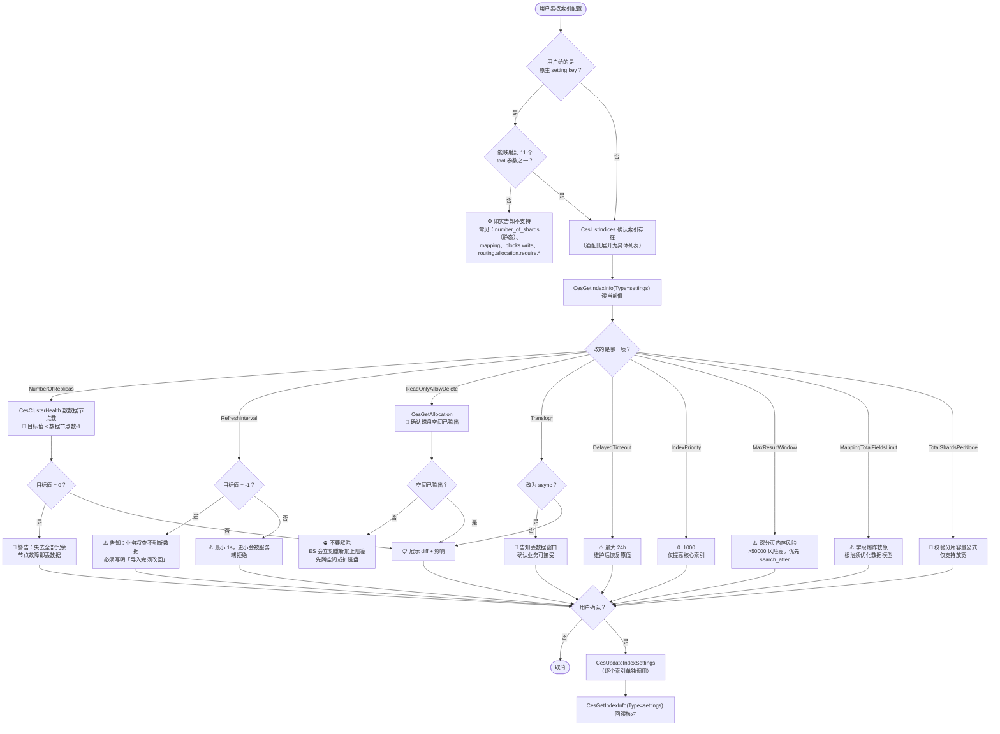
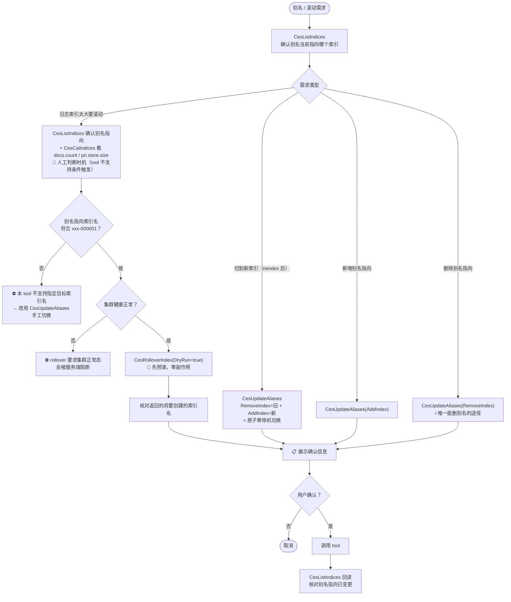
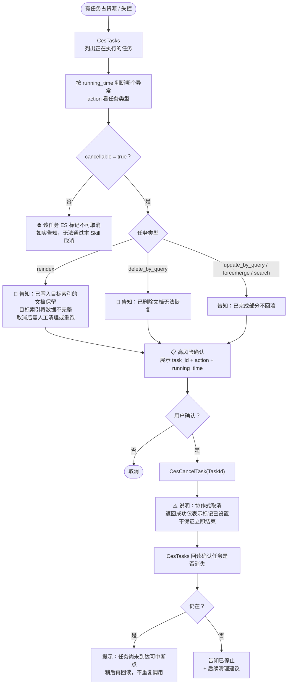
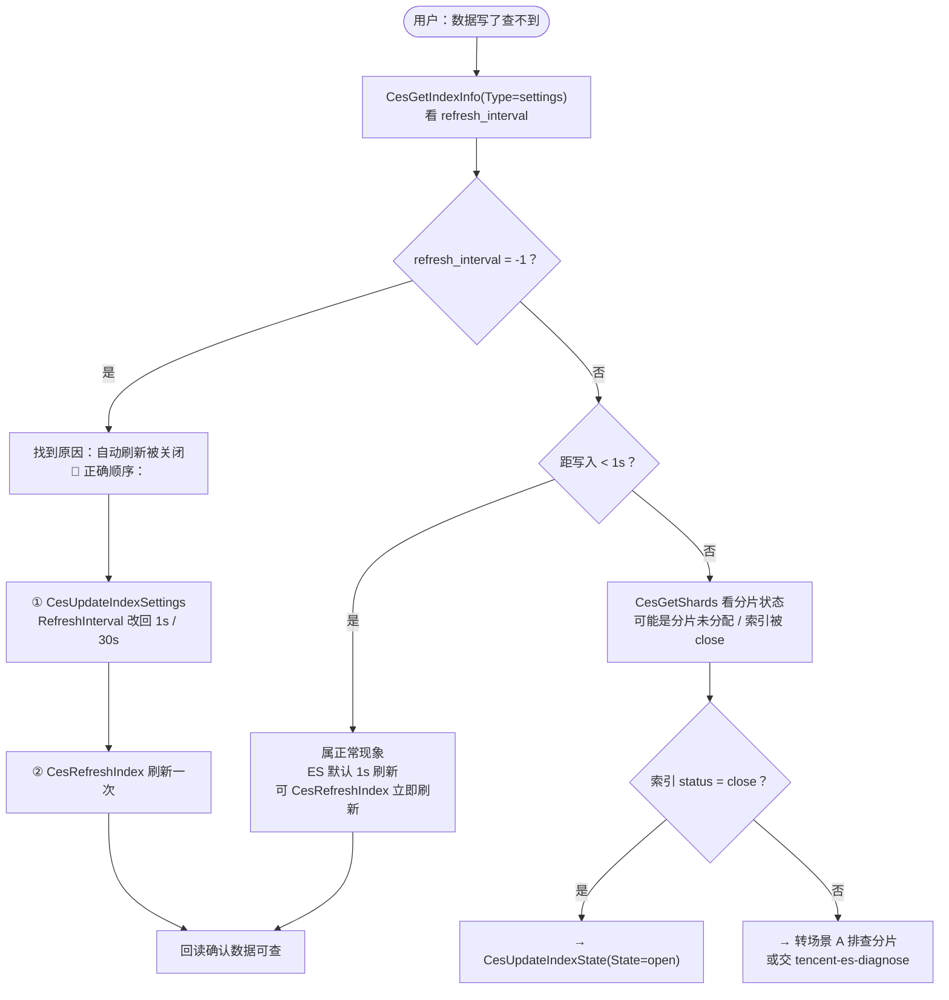

# 腾讯云 ES 数据面运维工作流程指南

> 🔴 **本文档是执行流程、确认话术、流程层异常处理的唯一权威来源（SSOT）**。
>
> **本文档不重复 tool 参数与服务端约束** —— 参数枚举、取值区间、服务端强制前置检查一律以 [`references/ces-tools-reference.md`](references/ces-tools-reference.md)（下称「tool 参考」）为准。文中 §N 指向该文档对应章节，**标注「必读」的必须真正读完再执行**。

## 核心原则

1. **先只读核对** — 任何变更前必须先调只读 tool：`CesClusterHealth` 看健康度，改 settings 前用 `CesGetClusterSettings` / `CesGetIndexInfo(Type=settings)` 读当前值
2. **参数是严格枚举，不是原生 key** — 写类 tool 只认固定参数名，用户提的原生 ES setting 必须先映射；映射不到就如实说不支持。映射表见 [§17 **必读**](references/ces-tools-reference.md#17-cesupdateclustersettings集群-settings-变更-) / [§18 **必读**](references/ces-tools-reference.md#18-cesupdateindexsettings索引-settings-变更-)
3. **根因优先** — `CesClusterReroute` 前必须先 `CesClusterAllocationExplain` 查根因并解决，否则重试必然再失败
4. **逐条单一变更** — 通配表达式先展开为具体索引，**逐个索引单独确认、单独调用**，禁止打包确认
5. **二次确认机制** — 展示完整 tool 名 + 全部参数 + 影响，获得用户明确确认。**无脚本层兜底，Agent 是唯一防线**
6. **能预演就预演** — `CesRolloverIndex` 先 `DryRun=true` 跑一次确认后再实际执行
7. **不在故障中扩大影响面** — Red / yellow 集群上不做 `close`、不做 rollover、不调低副本数
8. **不绕行** — MCP tools 不可用或能力缺失时引导控制台 / Kibana Dev Tools，**绝不用 tccli / curl 云 API / ES 直连绕过**
9. **变更后回读核对** — 变更提交后回读实际状态，基于真实返回汇报，禁止凭空推测
10. **临时配置必须收尾** — `AllocationEnable=none/primaries`、`RefreshInterval=-1` 等临时配置，必须在确认信息中写明"完成后需改回"，并在后续对话主动提醒

---

## 主流程决策树



---

## 五大典型场景流程图

### 场景 A：分片未分配 / 集群 yellow、red 恢复

> 适用：集群 yellow / red，有 unassigned 分片需要恢复。



### 场景 B：索引 settings 变更（副本数 / 刷新间隔 / translog / 解除只读）



### 场景 C：别名切换 / 索引滚动



### 场景 D：任务失控 / 取消任务



### 场景 E：数据写进去了但查不到



---

## 步骤详解

### 步骤 1：只读核对现状（必须执行）

**任何变更前的必要步骤。**

```
# 通用第一步
CesClusterHealth(Region="ap-guangzhou", InstanceId="es-xxxxxxxx")

# 集群 settings 变更前
CesGetClusterSettings(Region="ap-guangzhou", InstanceId="es-xxxxxxxx")
  → 🔴 展示 persistent / transient / defaults；同名 transient 会在写入时自动清除，必须纳入确认

# 索引 settings 变更前
CesGetIndexInfo(Region="ap-guangzhou", InstanceId="es-xxxxxxxx",
                Index="my_index", Type="settings")

# 索引 / 别名类变更前
CesListIndices(Region="ap-guangzhou", InstanceId="es-xxxxxxxx", Index="logs-*")
  → 确认索引存在、status（open/close）、别名当前指向
```

> 🔴 **必读** [§1](references/ces-tools-reference.md#1-cesclusterhealth集群健康-) / [§10](references/ces-tools-reference.md#10-cesgetclustersettings集群-settings-) / [§11](references/ces-tools-reference.md#11-ceslistindices索引与别名列表-)：各返回字段判读、三层优先级机制。**禁止**凭印象判断。

---

### 步骤 2：原生 key → tool 参数映射（settings 变更必做）

用户通常会用 ES 原生 setting key 描述需求，**必须先映射**：

| 用户说的 | 映射到 |
|---------|-------|
| `indices.recovery.max_bytes_per_sec` | `CesUpdateClusterSettings(RecoveryMaxBytesPerSec)` |
| `cluster.routing.allocation.enable` | `CesUpdateClusterSettings(AllocationEnable)` |
| `cluster.routing.allocation.disk.watermark.low/high/flood_stage` | `CesUpdateClusterSettings(DiskWatermarkLow/High/FloodStage)` |
| `cluster.routing.allocation.node_concurrent_recoveries` | `CesUpdateClusterSettings(NodeConcurrentRecoveries)` |
| `cluster.routing.allocation.node_initial_primaries_recoveries` | `CesUpdateClusterSettings(NodeInitialPrimariesRecoveries)` |
| `cluster.routing.rebalance.enable` | `CesUpdateClusterSettings(RebalanceEnable)` |
| `cluster.max_shards_per_node` | `CesUpdateClusterSettings(MaxShardsPerNode)` |
| `index.number_of_replicas` | `CesUpdateIndexSettings(NumberOfReplicas)` |
| `index.refresh_interval` | `CesUpdateIndexSettings(RefreshInterval)` |
| `index.translog.durability / sync_interval / flush_threshold_size` | `CesUpdateIndexSettings(TranslogDurability / TranslogSyncInterval / TranslogFlushThresholdSize)` |
| `index.blocks.read_only_allow_delete` | `CesUpdateIndexSettings(ReadOnlyAllowDelete)`（**只能解除**） |
| `index.unassigned.node_left.delayed_timeout` | `CesUpdateIndexSettings(DelayedTimeout)` |
| `index.priority` | `CesUpdateIndexSettings(IndexPriority)` |
| `index.max_result_window` | `CesUpdateIndexSettings(MaxResultWindow)` |
| `index.mapping.total_fields.limit` | `CesUpdateIndexSettings(MappingTotalFieldsLimit)` |
| `index.routing.allocation.total_shards_per_node` | `CesUpdateIndexSettings(TotalShardsPerNode)` |

**映射不到的一律如实告知不支持**，常见有：`cluster.routing.allocation.cluster_concurrent_rebalance`、`awareness.*`、`allocation.filter.*`、`index.number_of_shards`（静态）、`index.blocks.write`、`index.routing.allocation.require.*`、mapping 变更。

> 🔴 **必读** [§17](references/ces-tools-reference.md#17-cesupdateclustersettings集群-settings-变更-) / [§18](references/ces-tools-reference.md#18-cesupdateindexsettings索引-settings-变更-)：完整映射表、取值格式、服务端校验。

---

### 步骤 3：通配表达式展开（逐条原则）

用户说「把 `logs-*` 的副本数都改成 1」时：

```
① CesListIndices(Index="logs-*")  → 展开为 logs-2026.08.24 / logs-2026.08.25 / logs-2026.08.26
② 告知用户命中 3 个索引，列出清单
③ 🔴 逐个索引单独展示确认信息、单独获得确认、单独调用 tool
```

> 🚫 **禁止打包为一次确认**（"这 3 个都改，确认吗？"）。写类 tool 本身也禁止通配符入参。
> 💡 索引数量很多时（如命中 50 个），先如实告知数量，询问用户是否确实要逐个执行，或建议改用控制台批量操作。

---

### 步骤 4：展示确认信息并获得确认

见下方 [确认交互规范](#确认交互规范-确认话术的唯一权威来源)。

---

### 步骤 5：调用 tool 并处理返回

| 返回情况 | 处理 |
|---------|------|
| 成功 | 进入步骤 6 回读；`CesUpdateClusterSettings` 还须核对目标项的同名 transient 已清除、persistent 为目标值 |
| 返回包含自动清除 transient 的信息 | 属预期行为；如实说明被清除的旧值及当前生效来源，不得省略该副作用 |
| 服务端前置检查阻断 | 如实转述原因，**不重试、不换参数硬闯** |
| 参数校验失败 | 按 [附录 A](references/ces-tools-reference.md#附录-a索引--别名命名约束全局通用) 修正后**重新走一轮确认** |

---

### 步骤 6：回读核对生效

| 刚执行的变更 | 回读 tool |
|------------|----------|
| `CesUpdateClusterSettings` | `CesGetClusterSettings`（核对 persistent 目标值与同名 transient 已清除）；恢复参数变更再用 `CesGetRecovery(ActiveOnly=true)` 看效果 |
| `CesUpdateIndexSettings` | `CesGetIndexInfo(Type=settings)`；调大副本数/恢复优先级时再用 `CesGetRecovery(ActiveOnly=true)` |
| `CesClusterReroute` | `CesClusterHealth` + `CesGetShards` + `CesGetRecovery(ActiveOnly=true)` |
| `CesUpdateIndexState` | `CesListIndices`（看 status）+ `CesClusterHealth`；open 后用 `CesGetRecovery(ActiveOnly=true)` |
| `CesUpdateAliases` | `CesListIndices`（看别名指向） |
| `CesRolloverIndex` | `CesListIndices`（看别名指向）+ `CesCatIndices`（看新旧索引量化信息） |
| `CesCancelTask` | `CesTasks`（任务是否消失） |
| `CesRefreshIndex` | 返回体 `_shards` 即为结果，无需额外回读 |

> 📌 **基于真实返回汇报**，禁止凭空推测"应该已经生效了"。

---

### 步骤 7：临时配置收尾提醒（必做）

以下操作属**临时配置**，执行后必须主动提醒：

| 临时配置 | 提醒内容 |
|---------|---------|
| `AllocationEnable = none` / `primaries` | 🔴 运维窗口结束后**必须改回 `all`**，否则分片长期无法分配、集群持续 yellow / red |
| `RebalanceEnable != all` | 🔴 运维窗口结束后**必须改回 `all`**，否则分片可能长期分布不均 |
| `RefreshInterval = -1` | 🔴 批量导入完成后**必须改回**（`1s` / `30s`），否则业务永久查不到新数据 |
| `RecoveryMaxBytesPerSec` / `NodeConcurrentRecoveries` / `NodeInitialPrimariesRecoveries` 调大 | 恢复完成后建议恢复原值，避免长期占用 IO、CPU 与网络影响在线业务 |
| `DelayedTimeout` 调大 | 滚动维护完成后恢复原值，避免真实节点故障时延迟副本恢复 |
| `TranslogDurability = async` | 存在丢数据窗口，业务对数据安全要求提高时需改回 `request` |

> 💡 在确认信息中就要写明"完成后需改回 X"，并在变更成功的汇报里再提醒一次。

---

## 确认交互规范（🔴 确认话术的唯一权威来源）

> 以下模板是**变更前的唯一防线**，必须完整展示 tool 名 + 全部参数 + diff + 影响，不得简化。
> **只读 tool 无需确认**，可直接调用。

### 标准变更确认（索引 settings）

```
请确认是否执行以下变更：

Tool：CesUpdateIndexSettings
参数：Region=ap-guangzhou, InstanceId=es-xxxxxxxx,
      Index=my_index, NumberOfReplicas=1

集群健康状态：green ✅（数据节点数 3，上限 NumberOfReplicas ≤ 2）
索引：my_index

变更详情：
  副本数：2 → 1

预期影响：
  - 会触发实际数据变更（删除多余副本分片），期间可能有 IO 开销
  - 单分片冗余从 2 份降为 1 份，仍保留冗余
  - 可回滚：再改回 2 即可（会触发数据复制）

请回复「确认」执行，或回复其他内容取消。
```

新增索引参数的确认信息还必须包含对应风险：

| 参数 | 确认时必须说明 |
|------|---------------|
| `DelayedTimeout` | 延迟真实故障后的副本恢复；滚动维护完成后恢复原值 |
| `IndexPriority` | 只提高核心索引；优先级调整不增加实际恢复资源 |
| `MaxResultWindow` | 深分页增加协调节点内存，超过 50000 有 OOM 风险；优先 `search_after` |
| `MappingTotalFieldsLimit` | 仅字段爆炸救急；上调会增加查询与 master 元数据压力，根治应优化数据模型 |
| `TotalShardsPerNode` | 必须展示容量公式校验结果；放宽可能形成节点热点，不能代替减少分片或扩容 |

### 标准变更确认（集群 settings）

```
请确认是否执行以下变更：

Tool：CesUpdateClusterSettings
参数：Region=ap-guangzhou, InstanceId=es-xxxxxxxx,
      RecoveryMaxBytesPerSec=100mb

当前值（persistent）：40mb
当前值（transient）：无同名项 ✅

变更详情：
  persistent 分片恢复带宽上限：40mb → 100mb
  transient 同名项：无（如存在，tool 会自动清除为 null）

预期影响：
  - 加快节点故障后的分片恢复速度
  - ⚠️ 会占用更多网络与磁盘 IO，可能影响在线查询延迟
  - 建议在业务低峰期执行
  - 恢复完成后建议调回 40mb

请回复「确认」执行，或回复其他内容取消。
```

> ⚠️ 若 `CesGetClusterSettings` 显示 **transient 层已有同名项**，确认信息中必须写明：
> `transient 层检查：⚠️ 已存在同名项（值 X）；本次 tool 会自动将其清除为 null，并把目标值写入 persistent，使 persistent 值立即生效`
> 这是额外配置变化，必须纳入二次确认，执行后回读三层结果。

新增集群参数的确认信息还必须包含对应风险：

| 参数 | 确认时必须说明 |
|------|---------------|
| `NodeConcurrentRecoveries` | 调大会增加恢复 IO/CPU/网络压力；恢复完成后建议回退原值 |
| `NodeInitialPrimariesRecoveries` | 仅影响本地主分片初始恢复；调大会增加节点磁盘 IO/CPU 压力 |
| `RebalanceEnable` | 与 `AllocationEnable` 语义不同；非 `all` 为临时状态，维护后必须改回 `all` |
| `MaxShardsPerNode` | 仅 ES 7.0+；调大只是分片上限救急，会增加 master 元数据负担，根治应减少分片或扩节点 |

### 别名切换确认

```
请确认是否执行以下变更：

Tool：CesUpdateAliases
参数：Region=ap-guangzhou, InstanceId=es-xxxxxxxx,
      Alias=my_alias, RemoveIndex=my_index_v1, AddIndex=my_index_v2

别名当前指向：my_index_v1
变更后指向：  my_index_v2

预期影响：
  - 原子切换（remove 先于 add），业务流量无缝切到新索引，零停机
  - 🔴 所有通过 my_alias 读写的业务流量将立即改向 my_index_v2
  - 旧索引 my_index_v1 仍存在且可直接按索引名查询
  - 可回滚：反向再切一次（Alias=my_alias, RemoveIndex=my_index_v2, AddIndex=my_index_v1）

请回复「确认」执行。
```

### 索引滚动确认（先预演）

```
已完成 DryRun 预演（零副作用），结果如下：

Tool：CesRolloverIndex（DryRun=true）
当前别名 my_logs_write 指向：my_logs-000001
  文档数：128,450,000    存储：42.3gb
预演结果：将创建新索引 my_logs-000002

集群健康状态：green ✅（rollover 要求集群正常态）

现在请确认是否实际执行：

Tool：CesRolloverIndex
参数：Region=ap-guangzhou, InstanceId=es-xxxxxxxx, Alias=my_logs_write

预期影响：
  - 立即创建 my_logs-000002，别名切换到新索引，新数据写入新索引
  - 旧索引 my_logs-000001 仍可查询
  - ⚠️ 本 tool 为无条件立即滚动，不设 max_size / max_age 条件
  - 回滚需用 CesUpdateAliases 手工把别名切回旧索引

请回复「确认」执行。
```

### 高风险操作确认

> 🔴 以下三类操作**必须**用加码模板，显著标注风险后果。

#### ① 关闭索引（制造不可用）

```
🔴 高风险操作警告！

即将关闭索引 my_old_index —— 关闭后该索引【既不可读也不可写】。

Tool：CesUpdateIndexState
参数：Region=ap-guangzhou, InstanceId=es-xxxxxxxx,
      Index=my_old_index, State=close

风险后果：
  - 🔴 该索引上的所有读写请求都会失败（这是「制造不可用」的操作）
  - 请务必确认业务已完全不再访问该索引
  - ⚠️ ES 6.x / 7.0 / 7.1 在索引关闭期间【不复制副本】，此时若发生节点故障存在丢数据风险
    （当前集群版本：<版本号>）

收益：释放该索引占用的集群堆内存

可回滚：CesUpdateIndexState(State=open) 重新打开（会触发分片恢复，大索引耗时较长）

如确认业务已不再访问该索引，请回复「确认关闭」。
```

#### ② 取消任务（已完成部分不回滚）

```
🔴 高风险操作警告！

即将取消任务：
  task_id：oTUltX4IQMOUUVeiohTt8A:12345
  action：indices:data/write/reindex
  已运行：47 分钟

Tool：CesCancelTask
参数：Region=ap-guangzhou, InstanceId=es-xxxxxxxx,
      TaskId=oTUltX4IQMOUUVeiohTt8A:12345

风险后果：
  - 🔴 【已完成的部分不会回滚】——已写入目标索引的文档会保留，
    造成目标索引数据不完整，取消后通常需要人工清理或重跑
  - ⚠️ ES 取消是【协作式】的：返回成功仅表示取消标记已设置，
    任务会在到达下一个可中断点时才真正停止，不保证立即结束

收益：释放该任务占用的 CPU / IO / 内存资源，缓解集群压力

不可回滚（任务无法恢复继续，只能重新发起）

如确认要取消，请回复「确认取消」。
```

> 若任务是 `delete_by_query`，风险后果改为：`🔴 已删除的文档【无法恢复】`。

#### ③ 副本数设为 0（失去全部冗余）

```
🔴 高风险操作警告！

即将把索引 my_index 的副本数设为 0 —— 该索引将【失去全部冗余】。

Tool：CesUpdateIndexSettings
参数：Region=ap-guangzhou, InstanceId=es-xxxxxxxx,
      Index=my_index, NumberOfReplicas=0

风险后果：
  - 🔴 任一持有该索引主分片的节点发生故障，该分片数据【直接丢失】且无法恢复
  - 查询吞吐也会下降（无副本分担读请求）

收益：节省约一半存储空间、减少写入时的复制开销

可回滚：改回 1 即可（会触发实际数据复制，有 IO 开销）

如确认可接受无冗余风险，请回复「确认」。
```

### 确认规则细则

1. **逐条确认**：多索引 / 多项变更必须**逐条**展示并确认，不得打包
2. **参数必须完整展开**：所有入参明文列出，不用 `...` 省略
3. **展示内容 = 执行内容**：用户确认后执行的 tool 与参数**必须**与展示完全一致，**禁止**擅自追加或修改。如需调整，**重新走一轮确认**
4. **明确回复才执行**：仅当用户回复 `确认` / `确认执行` / `是` / `执行` / `yes` / `y` 等明确肯定词时执行；含糊回复（"好像可以""看起来 ok"）一律视为**未确认**
5. **重新加载文档**：用户回复确认词时，必须重新 `use_skill("tencent-es-data-panel")` 加载后再执行
6. **只读免确认**：所有 `CesGet*` / `CesList*` / `CesCluster*`（除 `CesClusterReroute`）/ `CesTasks` 可直接调用
7. **变更后必回读**：见 [步骤 6](#步骤-6回读核对生效)

---

## 异常处理指引（流程层）

> tool 层错误码与参数校验失败的处理见 [附录 C](references/ces-tools-reference.md#附录-c通用约定与错误处理)，本表不重复。

| 异常场景 | 处理方式 |
|---------|---------|
| MCP tools 不可用 / 调用报连接错误 | 提示用户在连接器管理页面配置并连接；**禁止**用 `tccli` / `curl` / ES 直连 / 自写签名脚本绕行 |
| 用户未提供集群 ID / 地域 | 引导用户提供（本 Skill 无集群列表能力，`DescribeInstances` 属管控面 Skill） |
| 用户提的 setting 无对应 tool 参数 | 如实告知不支持，说明原因（枚举限制 / 静态 setting / 属 mapping），引导控制台或 Kibana Dev Tools |
| 服务端「要求集群正常状态」阻断（rollover / close） | 如实转述；建议先 `CesClusterHealth` + `CesClusterAllocationExplain` 定位，或交 `tencent-es-diagnose` |
| `CesUpdateClusterSettings` 自动清除了同名 transient 值 | 属预期行为；回读三层并如实说明 transient 已清除、persistent 为目标值及当前生效来源 |
| settings 参数超范围或容量公式不满足被阻断 | 按 §17/§18 的范围与公式重算，展示新参数与影响后**重新走一轮确认**；副本数问题还需核对数据节点数 |
| `RefreshInterval` 小于 `1s` 被拒 | 说明 ES 硬性下限，建议改用 `1s`；若诉求是"立即可查"改用 `CesRefreshIndex` |
| `CesRolloverIndex` 报索引名格式错误 | 说明本 tool 不支持指定目标索引名，改用 `CesUpdateAliases` 手工创建并切换 |
| `CesClusterReroute` 后分片仍未分配 | 根因大概率未真正解决 → 再次 `CesClusterAllocationExplain`，**不要反复刷 reroute** |
| `CesCancelTask` 后任务仍在 | 协作式取消尚未到可中断点，稍后再回读 `CesTasks`，**不要重复调用** |
| `CesCancelTask` 报任务不可取消 | 如实告知 `cancellable: false`，本 Skill 无法取消 |
| 返回体过大 / 上下文截断 | `CesGetNodesStats` 指定 `Module`；只读索引类 tool 用更精确的 `Index` 表达式；`CesGetHotThreads` 减小 `Threads` |
| 用户要求扩容 / 升配 / 重启 / Kibana 相关 | 属管控面 → 引导 `tencent-es-control-panel`，**本 Skill 不执行** |
| 用户要求根因分析 / 监控趋势判读 / 巡检打分 | 属诊断 → 引导 `tencent-es-diagnose` |
| 用户要求 search / bulk / reindex / 改 mapping / 建删索引 | 本 Skill 无对应 tool，如实告知并引导 Kibana Dev Tools |
| 用户取消确认 | 不执行操作，提示可随时重新发起 |
