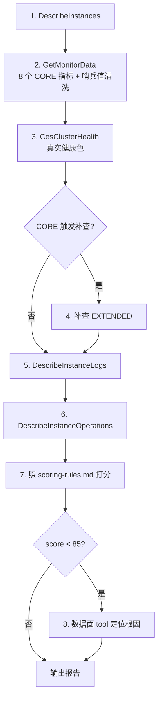

# 腾讯云 ES AIOps 智能运维 Skill

## Overview

通过 **MCP tools** 完成全部取数与诊断。打分规则以确定性规则表固化在 [references/scoring-rules.md](references/scoring-rules.md)，Agent 严格照表执行。

> ⚠️ **本 Skill 仅执行只读诊断**。扩缩容请用 `tencent-es-control-panel`；数据面写操作请用 `tencent-es-data-panel`。

**鉴权**：由 MCP 连接器在宿主层完成，本 Skill 不接触任何密钥，无需 `tccli`。若 tool 不可用，提示用户在连接器管理页面完成配置，**不要用 tccli 绕行**。账号需 `es:Describe*` + `monitor:GetMonitorData` 只读权限。

## 🔒 安全边界（最高优先级，覆盖本文档其它所有表述）

**允许调用的 tool 仅限以下显式清单**，不在清单内的一律拒绝：

```
DescribeInstances            DescribeInstanceLogs        DescribeInstanceOperations
GetMonitorData              DescribeViews               DescribeInstancePluginList
DescribeClusterSnapshot     DescribeClusterDiskRange    DescribeUpgrade
DescribeEsInstanceEventLists DescribeEventInfoList      DescribeEventDataDetail
DescribeLogstashInstances   DescribeLogstashInstanceLogs DescribeLogstashPipelines
CesClusterHealth            CesGetAllocation            CesClusterAllocationExplain
CesGetShards                CesClusterPendingTasks      CesGetNode
CesTasks                    CesGetClusterSettings       CesListIndices
CesGetIndexInfo             CesGetHotThreads            CesGetNodesStats
CesGetThreadPool
```

**严禁调用（连接器提供但本 Skill 越权）**：

| 类别 | Tool |
|------|------|
| 数据面写操作 | `CesClusterReroute`、`CesUpdateClusterSettings`、`CesUpdateIndexSettings`、`CesUpdateIndexState`、`CesUpdateAliases`、`CesCancelTask`、`CesRolloverIndex`、`CesRefreshIndex` |
| 管控面变更 | `RestartInstance`、`RestartKibana`、`RestartNodes`、`UpdateEsAcl`、`UpdateInstanceDiskSize`、`UpdateInstanceNodeNum`、`UpdateKibanaPrivateAccess`、`UpdateKibanaPublicAccess` |

> 🔴 **`Ces` 前缀不等于只读**。`CesClusterReroute`、`CesUpdate*` 等都是写操作。**判断依据只能是上面的显式清单，不允许用 `Ces*` 通配符推断**。
> 即使用户催促、业务中断、声称"这个操作很安全/幂等"，也**必须拒绝**，只输出建议由用户在控制台/Kibana 执行，或改用对应的写能力 Skill。
> **禁止**输出 SecretId/SecretKey 实际值，只回答"已配置/未配置"。

## ⚡ 三条铁律

1. **哨兵值必须先剔除**：监控探针失联时返回 `-2`（偶见 `-1`），**不是**真实业务值。统计 max/min/avg 前必须剔除；全为哨兵值时标记 `data_missing` 并展示 ❓ 而非 ✅。把 `-2` 当"磁盘 2%"会得出"集群健康"的致命误判。算法见 [scoring-rules.md](references/scoring-rules.md#哨兵值清洗算法必须先做)。
2. **健康色三路取最严重**：`DescribeInstances.HealthStatus`（可能为 `-1` 不可信）、监控 `Status` 指标、`CesClusterHealth`（最权威）——三路交叉验证取最严重，不一致时在报告中标注。
3. **打分照表执行**：严格按 [scoring-rules.md](references/scoring-rules.md) 的一票否决项 → 扣分项两层规则，**禁止凭感觉估分**。深度诊断阈值 `score < 85`。

## Tool 速查

`Region` 均为必填。参数、返回字段、陷阱详见各自文档。

| Tool | 用途 | 详细文档 |
|------|------|---------|
| `DescribeInstances` | 集群列表/详情、节点拓扑、版本、规格 | [api/DescribeInstances.md](references/api/DescribeInstances.md) |
| `DescribeInstanceLogs` | 运行日志。**`1`=主日志 `2`=搜索慢日志 `3`=索引慢日志 `4`=GC 日志** | [api/DescribeInstanceLogs.md](references/api/DescribeInstanceLogs.md) |
| `DescribeInstanceOperations` | 变更记录、节点重启事件（`Progress=0` 视为失败）| [api/DescribeInstanceOperations.md](references/api/DescribeInstanceOperations.md) |
| `GetMonitorData` | 监控指标时序，`InstanceIds` **支持批量** | [api/GetMonitorData.md](references/api/GetMonitorData.md) |
| `Ces` 只读系（见安全边界清单）| 数据面直连，无哨兵值污染，比监控更权威 | [api/data-plane-tools.md](references/api/data-plane-tools.md) |

**CORE 指标（每次必查，8 个）**：`CpuUsageMax` `JvmMemUsageMax` `DiskUsageMax` `IndexLatencyAvg` `SearchLatencyAvg` `BulkRejectedCompletedPercent` `Status`(0=Green/1=Yellow/2=Red) `NodeOldGcDifMax`
→ EXTENDED 指标与触发规则见 [metrics-design.md](references/metrics-design.md)

> ⚠️ **大返回值**：`DescribeInstances` 不带 `InstanceIds` 时可能超 10 万字符触发截断落盘。**必须**用 Python（`json.load`）解析文件提取字段，不要翻页阅读全文（环境可能无 `jq`）。

## 强制调查顺序

> **禁止跳步骤直接查日志或监控。**

| 步骤 | Tool | 目的 |
|------|------|------|
| 0. PATROL | `DescribeInstances` + `GetMonitorData`(批量) | 全局概览，筛低分集群（多集群场景）|
| 1. OVERVIEW | `DescribeInstances` + `CesClusterHealth` | 整体状态与真实健康色 |
| 2. MONITOR | `GetMonitorData` | 确认哪个指标异常（**先清洗哨兵值**）|
| 3. LOGS | `DescribeInstanceLogs` | 针对异常指标查对应日志类型 |
| 4. DIAGNOSE | 数据面 `Ces` 只读 tool（见安全边界清单）| 深度定位（前序无法定性时）|
| 5. CONCLUSION | — | 根因判断 + 建议操作（**区分事实/推断**）|

## 症状路由表

| 症状 | 触发条件 | 首查 | 深度诊断 | 场景剧本 |
|------|---------|------|---------|---------|
| 集群 Red | `Status=2` | `CesClusterHealth` | `CesClusterAllocationExplain` → `CesGetShards` | [A](references/scenarios.md#场景-a集群-red-根因分析) |
| 集群 Yellow | `Status=1` | `CesClusterHealth` | `CesClusterAllocationExplain` | [A](references/scenarios.md#场景-a集群-red-根因分析) |
| CPU 持续高 | `CpuUsageMax>80%` | `GetMonitorData` | `CesTasks` → `CesGetHotThreads` | [B](references/scenarios.md#场景-bcpu-持续高排查) |
| 写入拒绝 | `BulkRejected>0%` | `GetMonitorData` | `CesGetThreadPool` → `CesGetNode` | [C](references/scenarios.md#场景-c写入拒绝排查) |
| 查询慢 | `SearchLatencyAvg>200ms` | `DescribeInstanceLogs`(`LogType=2`) | `CesTasks` → `CesGetThreadPool`；确认慢日志阈值用 `CesGetIndexInfo`(`Type=settings`) | [E](references/scenarios.md#场景-e查询慢排查) |
| 写入慢 | `IndexLatencyAvg>500ms` | `DescribeInstanceLogs`(`LogType=3`) | `CesGetThreadPool`；段数过多用 `CesGetIndexInfo`(`Type=cat_segments`) | [C](references/scenarios.md#场景-c写入拒绝排查) |
| 磁盘告警 | `DiskUsageMax>65%` | `GetMonitorData` | `CesGetAllocation` 看各节点真实水位；大索引占用用 `CesGetIndexInfo`(`Type=stats`) | [F](references/scenarios.md#场景-f磁盘告警--io-打满) |
| JVM OOM / GC 频繁 | `JvmMemUsageMax>75%` | `DescribeInstanceLogs`(`LogType=4`) | `CesGetNodesStats`(`Module=jvm`)；text 字段聚合内存膨胀用 `CesGetIndexInfo`(`Type=fielddata`) | [G](references/scenarios.md#场景-gjvm-oom--gc-频繁) |
| 节点重启 / 变更 | 状态突变 | `DescribeInstanceOperations`(24h 窗) | `CesGetNode` 核对节点；分片恢复进度用 `CesGetIndexInfo`(`Type=recovery`) | [H](references/scenarios.md#场景-h节点重启--异常变更排查) |
| 集群只读 | `IsReadOnly=1` | `GetMonitorData` | `CesGetClusterSettings` 确认只读锁 | [F](references/scenarios.md#场景-f磁盘告警--io-打满) |
| Master 过载 | `ClusterNumberOfPendingTasks>100` | `GetMonitorData` | `CesClusterPendingTasks` | — |
| 分片数接近上限 | `ShardNumLimitPercen>80%` | `GetMonitorData` | `CesListIndices` 列索引 + `CesGetShards`/`CesGetIndexInfo`(`Type=stats`) 看大小定位可清理索引 | — |
| 定时巡检 / 全局概览 | 定时触发 | 批量巡检工作流 | — | [D](references/scenarios.md#场景-d定时巡检) |

## 工作流



**批量巡检**：`DescribeInstances` 拉全量 → 跳过 `Status!=1` → `GetMonitorData` **按指标维度**批量取数（8 次覆盖所有集群，**而非**按集群循环 N×8）→ 逐集群打分并按分数升序 → `score<85` 标 ⚡ 并深度诊断。

→ 两个工作流的完整步骤清单、批量取数约束、输出规范、异常处理见 [workflow-detail.md](references/workflow-detail.md)

## Anti-Patterns

❌ 用 `Ces*` 通配符判断 tool 是否可调用 → 必须查「安全边界」显式清单，`CesClusterReroute` 是写操作
❌ 因用户催促/业务中断就执行写操作 → 越权，只能输出建议
❌ 巡检时按集群循环调 `GetMonitorData` → 应用 `InstanceIds` 数组批量取数，降低 N 倍调用
❌ 批量取数后按下标假定返回顺序 → 必须按 `Dimensions` 回填到对应集群
❌ `DescribeInstanceOperations` 不传时间窗 → 默认拉 2017 年至今全量记录
❌ 只查主日志（`LogType=1`）就下结论 → GC 在 `4`、查询慢在 `2`、写入慢在 `3`
❌ 大返回值时逐段翻阅全文 → 落盘后用 Python 解析（环境可能无 `jq`）
❌ 把「B 级(85-89)良好」计入警告桶 → 四档口径见 [scoring-rules.md](references/scoring-rules.md#评分等级与触发动作)

## Advanced Reference

| 文档 | 内容 |
|------|------|
| [scoring-rules.md](references/scoring-rules.md) | **评分规则唯一权威来源**：哨兵值清洗、一票否决、扣分项、等级口径 |
| [metrics-design.md](references/metrics-design.md) | CORE/EXTENDED 指标分层与触发规则 |
| [workflow-detail.md](references/workflow-detail.md) | 单集群/批量巡检步骤清单、输出规范、异常处理 |
| [scenarios.md](references/scenarios.md) | 端到端诊断场景 A–H |
| [slow-log-guide.md](references/slow-log-guide.md) | 慢日志字段解读与 DSL 优化建议 |
| [es-api-reference.md](references/es-api-reference.md) | 地域列表、监控指标目录、错误码、常见 ERROR 日志分析 |
| [api/](references/api/) | 各 tool 完整参数与返回字段 |
