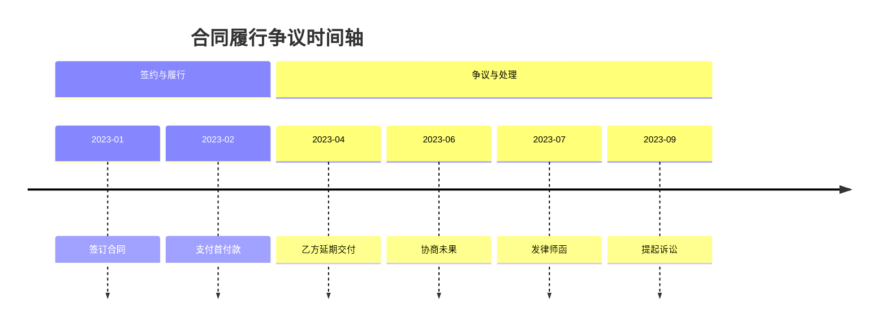

## 目录

- [模块1：法律合规与风险声明](#模块1-法律合规与风险声明)
- [模块2：快速开始](#模块2快速开始)
- [模块3：核心参数与法律约束](#模块3核心参数与法律约束)
- [模块4：输出格式与质量标准](#模块4输出格式与质量标准)
- [模块5：适用场景与不适用场景](#模块5适用场景与不适用场景)
- [模块6：常见问题](#模块6常见问题)

---

## 模块1：法律合规与风险声明

### 免责声明

本技能为**L1 辅助参考级**可视化工具，输出仅供参考，不构成以下任何内容：

- 法律意见、法律判断或事实认定
- 证据效力认定或证明力评价
- 诉讼策略决策或裁判结果预测

证据强度标注仅基于形式特征（原件/复印件/电子数据等），不替代律师对证据实质效力的专业判断。攻防矩阵中的风险等级仅为预判参考，不代表最终裁判结果。

### 适用法域限制

- 适用：中华人民共和国民商事诉讼领域
- 谨慎适用：刑事案件（证据链更复杂）、知识产权案件（技术关系可能超出通用图表能力）
- 不适用：域外法律场景

---

## 模块2：快速开始

**一句话定位**：发来材料后，选择最合适的图表类型，以文字讲清结论，并把核心图表渲染为图片一并交付。

**最小示例**：

```
2023年1月签约，2月付款，4月乙方延期交付，6月协商未果，7月发律师函，9月起诉。
```

**预期输出**：按"文字结论 → 对话内直接显示的时间轴组件 → 图下解读与风险"交付。默认不展示 Mermaid 源码；不得只返回图名、节点文字、代码块、文件路径或 HTML 报告。

````markdown
图表类型：timeline
标题：合同履行争议时间轴

```

---

## 模块3：核心参数与法律约束

### 3.1 输入参数

| 参数 | 必填 | 法律含义 | 说明 |
|------|------|---------|------|
| `content` | 是 | 待可视化的事实材料 | 原始内容（事实描述/事件记录/关系说明/步骤说明） |
| `goal` | 否 | 可视化的法律目的 | 如"突出履约延误""展示股权关系"，影响选型和编排侧重 |
| `preferred_chart` | 否 | 图表类型的法律场景映射 | auto / timeline / relation / evidence / flow / dispute / matrix / data_table，默认 auto |
| `audience` | 否 | 受众的法律角色 | 法官 / 客户 / 内部团队 / 领导汇报 / 通用，默认通用 |
| `style` | 否 | 呈现的法律正式程度 | 正式 / 商务 / 法律 / 极简 / 科技 / 演示，默认正式 |
| `detail_level` | 否 | 法律事实的详略程度 | 简略 / 标准 / 详细，默认标准 |
| `output_format` | 否 | 图表源格式 | mermaid / markdown / json，默认 mermaid；除非用户明确要求纯 JSON 或仅代码，最终答复仍采用文字与必要图片混合交付 |
| `deliver_style` | 否 | 最终交付形态 | conversation_inline / html_report / attachment，默认 conversation_inline；仅在用户明确要求报告文件时使用 html_report |
| `render_adapter` | 否 | 对话内渲染适配器 | auto / pureshow_widget / markdown_image / attachment，默认 auto；检测到已注册的 PureShowWidget 时优先 pureshow_widget |
| `include_source` | 否 | 是否展示可编辑源码 | true / false，默认 false；仅在用户明确要求源码时设为 true |
| `visual_budget` | 否 | 最终视觉单元数量 | 1-3，默认 3；图片与大型 Markdown 表格合计不得超过该值 |

> 完整输入规格参见 `references/input-spec.md`

### 3.2 受众差异化策略

| 受众 | 信息密度 | 术语层级 | 风险标注 | 证据细节 |
|------|---------|---------|---------|---------|
| 法官 | 精简聚焦 | 正式法律术语 | 核心风险点 | 标注来源坐标 |
| 客户 | 适度解释 | 通俗化表达 | 红绿灯标注 | 补充计算说明 |
| 内部团队 | 完整详尽 | 专业术语 | 三级展开 | 页码+版本号 |
| 对方当事人 | 选择性呈现 | 正式措辞 | 突出我方优势 | 适度保留 |

### 3.3 图表类型与法律场景映射

| 类型 | 核心法律场景 | 输出格式 | 关键特征 |
|------|------------|---------|---------|
| timeline | 履约过程、案件发展 | Mermaid | 时间点/区间 + 证据锚点 |
| relation | 交易结构、股权控制 | Mermaid | 主体 + 法律关系连线 |
| evidence | 证明链、证据梳理 | Mermaid | 事实主张 + 证据强度 |
| flow | 审批程序、诉讼流程 | Mermaid | 步骤 + 判断分支 |
| dispute | 争议焦点、关键转折 | Mermaid | 争点 + 证据支撑 + 抗辩 |
| matrix | 攻防策略、质证预案 | Markdown 表格 | 主张 × 抗辩 × 回应 × 证据 × 风险 |
| data_table | 金额拆解、损失构成 | Markdown 表格 | 项目 + 金额 + 占比 + 依据 |

### 3.4 诉讼阶段 × 图表推荐

| 诉讼阶段 | 核心需求 | 推荐类型 | 次选 |
|----------|---------|---------|------|
| 接待与评估 | 案件全貌、流程预期 | flow | timeline |
| 策略制定 | 事实梳理、主体关系 | timeline + relation | evidence |
| 起诉/答辩准备 | 证据链、争议焦点 | evidence + dispute | matrix |
| 证据组织 | 证据关联、缺口识别 | evidence | timeline |
| 庭前准备 | 攻防预案、争议梳理 | matrix | dispute |
| 庭审展示 | 时间线、争议链路 | timeline + dispute | evidence |
| 判后与执行 | 判决解读、执行方案 | flow | data_table |
| 常年服务报告 | 统计汇总、趋势展示 | data_table | timeline |

### 3.5 工作流概览

7 Phase 管线（详细步骤参见 `references/workflow-detail.md`）：

| Phase | 名称 | 处理方式 | 核心产出 |
|-------|------|------------|---------|
| 1 | 信息接收与预处理 | — | 参数集合 + 格式标记 |
| 2 | 信息提取与结构化 | 内置分析步骤 | 8维度结构化信息 |
| 3 | 图表类型判断 | 内置选型规则 | 类型 + 选择理由 |
| 4 | 图表内容编排 | 内置编排规则 | 编排方案 |
| 5 | 图表代码生成 | Mermaid / Markdown | Mermaid代码/Markdown表格 |
| 6 | 断点矛盾分析 | 内置分析规则 | 断点+矛盾列表 |
| 7 | 输出组装与优化 | — | 文字与必要图片混合输出 |

---

## 模块4：输出格式与质量标准

### 4.1 标准输出结构

默认采用 `deliver_style=conversation_inline`，按材料的逻辑顺序交付"文字 + 图片 + 紧随其后的解读"。文字承担结论、选择理由、断点、风险和下一步；图片只承载最适合视觉表达的核心关系。不得把全部解释做成图片，也不得只返回 Mermaid 代码。

````markdown
结论摘要：{2-4句，说明核心事实、关系或流程}
图表类型：{7种类型之一}；选择理由：{1-2句}

## 1. {逻辑主题或阶段}
{该图出现前的结论、背景或承上启下文字}


图示解读：
- {按阅读顺序说明图片中的关键节点、关系或转折}

## 2. {下一逻辑主题或阶段，仅在确有必要时}
{先写说明，再嵌入对应图片，随后立即解读；不得把所有图片集中堆放}

断点与矛盾分析：{timeline/evidence/matrix/data_table 适用}
- ...

优化建议：
- ...

建议补充信息：
- ...

## 可编辑源码（仅 include_source=true 时）
```mermaid
{与图片一致的图表代码或表格}
```
````

执行要求：

- **默认交付**：最终答复必须按逻辑顺序组织为"总述文字 → 第1张内联图 → 第1张图解读 → 过渡文字 → 第2张内联图 → 第2张图解读 → 风险与建议"。只有一张图时省略后续图片段。图片不得与对应说明分离。
- **视觉预算**：从所有候选图表中只选择最能支撑结论的 1-3 个视觉单元。图片和大型 Markdown 表格合计不得超过 `visual_budget`；其余内容改为精简文字，不得生成后再引用工作区文件。
- **内联渲染硬门槛**：对每个 timeline / relation / evidence / flow / dispute，生成并校验 Mermaid，渲染为 SVG 后必须调用 `references/inline-render-adapter.md` 规定的适配器。检测到已注册的 `PureShowWidget` 时，必须使用 `mode=inline` 在该图对应段落位置渲染 SVG；不得再生成 HTML 报告或用 HTML 页面截图代替。
- **成功判定**：只有收到渲染工具的成功结果，且对话流中出现对应 Widget/图片块，才可输出该图标题和"图示解读"。若成功渲染数与计划图数不一致，按适配器降级链重试；仍失败则明确说明并输出精简文字，不得留下一个孤立图名冒充图片。
- **平台适配**：不得调用未注册工具。未检测到 PureShowWidget 时，依次尝试平台原生内联组件、Markdown 图片、可预览附件。优先使用兼容性更好的 PNG；用户需要无损缩放或后续排版时可补充 SVG。
- **禁止默认 HTML**：未经用户明确要求，禁止生成、打包或交付独立 HTML 报告，不得将"文件已保存"视为完成。仅当 `deliver_style=html_report` 或用户明确提出"HTML/网页/报告文件"时生成 HTML。
- **源码默认关闭**：`include_source=false` 时禁止输出 Mermaid 源码、渲染后拆散的节点文字、HTML 代码或"源码见工作区"等说明；只有用户明确要求源码时才在文末折叠提供。
- **清洁输出**：禁止输出缩放控件残留（如孤立的 `100%`）、资源目录、工作区路径、"点击放大查看"、图表代码注释区或未显示图片的替代标题。
- **降级链**：PureShowWidget 内联 SVG → 平台原生内联组件 → 对话内嵌 PNG/SVG 图片 → 可预览图片附件 → 精简文字。每次降级都必须说明平台限制；除非 `include_source=true`，不得用 Mermaid 源码作为默认降级结果。
- 图片必须与文字结论和源码一致；较长解释、风险提示、证据坐标和待确认项保留为文字，不放入图片。
- 对 matrix / data_table，优先直接输出可复制的 Markdown 表格。只有在同时存在关系、流程或时间结构时，才额外生成概览图片。
- 用户明确要求纯 JSON、仅源码或无图片时，遵从用户指定格式。

> 完整输出规格参见 `references/output-spec.md`

### 4.2 法律准确性验证标准

| 检查项 | 标准 | 纠正方式 |
|--------|------|---------|
| 事实忠实 | 不编造关键事实，无法确认用中性表达 | 删除推断性内容，标注为"待确认" |
| 证据标注 | 证据强度仅基于形式特征，不评价实质效力 | 不使用"证明力强/弱"等实质判断用语 |
| 时间精度 | 精确/近似/模糊/期间/未知五级标注清晰 | 模糊时间不臆断为精确日期 |
| 法条引用 | 不引用具体法条编号（本技能非法条检索工具） | 删除法条编号，改为法律原则名称 |
| 计算校验 | data_table 各项之和等于总计 | 自动计算验证，不一致时标注矛盾 |

### 4.3 常见质量问题与纠正

| 问题 | 表现 | 纠正 |
|------|------|------|
| 节点文案过长 | 单节点超过20字 | 概括为短句，细节放入标注 |
| 关系方向混乱 | 时间轴从右到左，流程图无方向 | 时间轴统一从左到右，流程图从上到下 |
| 证据强度误判 | 将复印件标注为"强" | 按证据类型默认强度表纠正 |
| 混合信息堆叠 | 一张图包含时间线+关系+流程 | 拆分为多张图表 |
| 数据校验缺失 | 金额拆解各项之和不等于总计 | 添加计算校验行 |

---

## 模块5：适用场景与不适用场景

### 适用场景

- 民商事诉讼事实梳理与可视化
- 合同履行过程、交易结构展示
- 证据关联与证明链展示
- 程序流程与审批路径
- 庭前攻防策略梳理
- 金额/损失结构化拆解
- 律师汇报材料、庭审展示、客户沟通

### 本技能不适用于

- **空间/现场图**：事故现场、地理位置、空间布局需要坐标系和比例尺，请使用 CAD、航拍图、手绘扫描等外部工具
- **复杂数据图表**：折线图、柱状图、饼图、散点图等需要专业数据可视化工具（data_table 仅提供结构化表格+文本柱状条）
- **法律意见生成**：本技能不输出法律判断、事实认定或策略决策
- **证据效力认定**：证据强度标注仅为形式分类，不替代律师专业判断
- **刑事证据链**：刑事案件证据链更复杂，建议配合专业工具使用
- **批量文书生成**：本技能每次生成一张图表，不支持批量生成

---

## 模块6：常见问题

### Q1：不同地区法院对证据形式要求不同，图表中的证据强度标注是否需要调整？

证据强度标注基于《民事诉讼法》第66-73条和《证据规定》的通用框架，不区分地区差异。但某些地区法院对电子数据采信标准可能更严格（如要求区块链存证），建议在 `audience=法官` 时根据当地实践调整标注。本技能标注仅为形式分类参考，不替代律师的地域性专业判断。

### Q2：生成的图表可以直接提交法院吗？

**不可以直接提交**。本技能输出包含文字说明、预览图片、Mermaid 源码或 Markdown 表格，属于草稿级辅助参考。提交法院前需：1）由律师审核内容准确性；2）转换为法院接受的格式（PDF/纸质）；3）确认不包含任何推测性内容。本技能输出的 `⚠️ 待确认` 标注项必须由律师核实后才能提交。

### Q3：批量生成多张图表时如何保证一致性？

本技能每次处理生成一张图表。如需多张图表，建议：1）按诉讼阶段分批生成；2）每次指定 `audience` 和 `style` 参数保持一致；3）生成后人工检查术语和事实描述的统一性。不支持单次调用生成多张图表。

### Q4：时间轴中的模糊时间如何处理？

模糊时间（"大约""左右""前后"）使用五级精度标注体系标记：精确✅、近似📅、模糊🌫️、期间📏、未知❓。精度过低的时间序列（多数为🌫️/❓）不适合时间轴图，系统会建议改用流程图或关系图。详见 `references/input-spec.md` §6。

### Q5：攻防矩阵中的风险等级如何理解？

风险等级基于以下因素综合评估：证据充分程度、法律适用明确程度、对方抗辩力度。🟢低=证据充分/法律明确；🟡中=存在争议空间；🔴高=证据薄弱/法律适用不明。此等级仅为庭前准备参考，不代表裁判结果预判。

---

## 降级与约束

### SOFT_DEGRADED 最小骨架

当资源或信息受限时，技能降级为最小骨架运行：

**C) Missing Facts Checklist（待补充事实清单）**

| field_name | impact_level | suggested_source | estimated_timeliness |
|------------|-------------|-----------------|---------------------|
| 时间信息 | boundary | 当事人回忆/书面文件 | 需在庭审前核实 |
| 证据材料 | evaluation | 当事人提供/法院调取 | 举证期限内 |
| 主体关系 | content_detail | 工商登记/合同文件 | 随时可补充 |

**D) Governance & Non-Goals（治理与禁区/非目标）**

- 禁区边界：不生成可被当作确定性结论使用的实质定性/责任认定/胜诉把握内容
- 非目标：不替代律师专业判断、不验证事实真伪、不评估证据实质效力

**G) Actionable Next Steps（下一步行动）**

| upgrade_actions | target_field | expected_outcome |
|----------------|-------------|-----------------|
| 补充具体日期 | 时间信息 | 提升时间轴精度等级 |
| 提供证据材料 | 证据材料 | 增强证据锚点完整性 |
| 明确主体关系 | 主体关系 | 提升关系图准确性 |

降级输出仅包含简要文字说明、基础图表代码和最小骨架；无法渲染时不强制生成图片，并明确告知用户。

### 硬约束

- 不编造关键事实或法律结论
- 不将长段原文直接复制进图节点（单节点≤20字）
- 不输出混乱嵌套的Mermaid结构
- 不替代律师的专业法律判断
- 不省略L1辅助参考声明

---

## 规格索引

详细规格文件位于 `references/` 目录：

| 文件 | 内容 |
|------|------|
| `references/input-spec.md` | 输入参数定义、触发机制、证据坐标格式、时间精度体系 |
| `references/output-spec.md` | 输出结构定义、7种图表模板、JSON/Markdown格式 |
| `references/workflow-detail.md` | 7 Phase工作流详细说明、断点矛盾分析规则 |
| `references/inline-render-adapter.md` | 对话内 SVG/图片渲染的工具选择、调用与成功判定；conversation_inline 时必须读取 |
| `references/legal-references.md` | 证据强度分级框架、时间精度标注体系、法规索引 |

规则文件位于 `rules/` 目录：

| 文件 | 内容 |
|------|------|
| `rules/chart-selection-rules.md` | 图表选型决策规则、风格配色方案 |
| `rules/mermaid-style-rules.md` | Mermaid代码风格规范、classDef样式库 |
| `rules/evidence-strength-framework.md` | 证据强度三级分级框架 |

模板文件位于 `templates/` 目录：

| 文件 | 内容 |
|------|------|
| `templates/chart-templates.md` | 7种图表的Mermaid模板库及Markdown表格模板 |

---

## 欢迎语

请把你的材料或需求发给我。我会自动选择时间轴图、关系图、流程图、证据关联图、争议链路图、攻防矩阵或数据结构化表，用文字讲清重点，并把最关键的图表渲染成图片一并展示；需要时也会附上可编辑源码。你也可以直接指定图表类型。
