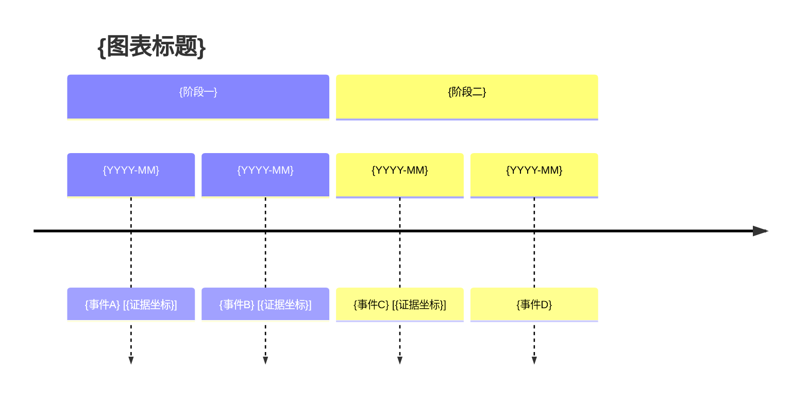

# 输出规格（output-spec）

## 目录

- [§1 标准输出结构](#1-标准输出结构)
- [§1.3 混合交付规则](#13-混合交付规则)
- [§2 图表类型定义](#2-图表类型定义)
- [§3 七种图表模板](#3-七种图表模板)
- [§4 风格配色方案](#4-风格配色方案)
- [§5 JSON输出格式](#5-json输出格式)
- [§6 Markdown输出格式](#6-markdown输出格式)

---

## §1 标准输出结构

### 1.1 混合格式（默认）

````markdown
结论摘要：{2-4句，概括图表核心内容和主要发现}
图表类型：{timeline | relation | evidence | flow | dispute | matrix | data_table}
选择理由：{为什么选这种图表，1-2句}

## 1. {第一逻辑主题或阶段}

{该图出现前的结论、背景或过渡说明}


图示解读：
- {关键节点、关系、转折或数据差异}

## 2. {第二逻辑主题或阶段，仅在确有必要时}

{重复“图前文字 → 图片 → 图后解读”，不得集中堆放图片}

断点与矛盾分析：{适用类型见 §2 各类型说明}
- {断点或矛盾描述}

优化建议：
- {设计层面的改进建议}
- {内容层面的补充建议}

建议补充信息：
- {用户可补充以优化图表的信息}

## 可编辑源码（仅 include_source=true 时）
```mermaid
{与图片一致的 Mermaid 源码；matrix/data_table 改为 Markdown 表格}
```
````

### 1.2 字段说明

| 字段 | 必填 | 说明 |
|------|------|------|
| 图表类型 | 是 | 7种类型之一 |
| 选择理由 | 是 | 1-2句话说明选择依据 |
| 结论摘要 | 是 | 2-4句，先讲清结果，不让用户必须阅读图片才能理解 |
| 核心图示 | 条件 | timeline/relation/evidence/flow/dispute 默认必填；matrix/data_table 按需 |
| 图示解读 | 条件 | 有图片时必填，解释关键节点和关系 |
| 图表代码 | 条件 | 用户需要编辑、复用或环境无法渲染时提供 |
| 断点与矛盾分析 | 条件 | 各类型适用范围不同，见 §2 |
| 优化建议 | 是 | 至少1条建议 |
| 建议补充信息 | 条件 | 信息不足时提供 |
| 可编辑源码 | 条件 | 默认不输出；仅当 `include_source=true` 或用户明确要求源码时提供 |

### 1.3 混合交付规则

1. 默认 `deliver_style=conversation_inline`。先写总述；每张图片前写该图的结论或承接文字，图片后立即写解读和风险，再进入下一逻辑主题。
2. 图片与大型 Markdown 表格合计为 1-3 个视觉单元；只保留最能支撑结论的内容，不为装饰生成图片，不得把多张图片集中放在文字末尾。
3. timeline、relation、evidence、flow、dispute 先生成并校验 Mermaid，再渲染为 PNG 或 SVG。优先使用兼容性更好的 PNG；用户需要编辑或高清排版时补充 SVG。
4. conversation_inline 时必须读取 `references/inline-render-adapter.md`。若平台已注册 `PureShowWidget`，每张图必须将校验后的 SVG 通过 `mode=inline` 渲染到对应段落；若未注册，再选择其他适配器，不得虚构工具。
5. matrix、data_table 保留为 Markdown 表格以便复制和检索；仅在存在可视化关系、流程或时间结构时增加概览图片。
6. 图片只承载核心结构；完整事实、证据坐标、断点、矛盾、免责声明和待补信息必须以文字输出。
7. 图片必须带有意义的替代文本，并在当前客户端的对话回复中直接可见。允许使用绝对路径或附件地址作为客户端嵌入机制，但禁止把裸路径、附件链接或“文件已保存”作为唯一交付内容。
8. 未经用户明确要求，禁止生成、打包或交付独立 HTML 报告。只有 `deliver_style=html_report` 或用户明确要求 HTML、网页、报告文件时，才切换为文件交付。
9. 每张图只有在收到工具成功结果且回复流出现对应组件/图片块后才算完成。禁止以孤立图名、拆散节点文字、`100%`、工作区路径、资源目录或“点击放大”代替图片。
10. `include_source=false` 时禁止输出源码以及“源码见前文/工作区/注释区”等指引；只有用户明确要求源码时才在文末提供。
11. 降级顺序为：PureShowWidget 内联 SVG → 平台原生内联组件 → 对话内嵌 PNG/SVG → 可预览图片附件 → 精简文字。降级时说明原因，不得伪称图片已生成或已显示。
12. 用户明确要求 JSON、仅源码或无图片时，以用户要求为准。

---

## §2 图表类型定义

### 2.1 时间轴图（timeline）

- **Mermaid语法**：`timeline`
- **适用**：事件演进、履约过程、案件发展历程
- **核心要素**：时间节点 + 事件描述 + 证据锚点
- **方向**：从左到右
- **节点上限**：单图 ≤ 20 事件
- **断点分析**：适用（时间断点 + 证据断点 + 事实断点 + 时间矛盾 + 内容矛盾 + 证据矛盾）

### 2.2 主体关系图（relation）

- **Mermaid语法**：`flowchart LR`
- **适用**：主体关系、交易结构、股权控制、资金流向
- **核心要素**：主体节点 + 关系连线 + 关系标签
- **方向**：从左到右
- **节点上限**：单图 ≤ 15 节点
- **断点分析**：不适用

### 2.3 证据关联图（evidence）

- **Mermaid语法**：`flowchart TB`
- **适用**：证据梳理、证明链展示、证据强度可视化
- **核心要素**：事实节点 + 证据节点 + 证明关系 + 强度标注
- **方向**：从上到下
- **节点上限**：单图 ≤ 12 事实 + 8 证据
- **断点分析**：适用（证据断点 + 事实断点 + 证据矛盾）

### 2.4 流程图（flow）

- **Mermaid语法**：`flowchart TD`
- **适用**：处理程序、审批路径、步骤分支
- **核心要素**：步骤节点 + 判断菱形 + 分支连线
- **方向**：从上到下
- **节点上限**：单图 ≤ 15 步骤
- **断点分析**：不适用

### 2.5 争议链路图（dispute）

- **Mermaid语法**：`flowchart LR`
- **适用**：争议焦点梳理、关键转折展示、决策链条
- **核心要素**：争议节点 + 证据支撑 + 矛盾标注 + 风险标记
- **方向**：从左到右
- **节点上限**：单图 ≤ 10 争议节点
- **断点分析**：不适用

### 2.6 攻防矩阵图（matrix）

- **输出格式**：Markdown 表格（非 Mermaid）
- **适用**：庭前攻防策略梳理、质证预案、多主张横向对比
- **核心要素**：我方主张 + 对方可能抗辩 + 我方回应策略 + 支撑证据 + 风险等级
- **受众差异化**：法官版精简4列，团队版展开三级细节，客户版含解释
- **行上限**：单表 ≤ 15 行主张
- **断点分析**：适用（策略断点 + 风险盲区 + 证据缺口）

### 2.7 数据结构化表（data_table）

- **输出格式**：Markdown 表格 + 可选文本柱状条
- **适用**：赔偿金额拆解、资金流水、损失构成、比例对比
- **核心要素**：项目 + 金额/数值 + 占比 + 计算依据 + 证据
- **子类型**：金额拆解表、资金流水表、损失构成表、比例对比表
- **行上限**：单表 ≤ 20 行
- **断点分析**：适用（数据断点 + 计算矛盾 + 比例异常）

---

## §3 七种图表模板

### 3.1 时间轴图模板



### 3.2 主体关系图模板

```mermaid
flowchart LR
    subgraph {群体A}
        a[{主体A名称}]
        b[{主体B名称}]
    end
    subgraph {群体B}
        c[{主体C名称}]
        d[{主体D名称}]
    end

    a -->|{关系标签1}| b
    a -->|{关系标签2}| c
    b -.->|{弱关系}| d

    classDef key fill:#1d4ed8,color:#fff,stroke:#1e3a8a,stroke-width:2px
    classDef normal fill:#eff6ff,color:#1e3a8a,stroke:#60a5fa,stroke-width:1px
    classDef weak fill:#f9fafb,color:#6b7280,stroke:#d1d5db,stroke-width:1px,stroke-dasharray:5 5

    class a,b key
    class c normal
    class d weak
```

### 3.3 证据关联图模板

```mermaid
flowchart TB
    subgraph 事实主张
        f1[{事实主张1}]
        f2[{事实主张2}]
        f3[{事实主张3}]
    end
    subgraph 证据支撑
        e1[{证据1 - 📄原件}]
        e2[{证据2 - 📑复印件}]
        e3[{证据3 - 💾电子数据}]
    end

    e1 -->|直接证明| f1
    e2 -->|间接佐证| f2
    e3 -->|佐证| f2
    e1 -.->|关联| f3

    classDef fact fill:#fef3c7,stroke:#d97706,stroke-width:2px
    classDef strong fill:#dcfce7,stroke:#16a34a,stroke-width:2px
    classDef medium fill:#fef9c3,stroke:#ca8a04,stroke-width:1px
    classDef weak fill:#fee2e2,stroke:#dc2626,stroke-width:1px

    class f1,f2,f3 fact
    class e1 strong
    class e2 medium
    class e3 weak
```

### 3.4 流程图模板

```mermaid
flowchart TD
    start([{开始}]) --> step1[{步骤1}]
    step1 --> step2[{步骤2}]
    step2 --> decision1{{判断条件}}
    decision1 -->|条件A| step3a[{步骤3A}]
    decision1 -->|条件B| step3b[{步骤3B}]
    step3a --> step4[{步骤4}]
    step3b --> step4
    step4 --> end([{结束}])

    classDef startend fill:#0f766e,color:#fff,stroke:#115e59,stroke-width:2px
    classDef process fill:#eff6ff,color:#1e3a8a,stroke:#3b82f6,stroke-width:1px
    classDef decision fill:#fff7ed,color:#9a3412,stroke:#fdba74,stroke-width:2px

    class start,end startend
    class step1,step2,step3a,step3b,step4 process
    class decision1 decision
```

### 3.5 争议链路图模板

```mermaid
flowchart LR
    d1[{争议焦点1}] --> e1a[{证据支撑A}]
    d1 --> e1b[{证据支撑B}]
    d1 --> c1[{对方抗辩}]
    d2[{争议焦点2}] --> e2a[{证据支撑C}]
    d2 --> c2[{对方抗辩}]

    d1 -.->|关联| d2

    classDef dispute fill:#fee2e2,color:#991b1b,stroke:#dc2626,stroke-width:2px
    classDef support fill:#dcfce7,color:#166534,stroke:#16a34a,stroke-width:1px
    classDef counter fill:#fef3c7,color:#92400e,stroke:#d97706,stroke-width:1px
    classDef link fill:#f9fafb,color:#6b7280,stroke:#d1d5db,stroke-width:1px,stroke-dasharray:5 5

    class d1,d2 dispute
    class e1a,e1b,e2a support
    class c1,c2 counter
```

### 3.6 攻防矩阵图模板（Markdown 表格）

```markdown
### 攻防矩阵：{案件类型}

| 我方主张 | 对方可能抗辩 | 我方回应策略 | 支撑证据 | 风险等级 |
|---------|------------|------------|---------|---------|
| {主张1} | {抗辩1} | {回应策略1} | {证据1} | 🟢 低 |
| {主张2} | {抗辩2} | {回应策略2} | {证据2} | 🟡 中 |
| {主张3} | {抗辩3} | {回应策略3} | {证据3} | 🔴 高 |

**风险等级说明**：🟢 低 = 证据充分/法律明确；🟡 中 = 存在一定争议空间；🔴 高 = 证据薄弱/法律适用不明
```

### 3.7 数据结构化表模板（Markdown 表格）

**3.7.1 金额拆解表**

```markdown
### {项目名称}金额构成表

| 项目 | 金额（元） | 占比 | 计算依据 | 证据 | 可视化 |
|------|-----------|------|---------|------|--------|
| {项目1} | {金额1} | {占比1}% | {依据1} | {证据1} | ▓▓▓▓▓▓░░░░ |
| {项目2} | {金额2} | {占比2}% | {依据2} | {证据2} | ▓▓▓▓░░░░░░ |
| **合计** | **{总金额}** | **100%** | — | — | ▓▓▓▓▓▓▓▓▓▓ |

> 计算校验：{项目1} + {项目2} = {总金额} ✅
```

**3.7.2 资金流水表**

```markdown
### 资金流水明细表

| 日期 | 方向 | 对方账户 | 金额（元） | 用途/备注 | 证据 |
|------|------|---------|-----------|----------|------|
| {日期1} | 支出 | {账户1} | {金额1} | {用途1} | {证据1} |
| {日期2} | 收入 | {账户2} | {金额2} | {用途2} | {证据2} |
| **合计** | — | — | **{净额}** | — | — |
```

**3.7.3 损失构成表**

```markdown
### 损失构成明细表

| 损失类型 | 直接损失 | 间接损失 | 计算方式 | 证据 | 风险 |
|---------|---------|---------|---------|------|------|
| {类型1} | {金额1} | {金额2} | {方式1} | {证据1} | 🟢 |
| {类型2} | {金额3} | {金额4} | {方式2} | {证据2} | 🟡 |
| **合计** | **{总额}** | **{总额}** | — | — | — |
```

**3.7.4 比例对比表**

```markdown
### {对比主题}比例对比表

| 对比项 | 数值 | 占比 | 对比基准 | 差异 | 可视化 |
|--------|------|------|---------|------|--------|
| {项A} | {数值A} | {占比A}% | {基准} | {差异A} | ▓▓▓▓▓▓▓▓░░ |
| {项B} | {数值B} | {占比B}% | {基准} | {差异B} | ▓▓▓▓░░░░░░ |
```

---

## §4 风格配色方案

### 4.1 六种预设风格

| 风格 | 主色 | 辅色 | 强调色 | 背景色 | 适用场景 |
|------|------|------|--------|--------|----------|
| 正式 | #1e3a8a 深蓝 | #60a5fa 蓝 | #dc2626 红 | #ffffff 白 | 法官、庭审 |
| 商务 | #0369a1 蓝 | #06b6d4 青 | #f97316 橙 | #ffffff 白 | 客户、领导 |
| 法律 | #1e3a8a 深蓝 | #6b7280 灰 | #dc2626 红 | #f8fafc 浅灰 | 法律文书 |
| 极简 | #374151 灰 | #9ca3af 浅灰 | #111827 黑 | #ffffff 白 | 内部交流 |
| 科技 | #0f766e 青 | #14b8a6 浅青 | #8b5cf6 紫 | #0f172a 深色 | 演示、PPT |
| 演示 | #2563eb 蓝 | #f59e0b 金 | #ef4444 红 | #ffffff 白 | 大屏展示 |

### 4.2 语义配色

| 语义 | 颜色 | 用途 |
|------|------|------|
| 关键/核心 | 主色深填充+白字 | 核心主体、关键步骤 |
| 正常/中性 | 主色浅填充+深字 | 普通节点 |
| 警告/争议 | 红色系 | 争议节点、违约事件 |
| 成功/支持 | 绿色系 | 支持性证据、完成状态 |
| 弱关联 | 浅灰虚线 | 间接关系、待确认 |

---

## §5 JSON输出格式

当 `output_format=json` 时，输出结构化JSON：

```json
{
  "chart_type": "timeline",
  "selection_reason": "用户描述包含明确的时间序列事件",
  "title": "合同履行争议时间轴",
  "summary": "展示从签约到起诉的7个关键节点",
  "diagram_code": "timeline\n    title ...\n    ...",
  "metadata": {
    "audience": "法官",
    "style": "正式",
    "detail_level": "标准",
    "total_nodes": 7,
    "total_evidence_refs": 5
  },
  "gap_analysis": {
    "time_gaps": ["2023-04至2023-06期间缺少详细记录"],
    "evidence_gaps": ["协商过程无书面记录"],
    "contradictions": []
  },
  "design_notes": [
    "核心争议节点用红色高亮",
    "建议补充证据编号以增强可追溯性"
  ],
  "followup_suggestions": [
    "可继续补充每个事件的证据编号",
    "可增加争议节点高亮"
  ]
}
```

**matrix 类型 JSON 示例**：

```json
{
  "chart_type": "matrix",
  "selection_reason": "用户要求梳理攻防策略和质证预案",
  "title": "买卖合同纠纷攻防矩阵",
  "summary": "展示3项主张的攻防对应关系及风险等级",
  "diagram_code": "| 我方主张 | 对方可能抗辩 | 我方回应策略 | 支撑证据 | 风险等级 |\n|---------|------------|------------|---------|---------|\n| ...",
  "metadata": {
    "audience": "内部团队",
    "style": "正式",
    "detail_level": "详细",
    "total_rows": 3,
    "high_risk_count": 1
  },
  "gap_analysis": {
    "strategy_gaps": ["第3项主张缺少直接证据支撑"],
    "risk_blindspots": ["未考虑对方可能提出的不可抗力抗辩"],
    "evidence_gaps": ["损失金额计算缺少第三方鉴定"]
  },
  "design_notes": [
    "高风险项已用🔴标注，建议优先补强证据"
  ],
  "followup_suggestions": [
    "补充不可抗力条款的审查意见",
    "补充损失金额的第三方鉴定报告"
  ]
}
```

**data_table 类型 JSON 示例**：

```json
{
  "chart_type": "data_table",
  "selection_reason": "用户要求拆解赔偿金额构成",
  "title": "违约赔偿金额构成表",
  "summary": "展示5项赔偿请求的金额、占比及计算依据",
  "diagram_code": "| 项目 | 金额（元） | 占比 | 计算依据 | 证据 | ...",
  "metadata": {
    "audience": "法官",
    "style": "正式",
    "detail_level": "标准",
    "total_rows": 5,
    "total_amount": 1500000
  },
  "gap_analysis": {
    "data_gaps": ["间接损失缺少因果关系证明"],
    "calculation_errors": [],
    "proportion_anomalies": ["违约金占比过高（60%），可能面临调减"]
  },
  "design_notes": [
    "已添加计算校验，各项之和等于总计",
    "文本柱状条直观展示各项占比"
  ],
  "followup_suggestions": [
    "补充间接损失的因果关系证据",
    "评估违约金是否可能超过实际损失的30%"
  ]
}
```

---

## §6 Markdown输出格式

当 `output_format=markdown` 时，输出包含可渲染图表的Markdown文档：

```markdown
# {标题}

> 图表类型：{类型} | 选择理由：{理由}

## 概要

{摘要描述}

## 图表

```mermaid
{Mermaid代码}
```

## 分析

### 断点与矛盾
- {分析内容}

## 优化建议
- {建议内容}

## 建议补充信息
- {补充建议}
```
