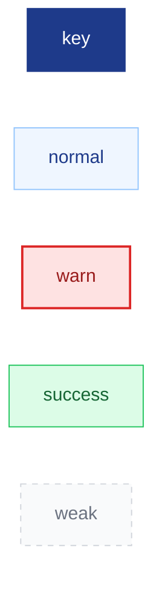
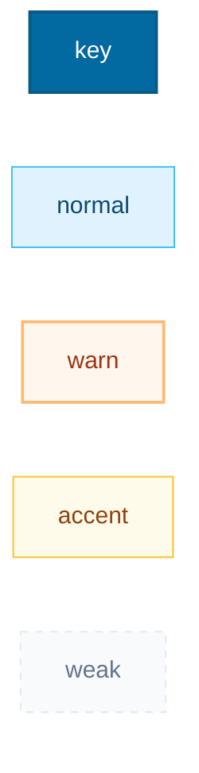
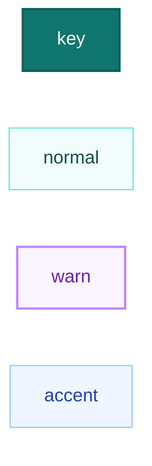
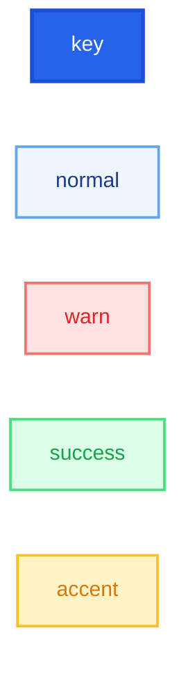

# 图表选型规则（chart-selection-rules）

## 目录

- [§1 选型决策总则](#1-选型决策总则)
- [§2 五种图表类型特征](#2-五种图表类型特征)
- [§3 自动判断决策树](#3-自动判断决策树)
- [§4 目标与选型映射](#4-目标与选型映射)
- [§5 混合信息处理策略](#5-混合信息处理策略)
- [§6 风格配色方案详细定义](#6-风格配色方案详细定义)

---

## §1 选型决策总则

### 1.1 三层决策优先级

1. **用户指定**：`preferred_chart` 明确指定 → 直接使用
2. **目标驱动**：`goal` 参数暗示核心表达意图 → 按目标选型
3. **特征匹配**：材料中的信息特征分布 → 按权重计算

### 1.2 核心判断维度

| 维度 | 核心问题 | 对应图表 |
|------|----------|----------|
| 时间 | "何时发生"最重要？ | timeline |
| 关系 | "谁和什么关系"最重要？ | relation |
| 证据 | "有什么证据"最重要？ | evidence |
| 步骤 | "怎么走"最重要？ | flow |
| 争议 | "争什么"最重要？ | dispute |

---

## §2 五种图表类型特征

### 2.1 时间轴图（timeline）

**优先条件**（满足任意2条）：
- 包含 ≥ 3 个具体时间点或时间区间
- 争议围绕"何时发生"展开
- 需要梳理案件或项目的发展过程
- 需要展示时间区间、前后对比、阶段变化
- 用户 goal 中包含"时间""过程""经过""进展"等关键词

**不适用条件**：
- 时间信息全部为模糊/未知精度
- 事件数量过少（< 3个）且无时序意义
- 用户明确要求其他类型

### 2.2 主体关系图（relation）

**优先条件**（满足任意2条）：
- 包含 ≥ 3 个不同主体
- 存在 ≥ 2 种关系类型
- 主体间的控制/合同/代理/资金关系是核心
- 时间不是核心，主体和连接关系更重要
- 用户 goal 中包含"关系""结构""股权""控股""关联"等关键词

**不适用条件**：
- 仅有2个主体且关系单一
- 主体间仅有时序关系而无结构性关系
- 用户明确要求其他类型

### 2.3 证据关联图（evidence）

**优先条件**（满足任意2条）：
- 证据数量 ≥ 3 个
- 需要展示证据与事实的对应关系
- 需要可视化证据强度/证明力
- 需要展示证明链的完整性或断裂
- 用户 goal 中包含"证据""证明""材料""关联"等关键词

**不适用条件**：
- 证据数量 < 3 个且关系简单
- 无需展示证据强度分级
- 用户明确要求其他类型

### 2.4 流程图（flow）

**优先条件**（满足任意2条）：
- 包含 ≥ 3 个步骤
- 存在判断分支（if/then）
- 不同情形需要分流处理
- 重点是处理程序而非具体日期或主体关系
- 用户 goal 中包含"流程""步骤""审批""办理""程序"等关键词

**不适用条件**：
- 步骤为简单线性序列无分支
- 步骤数量 < 3 个
- 用户明确要求其他类型

### 2.5 争议链路图（dispute）

**优先条件**（满足任意2条）：
- 存在 ≥ 2 个争议焦点
- 需要展示攻防对应关系
- 需要展示关键转折或决策分支
- 需要标注争议风险等级
- 用户 goal 中包含"争议""争点""矛盾""攻防""抗辩"等关键词

**不适用条件**：
- 争议焦点单一
- 无明确攻防结构
- 用户明确要求其他类型

### 2.6 攻防矩阵图（matrix）

**优先条件**（满足任意2条）：
- 存在 ≥ 2 项我方主张/诉讼请求
- 需要展示我方主张与对方抗辩的横向对比
- 需要梳理质证预案或回应策略
- 用户 goal 中包含"攻防""策略矩阵""质证预案""应对方案"等关键词
- `audience=内部团队` 且材料包含攻防信息

**不适用条件**：
- 仅1项主张且无复杂抗辩
- 无明确对方抗辩角度
- 用户明确要求其他类型

**与 dispute 的区分**：
- dispute 是**纵向推演**：单个争议的纵深结构（争议→证据→抗辩→裁判路径）
- matrix 是**横向对比**：多个主张的二维矩阵（主张×抗辩×回应×证据×风险）
- 两者互补：dispute 适合展示单个争议，matrix 适合展示多个争议的横向对比

### 2.7 数据结构化表（data_table）

**优先条件**（满足任意2条）：
- 包含 ≥ 2 个金额/数值数据项
- 需要拆解金额构成或计算过程
- 需要展示资金流水、损失构成、比例对比
- 用户 goal 中包含"金额""赔偿计算""费用构成""资金流水""损失""比例"等关键词

**不适用条件**：
- 无金额/数值数据
- 仅为简单单一项金额
- 用户明确要求其他类型

**定位声明**：
- data_table 是**结构化表格**，非真正的数据图表（折线图/柱状图/饼图）
- 输出为 Markdown 表格 + 可选文本柱状条（▓▓▓▓░░░░）
- 如需真正的数据图表，请使用 Excel、Tableau 等外部工具

---

## §3 自动判断决策树

```
preferred_chart != auto?
├── 是 → 使用指定类型
└── 否 → 进入自动判断

自动判断：
│
├─ goal 包含明确关键词？
│  ├── "时间/过程/经过" → timeline
│  ├── "关系/结构/股权" → relation
│  ├── "证据/证明链" → evidence
│  ├── "流程/步骤/审批" → flow
│  └── "争议/争点/矛盾" → dispute
│
├─ 信息特征权重计算：
│  │
│  ├─ time_score ≥ 6 且为最高分 → timeline
│  ├─ relation_score ≥ 6 且为最高分 → relation
│  ├─ evidence_score ≥ 6 且为最高分 → evidence
│  ├─ step_score ≥ 6 且为最高分 → flow
│  ├─ dispute_score ≥ 6 且为最高分 → dispute
│  │
│  └─ 最高分 < 6 或多类型平分
│     └─ 按 goal 选择最匹配
│     └─ 建议：可补充第二张图
```

### 3.1 特征权重计算表

| 特征 | timeline | relation | evidence | flow | dispute | matrix | data_table |
|------|----------|----------|----------|------|---------|--------|------------|
| 时间点 ≥ 3 | +3 | +0 | +1 | +0 | +1 | +0 | +1 |
| 主体 ≥ 3 | +0 | +3 | +1 | +1 | +1 | +1 | +0 |
| 关系类型 ≥ 2 | +0 | +3 | +1 | +0 | +1 | +1 | +0 |
| 步骤 ≥ 3 | +0 | +0 | +0 | +3 | +0 | +0 | +0 |
| 判断分支 ≥ 1 | +0 | +0 | +0 | +3 | +1 | +1 | +0 |
| 证据 ≥ 3 | +1 | +0 | +3 | +0 | +2 | +2 | +2 |
| 争议焦点 ≥ 2 | +0 | +0 | +1 | +0 | +3 | +3 | +0 |
| 主张/诉求 ≥ 2 | +0 | +0 | +1 | +0 | +1 | +3 | +2 |
| 金额/数值 ≥ 2 | +0 | +0 | +0 | +0 | +0 | +0 | +3 |
| goal 匹配 | +2 | +2 | +2 | +2 | +2 | +2 | +2 |
| audience=法官 | +1 | +1 | +2 | +0 | +2 | +1 | +2 |

---

## §4 目标与选型映射

常见用户目标与推荐的图表类型：

| 用户目标 | 推荐类型 | 理由 |
|----------|----------|------|
| 突出履约延误 | timeline | 延误是时间维度问题 |
| 展示股权关系 | relation | 股权是结构性关系 |
| 梳理审批步骤 | flow | 审批是程序性流程 |
| 证明违约事实 | evidence | 违约需要证据链 |
| 分析争议焦点 | dispute | 争点需要攻防展示 |
| 展示交易结构 | relation | 交易结构是关系网 |
| 合同履行过程 | timeline | 履行是时间演进 |
| 资金流向 | relation | 资金是关系维度 |
| 办理流程 | flow | 办理是程序流程 |
| 证据体系梳理 | evidence | 证据需要关联展示 |
| 攻防策略梳理 | matrix | 需要横向对比多个主张 |
| 赔偿金额拆解 | data_table | 需要结构化展示金额构成 |
| 资金流水展示 | data_table | 需要按时间展示资金流向 |
| 损失构成分析 | data_table | 需要分类展示损失项目 |

---

## §5 混合信息处理策略

当材料同时包含多种图表要素时：

### 5.1 单图策略

选择最能服务 `goal` 的一种类型，将其他类型信息作为辅助标注嵌入。

示例：用户 goal="突出履约延误"，材料同时有时间节点和主体关系
- 选择 timeline
- 在时间轴中用括号标注相关主体（"甲方向乙方支付首付款"）

### 5.2 双图建议

当信息明显包含两种核心维度时，建议生成两张图：

```
> 当前信息同时包含时间维度和关系维度，建议生成两张图表：
> 1. 时间轴图：展示事件演进过程
> 2. 关系图：展示主体之间的法律关系
>
> 以下为第一张图表（时间轴图）的输出：
```

### 5.3 优先级排序

当无法判断主次时，按以下优先级选择第一张图：
1. timeline（时间信息通常最基础）
2. relation（关系结构通常最直观）
3. flow（流程通常最独立）
4. evidence（证据通常需要基于事实）
5. dispute（争议通常需要基于事实和证据）
6. matrix（攻防通常需要基于争议焦点）
7. data_table（数据通常需要基于事实认定）

---

## §6 风格配色方案详细定义

### 6.1 正式风格（默认）

适用：法官、庭审、法律文书



### 6.2 商务风格

适用：客户汇报、商务演示



### 6.3 法律风格

适用：法律文书附件、律师内部材料


### 6.4 极简风格

适用：内部交流、快速笔记


### 6.5 科技风格

适用：PPT演示、技术场景



### 6.6 演示风格

适用：大屏展示、公开演讲



### 6.7 受众适配调整

| 受众 | 标题风格 | 节点详细度 | 证据标注 | 配色建议 |
|------|----------|-----------|----------|----------|
| 法官 | 正式简洁 | 精简 | 必须 | 正式/法律 |
| 客户 | 清晰易读 | 标准+解释 | 可选 | 商务 |
| 内部团队 | 简洁高效 | 标准 | 可选 | 极简 |
| 领导汇报 | 突出重点 | 简略+总结 | 简略 | 商务/演示 |
| 通用 | 均衡 | 标准 | 建议标注 | 正式 |
