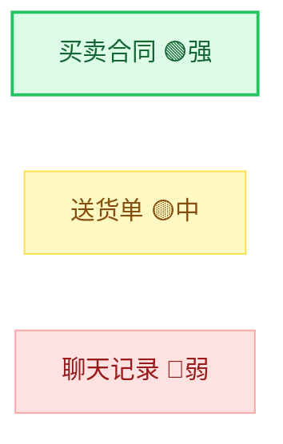
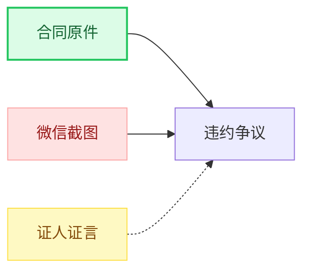

# 证据强度分级框架（evidence-strength-framework）

## 目录

- [§1 框架概述](#1-框架概述)
- [§2 三级分级定义](#2-三级分级定义)
- [§3 证据类型与默认强度](#3-证据类型与默认强度)
- [§4 强度调整规则](#4-强度调整规则)
- [§5 图表标注方式](#5-图表标注方式)

---

## §1 框架概述

本框架为诉讼可视化技能中的证据节点提供统一的强度分级标准，便于在图表中通过视觉方式区分证据的证明力强弱。

### 1.1 法律依据

- 《中华人民共和国民事诉讼法》第66-73条（证据种类）
- 《最高人民法院关于民事诉讼证据的若干规定》第85-93条（证明力认定）
- 《最高人民法院关于适用〈民事诉讼法〉的解释》第104-106条

### 1.2 适用范围

- 证据关联图（evidence）中的证据节点样式
- 时间轴图（timeline）中的证据锚点标注
- 争议链路图（dispute）中的证据支撑标注

### 1.3 重要声明

本框架的分级标注仅为可视化辅助参考，不构成对证据效力的法律判断。证据效力的最终认定需由专业律师或法庭裁决。

---

## §2 三级分级定义

### 🟢 强（strong）

**定义**：证明力较强，可独立证明待证事实的证据。

**判定标准**（满足任意2条）：
1. 原始书证或原物
2. 经过公证的证据
3. 国家机关、社会团体依职权制作的公文
4. 有资质的鉴定机构出具的鉴定意见
5. 有其他证据相互印证且来源可靠

**图表表现**：绿色填充，深色边框

**证据强度分值**：8-10

### 🟡 中（medium）

**定义**：有一定证明力，但需要结合其他证据才能形成完整证明链的证据。

**判定标准**（满足任意2条）：
1. 复印件或复制品（能提供原件核对路径）
2. 电子数据（完整提取，哈希值可验证）
3. 证人证言（无利害关系）
4. 当事人陈述（与已知事实一致的部分）
5. 单一证据但与其他证据不矛盾

**图表表现**：黄色/橙色填充

**证据强度分值**：5-7

### 🔴 弱（weak）

**定义**：证明力较弱，需要谨慎采信或需要进一步补强的证据。

**判定标准**（满足任意2条）：
1. 无法与原件核对的复印件
2. 提取过程有瑕疵的电子数据
3. 与案件有利害关系的证人证言
4. 与其他证据存在矛盾
5. 来源不明或待确认

**图表表现**：红色填充

**证据强度分值**：1-4

---

## §3 证据类型与默认强度

### 3.1 民诉法规定证据类型

| 证据类型 | 默认强度 | 说明 |
|----------|----------|------|
| 当事人陈述 | 🟡 中 | 己方有利陈述需结合其他证据 |
| 书证-原件 | 🟢 强 | 最常见的高强度证据 |
| 书证-复印件 | 🟡 中 | 需与原件核对 |
| 物证-原物 | 🟢 强 | 原始物证 |
| 视听资料-原始 | 🟡 中 | 需审查完整性 |
| 电子数据-完整 | 🟡 中 | 需审查提取过程 |
| 电子数据-不完整 | 🔴 弱 | 提取过程有瑕疵 |
| 证人证言-无利害 | 🟡 中 | 需结合其他证据 |
| 证人证言-有利害 | 🔴 弱 | 利害关系影响可信度 |
| 鉴定意见-有资质 | 🟢 强 | 有资质机构出具 |
| 鉴定意见-无资质 | 🟡 中 | 证明力需审查 |
| 勘验笔录 | 🟢 强 | 法定形式 |
| 公证文书 | 🟢 强 | 经公证增强证明力 |

### 3.2 可信度标记

在证据强度基础上，附加来源可信度标记：

| 标记 | 含义 | 对强度影响 |
|------|------|-----------|
| 📄 原件 | 原始文件 | 强度 +1 |
| 📑 复印件 | 复制文件 | 无影响 |
| 💾 电子数据 | 电子形式 | 无影响 |
| ⚠️ 待确认 | 来源待核实 | 强度 -1 |

---

## §4 强度调整规则

### 4.1 降级规则

以下情况证据强度自动降一级：

1. **对方有异议**：对方当事人对证据真实性提出异议
2. **无法核对原件**：书证复印件无法提供原件核对
3. **存在矛盾**：与其他已确认证据存在矛盾
4. **程序瑕疵**：证据收集程序存在瑕疵（如未经质证）
5. **利害关系**：提供证据的证人与当事人有利害关系

### 4.2 升级规则

以下情况证据强度可升一级：

1. **相互印证**：多个独立来源的证据指向同一事实
2. **公证确认**：经过公证机构公证
3. **法院确认**：已经被法院生效裁判确认
4. **对方自认**：对方当事人在诉讼中承认

### 4.3 用户覆盖

用户可以在输入中手动指定证据强度，覆盖自动判定：

```
证据1：送货单（强证据，原件）
证据2：聊天记录（弱证据，截图待确认）
```

---

## §5 图表标注方式

### 5.1 证据关联图中的标注

使用 classDef 样式区分强度：



### 5.2 时间轴中的标注

在事件描述后附加证据标记：

```
✅ 2023-01-15 : 签订买卖合同 [📄原件]
📅 2023-04约 : 乙方延迟交付 [⚠️待确认]
```

### 5.3 争议链路图中的标注

证据节点使用强度颜色区分：


