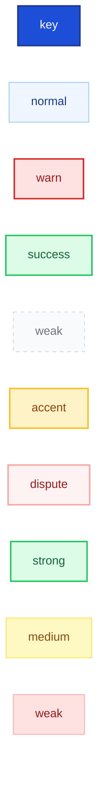
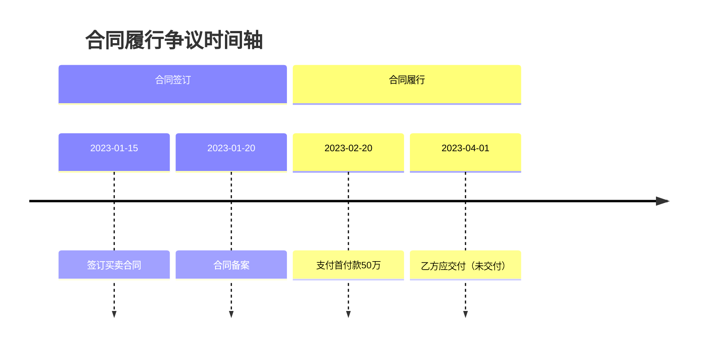

# Mermaid 风格规则（mermaid-style-rules）

## 目录

- [§1 通用代码规范](#1-通用代码规范)
- [§2 节点命名规范](#2-节点命名规范)
- [§3 连线标注规范](#3-连线标注规范)
- [§4 classDef 样式库](#4-classdef-样式库)
- [§5 各类型图表特殊规则](#5-各类型图表特殊规则)
- [§6 常见错误与修复](#6-常见错误与修复)

---

## §1 通用代码规范

### 1.1 代码结构

- 每个节点占一行
- 子图/分组使用缩进（2空格）
- classDef 定义放在代码末尾
- class 声明放在 classDef 之后
- 空行分隔不同逻辑块

### 1.2 语法要求

- 节点ID：英文小写+下划线（如 `company_a`、`event_01`）
- 节点标签：使用方括号 `[]`，内容为中文
- 节点标签长度：≤ 20 字
- 判断节点：使用花括号 `{}`
- 起止节点：使用圆角 `([{...}])`

### 1.3 可渲染性保证

- 不使用 Mermaid 不支持的语法特性
- 不使用特殊字符（`<`、`>`、`&`、`#`）在标签中（使用 HTML 实体替代）
- 不使用过深的嵌套层级（≤ 3 层）
- 确保所有节点ID唯一

---

## §2 节点命名规范

### 2.1 ID命名规则

| 类型 | 前缀 | 示例 |
|------|------|------|
| 主体/人物 | p_ 或 company_ | `company_a`、`p_zhangsan` |
| 事件/步骤 | event_ 或 step_ | `event_01`、`step_review` |
| 证据 | evidence_ 或 ev_ | `ev_01`、`evidence_contract` |
| 争议 | dispute_ 或 d_ | `d_01`、`dispute_breach` |
| 判断 | decision_ 或 dec_ | `dec_complete` |
| 起止 | start / end | `start`、`end` |

### 2.2 标签措辞

| 节点类型 | 标签格式 | 示例 |
|----------|----------|------|
| 主体 | 名称（可加角色） | `甲公司（甲方）` |
| 事件 | 动作+对象 | `签订买卖合同` |
| 证据 | 证据名称+标记 | `买卖合同 📄原件` |
| 步骤 | 动作描述 | `审核材料` |
| 判断 | 条件问句 | `材料是否齐全？` |
| 争议 | 焦点陈述 | `是否构成违约` |

---

## §3 连线标注规范

### 3.1 关系类型标注

| 关系类型 | 标注格式 | 示例 |
|----------|----------|------|
| 合同关系 | `合同类型` | `买卖合同`、`租赁合同` |
| 股权关系 | `持股比例` | `控股80%`、`参股30%` |
| 资金流向 | `资金动作+金额` | `支付50万元`、`代收货款` |
| 代理关系 | `代理类型` | `委托代理`、`法定代表` |
| 证明关系 | `证明程度` | `直接证明`、`间接佐证` |
| 流程方向 | `条件/动作` | `是`、`否`、`退回补充` |

### 3.2 连线样式

| 样式 | 含义 | 语法 |
|------|------|------|
| 实线箭头 | 强关系/必然路径 | `-->` |
| 虚线箭头 | 弱关系/可选路径 | `-.->` |
| 粗线箭头 | 核心关系 | `==>` |
| 双向箭头 | 双向关系 | `<-->` |
| 无箭头线 | 关联/并列 | `---` |

### 3.3 标签简洁规则

- 连线标签 ≤ 10 字
- 使用短语而非完整句子
- 同类关系使用统一措辞

---

## §4 classDef 样式库

### 4.1 语义样式

### 4.2 使用原则

- 同一图表中使用的 classDef 数量 ≤ 6 种
- 每种 classDef 至少有1个节点使用
- 优先使用语义化 classDef 名称而非颜色名

---

## §5 各类型图表特殊规则

### 5.1 timeline 特殊规则

- 使用 `section` 划分阶段
- 时间格式统一（YYYY-MM 或 YYYY-MM-DD）
- 每个事件占一行
- 事件描述简洁（动词+对象）
- 有证据的事件在描述后标注坐标

### 5.2 relation 特殊规则

- 使用 `subgraph` 划分主体群体
- 强关系用实线，弱关系用虚线
- 关系标签放在连线上方
- 同类主体使用相同样式

### 5.3 evidence 特殊规则

- 事实主张在上层，证据在下层
- 使用 evidence-strong / evidence-medium / evidence-weak 样式
- 证明关系用标签区分（直接证明/间接佐证）
- 关联关系用虚线

### 5.4 flow 特殊规则

- 判断节点必须使用 `{}` 菱形
- 起止节点使用 `([{...}])` 圆角
- 分支路径标注条件
- 循环/回退路径用虚线

### 5.5 dispute 特殊规则

- 争议节点居中
- 支撑证据在左/右两侧
- 对方抗辩使用不同样式
- 争议间关联用虚线

### 5.6 matrix 特殊规则

- **输出格式**：Markdown 表格，非 Mermaid
- **列结构**：我方主张 | 对方可能抗辩 | 我方回应策略 | 支撑证据 | 风险等级
- **列宽控制**：每列内容 ≤ 30 字，过长时换行或精简
- **对齐规则**：文本左对齐，风险等级居中
- **风险标注**：🟢 低 / 🟡 中 / 🔴 高，统一放在最右列
- **受众适配**：
  - 法官版：精简为4列（移除"对方可能抗辩"），仅展示主张+策略+证据+风险
  - 客户版：增加"法律依据"列，解释性文字放在表格下方
  - 团队版：增加"备注/版本号"列，支持迭代更新
- **空值处理**：信息不足的单元格标注"（待补充）"或"❓"

### 5.7 data_table 特殊规则

- **输出格式**：Markdown 表格 + 可选文本柱状条
- **数值格式**：金额保留2位小数，百分比保留1位小数
- **对齐规则**：文本左对齐，数值右对齐，百分比居中
- **计算校验**：表格下方必须展示计算校验（各项之和 = 总计）
- **文本柱状条**：长度 = 占比 / 10（取整），使用 `▓` 表示，`░` 补齐至10个字符
  - 示例：占比 65% → `▓▓▓▓▓▓▓░░░`（7个▓ + 3个░）
- **必填列**：项目、金额/数值、计算依据
- **可选列**：占比、证据、可视化、风险
- **受众适配**：
  - 法官版：精简列，突出计算依据和证据
  - 客户版：增加"说明"列，解释计算逻辑
  - 团队版：增加"数据来源"和"更新日期"列
- **空值处理**：缺失数据标注"（待确认）"或"❓"

---

## §6 常见错误与修复

| 错误 | 原因 | 修复方式 |
|------|------|----------|
| 渲染失败：语法错误 | 标签中包含特殊字符 | 使用 HTML 实体（`&lt;` `&gt;` `&amp;`） |
| 节点重叠 | 节点标签过长 | 缩短标签至 ≤ 20 字 |
| 布局混乱 | 缺少方向声明 | 添加 `flowchart LR/TD` |
| 样式不生效 | classDef 拼写错误 | 检查 classDef 和 class 名称匹配 |
| 中文乱码 | 渲染器编码问题 | 确保使用支持中文的渲染环境 |
| 时间轴不分段 | 事件过多 | 使用 section 分阶段 |
| 关系图线条交叉 | 布局方向不当 | 尝试 TD/TB 或调整节点位置 |
