# 图表模板库

## 目录

- [A. 时间轴图模板](#a-时间轴图模板)
- [B. 主体关系图模板](#b-主体关系图模板)
- [C. 证据关联图模板](#c-证据关联图模板)
- [D. 流程图模板](#d-流程图模板)
- [E. 争议链路图模板](#e-争议链路图模板)

---

## A. 时间轴图模板

### A.1 标准时间轴（单阶段）

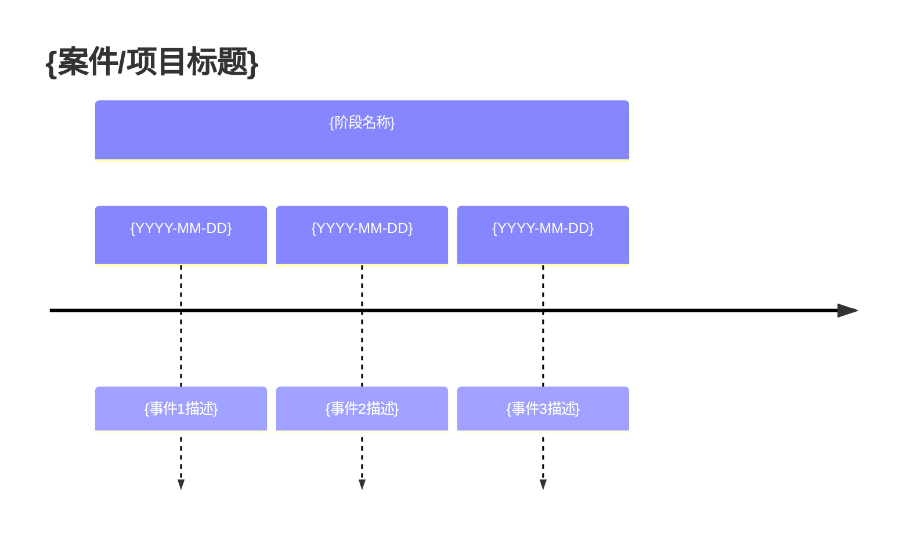

### A.2 多阶段时间轴

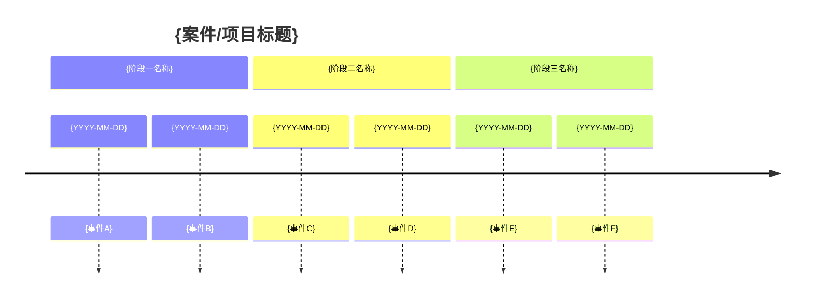

### A.3 含证据锚点的时间轴

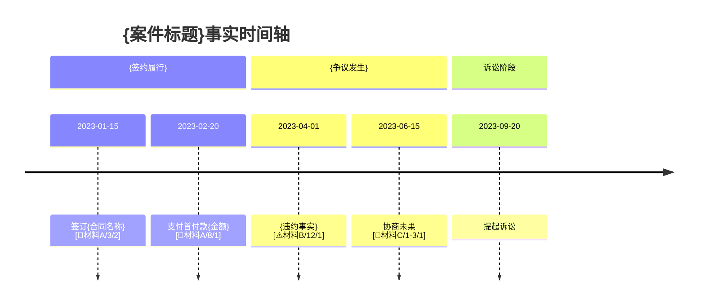

### A.4 含断点标注的时间轴

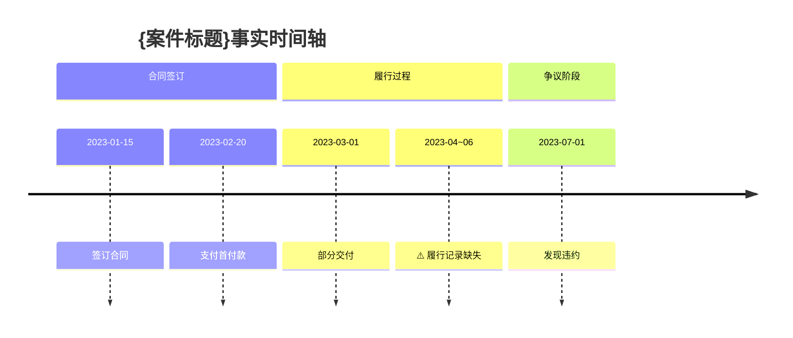

---

## B. 主体关系图模板

### B.1 基础主体关系图

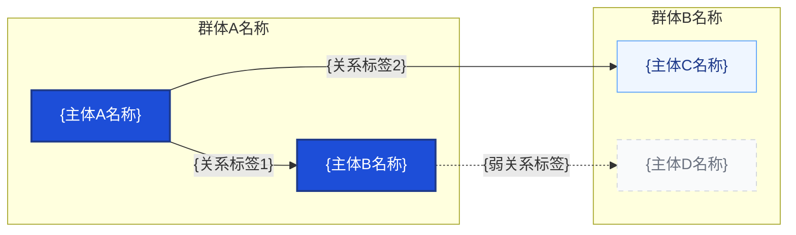

### B.2 股权控制关系图

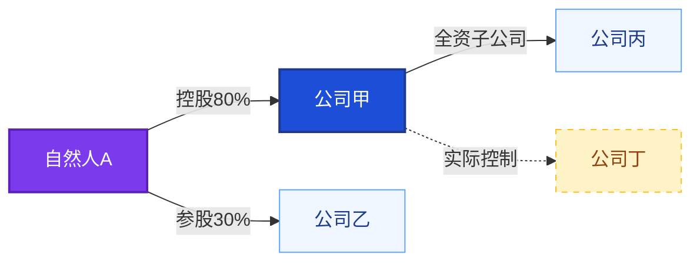

### B.3 交易关系图（含资金流向）

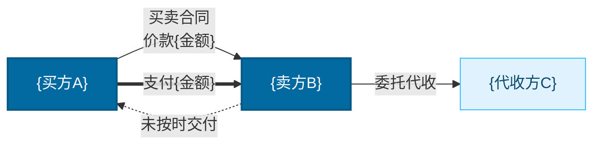

---

## C. 证据关联图模板

### C.1 基础证据关联图

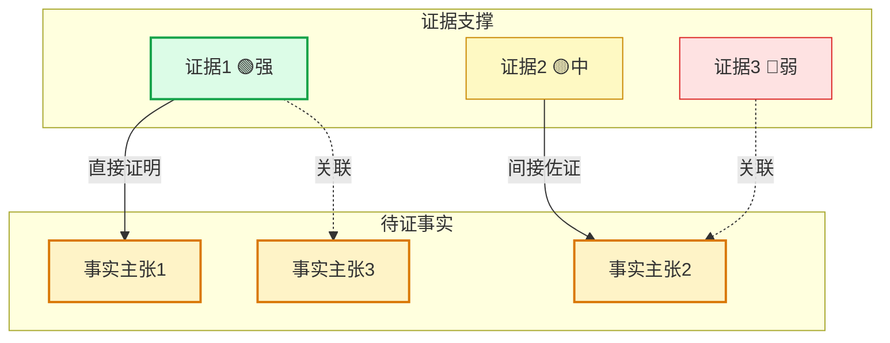

### C.2 含证据缺口标注的证据关联图

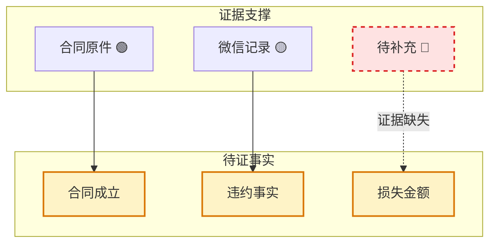

---

## D. 流程图模板

### D.1 基础流程图（含分支）

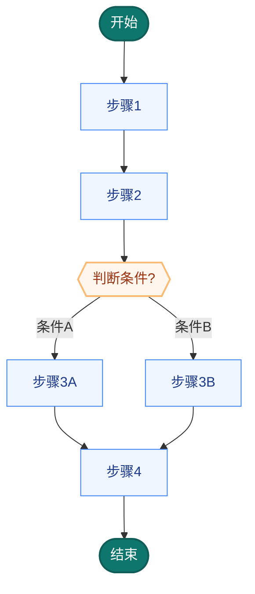

### D.2 含循环的流程图

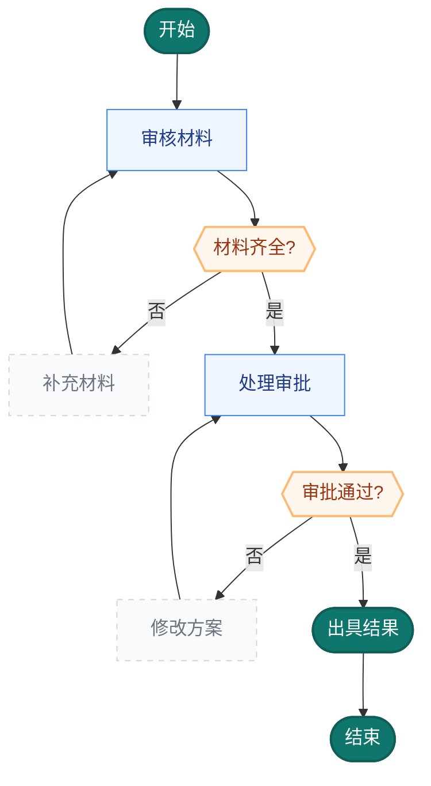

---

## E. 争议链路图模板

### E.1 基础争议链路图

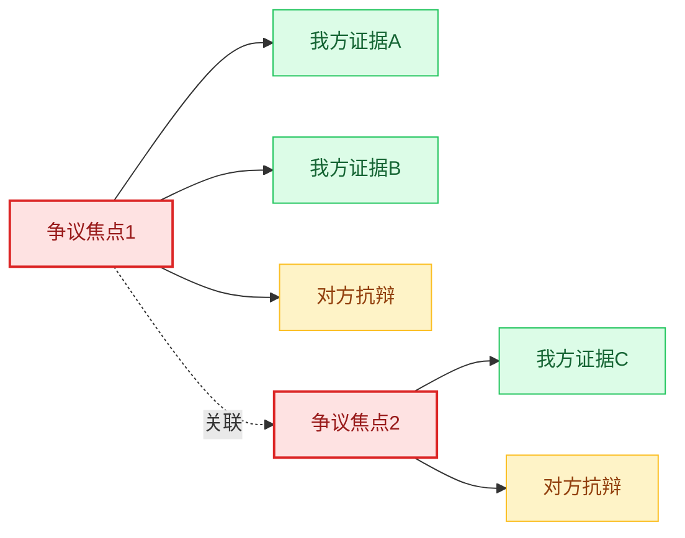

### E.2 含风险标注的争议链路图

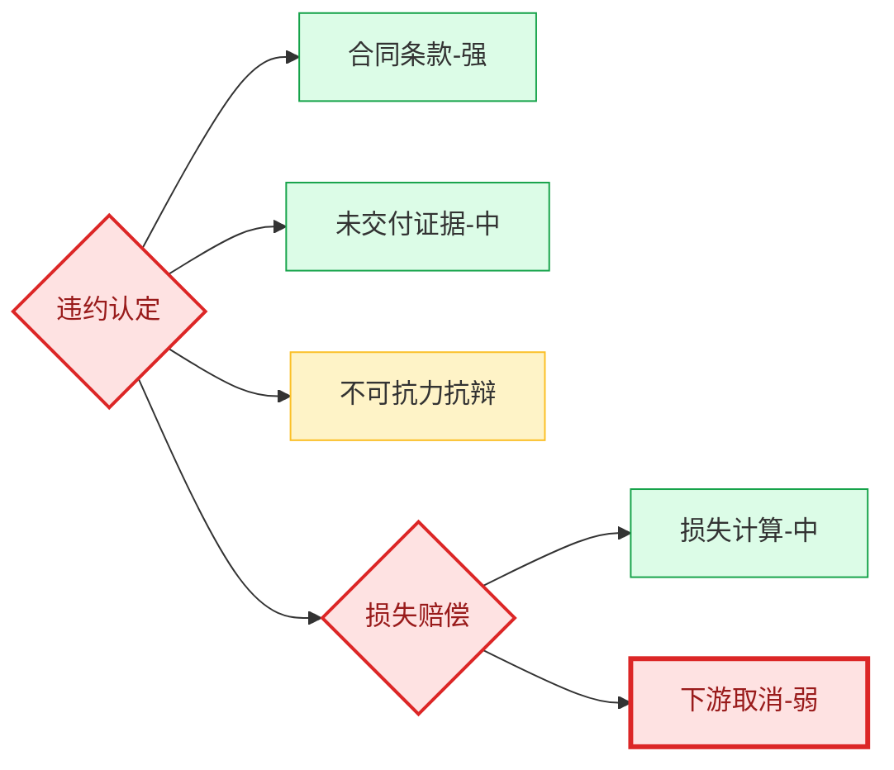

---

## F. 攻防矩阵图模板（Markdown 表格）

### F.1 标准攻防矩阵（5列完整版）

```markdown
### 攻防矩阵：{案件类型}

| 我方主张 | 对方可能抗辩 | 我方回应策略 | 支撑证据 | 风险等级 |
|---------|------------|------------|---------|---------|
| {主张1} | {抗辩1} | {回应策略1} | {证据1} | 🟢 低 |
| {主张2} | {抗辩2} | {回应策略2} | {证据2} | 🟡 中 |
| {主张3} | {抗辩3} | {回应策略3} | {证据3} | 🔴 高 |

**风险等级说明**：🟢 低 = 证据充分/法律明确；🟡 中 = 存在一定争议空间；🔴 高 = 证据薄弱/法律适用不明
```

### F.2 法官版攻防矩阵（4列精简版）

```markdown
### 攻防矩阵：{案件类型}（庭审版）

| 我方主张 | 我方回应策略 | 支撑证据 | 风险等级 |
|---------|------------|---------|---------|
| {主张1} | {回应策略1} | {证据1} | 🟢 |
| {主张2} | {回应策略2} | {证据2} | 🟡 |
| {主张3} | {回应策略3} | {证据3} | 🔴 |
```

### F.3 团队版攻防矩阵（6列扩展版）

```markdown
### 攻防矩阵：{案件类型}（团队工作版）

| 序号 | 我方主张 | 对方可能抗辩 | 我方回应策略 | 支撑证据 | 风险等级 | 备注 |
|------|---------|------------|------------|---------|---------|------|
| 1 | {主张1} | {抗辩1} | {回应策略1} | {证据1} | 🟢 | {备注1} |
| 2 | {主张2} | {抗辩2} | {回应策略2} | {证据2} | 🟡 | {备注2} |
| 3 | {主张3} | {抗辩3} | {回应策略3} | {证据3} | 🔴 | 需补强证据 |
```

---

## G. 数据结构化表模板（Markdown 表格）

### G.1 金额拆解表

```markdown
### {项目名称}金额构成表

| 项目 | 金额（元） | 占比 | 计算依据 | 证据 | 可视化 |
|------|-----------|------|---------|------|--------|
| {项目1} | {金额1} | {占比1}% | {依据1} | {证据1} | ▓▓▓▓▓▓░░░░ |
| {项目2} | {金额2} | {占比2}% | {依据2} | {证据2} | ▓▓▓▓░░░░░░ |
| **合计** | **{总金额}** | **100%** | — | — | ▓▓▓▓▓▓▓▓▓▓ |

> 计算校验：{项目1} + {项目2} = {总金额} ✅
```

### G.2 资金流水表

```markdown
### 资金流水明细表

| 日期 | 方向 | 对方账户 | 金额（元） | 用途/备注 | 证据 |
|------|------|---------|-----------|----------|------|
| {日期1} | 支出 | {账户1} | {金额1} | {用途1} | {证据1} |
| {日期2} | 收入 | {账户2} | {金额2} | {用途2} | {证据2} |
| **合计** | — | — | **{净额}** | — | — |
```

### G.3 损失构成表

```markdown
### 损失构成明细表

| 损失类型 | 直接损失 | 间接损失 | 计算方式 | 证据 | 风险 |
|---------|---------|---------|---------|------|------|
| {类型1} | {金额1} | {金额2} | {方式1} | {证据1} | 🟢 |
| {类型2} | {金额3} | {金额4} | {方式2} | {证据2} | 🟡 |
| **合计** | **{总额}** | **{总额}** | — | — | — |
```

### G.4 比例对比表

```markdown
### {对比主题}比例对比表

| 对比项 | 数值 | 占比 | 对比基准 | 差异 | 可视化 |
|--------|------|------|---------|------|--------|
| {项A} | {数值A} | {占比A}% | {基准} | {差异A} | ▓▓▓▓▓▓▓▓░░ |
| {项B} | {数值B} | {占比B}% | {基准} | {差异B} | ▓▓▓▓░░░░░░ |
```
