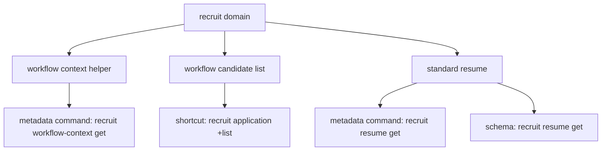

# recruit (v1)

**CRITICAL — 开始前 MUST 先阅读 [`../ihr-shared/SKILL.md`](../ihr-shared/SKILL.md)，其中包含共享运行规则、鉴权配置和 JSON 协议。**

当前随包 `recruit` 当前覆盖 3 个已确认可执行能力：

1. 流程候选人列表查询
2. 标准简历信息查询
3. 公司级 workflow/stage 配置查询

信息采集表能力当前仍处于暂停状态，不在本 Skill 中提供执行入口。

## 核心概念

- **Workflow Context**：公司级 workflow/stage 配置读取能力，用于支撑 C01 的流程发现、名称解析与默认流程确认；这是 metadata-driven API command。
- **Application List**：按流程和阶段查询候选人分页列表；这是手写 `+` shortcut。
- **Standard Resume**：按 `resumeId + applicationId` 读取标准简历；这是 metadata-driven API command，不是 `+resume` shortcut。
- **Workflow Scope**：候选人列表与标准简历都依赖招聘流程上下文与数据权限，`companyId/userId` 不需要手动传入。

## 资源关系



## 快捷指令

| Command | 说明 |
| --- | --- |
| [`ihr-cli recruit workflow-context get`](references/ihr-recruit-workflow.md) | 查询公司级 workflow 与 stage 配置，用于列表查询前确认范围 |
| [`ihr-cli recruit application +list`](references/ihr-recruit-workflow.md) | 查询流程候选人分页列表 |
| [`ihr-cli recruit resume get`](references/ihr-recruit-workflow.md) | 查询标准简历信息；高风险读取，必须显式传 `--yes` |

## Schema

调用前需要确认字段契约、响应边界或 JSON 形态时，先查：

```bash
ihr-cli schema recruit resume get
ihr-cli schema recruit workflow-context get
```

## 使用选择

| 用户意图 | 使用命令 |
| --- | --- |
| 查某个流程某个阶段下的候选人列表 | 先确认 workflow + stage；如果范围未知，先执行 `ihr-cli recruit workflow-context get`，再执行 `ihr-cli recruit application +list` |
| 查某个候选人的更详细资料/标准简历全文 | `ihr-cli recruit resume get --resume-id <id> --application-id <id> --yes` |
| 只想看接口字段和 JSON 契约，不执行请求 | `workflow-context` / `resume get` 可先用 `ihr-cli schema recruit ...`；`application +list` 以当前 reference 与 `--help` 为准 |

## 核心约束

1. `companyId`、`userId`、数据权限范围由 gateway/session 注入，不要作为 flag、JSON 字段或 query 参数传入。
2. `recruit application +list` 才是当前用户侧列表入口；`recruit application list` 只保留为内部 interface meta 身份，不直接执行，也不作为公开 schema 命令承诺。
3. 查询候选人列表前必须先明确“哪个 workflow、哪个 stage”。如果用户没有说明 workflow，可以提示公司常见默认流程 `workflowId=1` 作为候选，但必须先让用户确认；stage 不允许静默默认。
4. 如果用户不知道可选 workflow/stage，应优先执行 `ihr-cli recruit workflow-context get` 获取公司级流程配置，再让用户确认目标流程/阶段，不能擅自猜测。
5. 列表结果只用于摘要浏览与定位 `applicationId/resumeId`；如果用户要更详细的候选人资料，应转到 `recruit resume get` 读取标准简历，而不是把列表结果当成详情接口。
6. `recruit resume get` 是 `riskLevel=HIGH` 的 metadata command；执行时必须显式传 `--yes`，否则会返回 `CONFIRMATION_REQUIRED`。
7. `recruit application +list` 支持 `--json` / `--stdin`，但不能和分项 flags 混用；CLI 用户侧 `--page` 从 `1` 开始，内部会转换成后端 `0` 开始的 `page`。
8. 标准简历和候选人列表都属于敏感招聘数据；默认不要自动连续翻页、不要批量读取简历，也不要根据返回文本再自动扩展查询范围。
9. 不得改用 `candidate/list`、`/2ndparty/api`、raw API、curl/httpie/wget、`ihr-interface` 或自写 HTTP client 绕过当前公开入口。
10. 已知用户意图直接映射到当前 3 个公开命令时，直接执行对应命令；不要先用 `ihr-cli --help | grep ...`、`head`、管道、重定向或其他 shell 组合命令做探测。
11. 如需确认命令形态或字段契约，只允许使用单条命令：
   - `ihr-cli recruit workflow-context get --help`
   - `ihr-cli recruit application +list --help`
   - `ihr-cli recruit resume get --help`
   - `ihr-cli schema recruit ...`
12. 所有 CLI flags 必须使用命令真实暴露的 kebab-case 形式，不要从 JSON 字段名反推 camelCase flags。
13. 对标准简历查询，固定使用：
   - `ihr-cli recruit resume get --resume-id "<resumeId>" --application-id "<applicationId>" --yes`
   不要写成 `--resumeId`、`--applicationId`，也不要遗漏 `--yes`。
14. 如果用户已经明确提供 `applicationId + resumeId`，先直接执行标准简历命令；若后端返回业务异常，只能如实说明阻塞，不要自动改去查候选人列表或扩大查询范围，除非用户继续授权。
15. 如果用户已经给出候选人姓名、手机号、邮箱等可用于定位个人的线索，并且目标范围已限定到某个 workflow/stage，第一次执行 `recruit application +list` 时必须带上对应收窄条件，例如 `--candidate-name`、`--mobile-no` 或 `--email`；不要先查整页或整阶段列表再靠人工浏览定位人。
16. 默认不要自动连续翻页。按姓名/手机号/邮箱定位候选人时，首次列表查询必须保持小分页；如果第一页没有唯一命中，先如实说明未定位到唯一候选人，并请求用户确认是否继续翻页或补充更多线索。
17. 当用户明确要求读取生日、年龄、邮箱、手机号、教育经历等标准简历字段时，这本身就构成对该次详情读取的显式业务授权；在通过列表真实拿到 `applicationId + resumeId` 后，应直接执行 `recruit resume get --yes`，不要再要求用户补 ID，也不要停留在列表层反复翻页浏览。
18. `recruit application +list` 属于敏感招聘列表查询：最终输出不得主动暴露 `resumeBasic.mobileNo`、`resumeBasic.email`、`resumeBasic.birthday`、`resumeBasic.idCardNo`、`resumeBasic.qq`、`resumeBasic.wechat` 等标准简历敏感字段。凡是用户要的目标字段属于标准简历范畴，最终结论必须以 `recruit resume get` 返回值为准。
