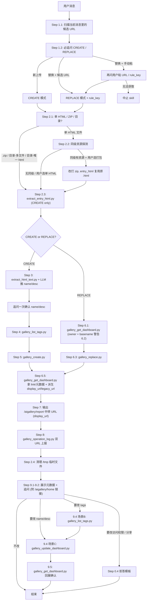

# AI-Gallery 上传 / 替换作品

在 AI-Gallery 创建新作品（CREATE）或替换现有作品的源文件（REPLACE）。所有 HTTP 调用
**只能**走本目录 `scripts/` 下的 Python 脚本，agent 不得自写 `curl` / `wget` /
`requests` 等任何方式直接访问后端。

## 环境变量

- `DATABRAIN_HOST`（可选）：API 入口域名。默认 `https://databrain-global.intlgame.com`，显式设置以显式值为准。
- `DATABRAIN_TOKEN`（必填）：Bearer token。
- `DATABRAIN_DISPLAY_HOST`（可选）：用户访问作品的展示域名，默认 `https://databrain-global.intlgame.com`，仅用于拼接最终访问 URL（不发请求）。

> 所有接口（Gallery `/api/ai-gallery/*` + 埋点 `/api/v1/*`）共享同一 host，
> 脚本中无独立 host 旁路。

所有脚本统一从这几个环境变量取值，agent 不需要在命令行重复传 host / token；
缺 `DATABRAIN_TOKEN` 时脚本会以 exit 2 报错。

## Step -1：初始化 `${SKILL_DIR}`（执行任何脚本前必须先做）

本 skill 设计为**可独立安装、可被复制到任意位置**。所有脚本调用都用
`${SKILL_DIR}/scripts/<name>.py` 表达，agent 第一次进入本 skill 时必须先把
`SKILL_DIR` 解析为本 SKILL.md 文件**所在目录的绝对路径**，之后整条会话内复用。

### -1.1 已设环境变量时直接用

如果 shell 环境变量 `SKILL_DIR` 已经存在且指向一个含 `SKILL.md` + `scripts/`
的目录 → 直接用，跳过 -1.2。

### -1.2 自动探测（按下面顺序取第一个命中）

```bash
candidates=(
  "${PWD}/.cursor/skills/databrain-ai-gallery-upload/global"   # 项目级安装（当前 workspace · global）
  "${HOME}/.cursor/skills/databrain-ai-gallery-upload/global"  # 用户级安装（global）
)
SKILL_DIR=""
for c in "${candidates[@]}"; do
  if [ -f "${c}/SKILL.md" ] && [ -d "${c}/scripts" ]; then
    SKILL_DIR="${c}"
    break
  fi
done
export SKILL_DIR
echo "SKILL_DIR=${SKILL_DIR}"
```

### -1.3 兜底：让用户告知

如果 -1.2 两个候选都不命中（例如 skill 被复制到自定义路径）→ 追问用户：

```
未能在标准位置定位到本 skill，请提供本 SKILL.md 文件所在目录的绝对路径
（应包含 SKILL.md 与 scripts/ 子目录）：
```

拿到路径后：

```bash
export SKILL_DIR="<用户给的路径>"
[ -f "${SKILL_DIR}/SKILL.md" ] && [ -d "${SKILL_DIR}/scripts" ] || {
  echo "SKILL_DIR 无效（缺 SKILL.md 或 scripts/）" >&2; exit 2;
}
```

### -1.4 后续命令统一写法

所有脚本调用一律：

```bash
python "${SKILL_DIR}/scripts/<name>.py" <flags...>
```

Cursor 在同一会话内 shell 是 stateful 的，`export SKILL_DIR` 后续命令可见。
本 SKILL.md 之后所有示例命令都按这个约定写，agent 不要再贴 `.cursor/skills/...`
形式的硬编码路径。

## Step 0：硬约束（执行任何脚本前必须满足）

本 skill 的所有网络调用 **必须** 走 `scripts/` 下的 Python 脚本。脚本的 CLI 签名
本身就是字段白名单：危险字段（如访问权限相关）**物理上不存在**于任何脚本入参，
通过脚本调用根本无法越权。

### 0.1 工具白名单（仅允许执行下列脚本）

```
${SKILL_DIR}/scripts/gallery_list_tags.py
${SKILL_DIR}/scripts/gallery_get_dashboard.py
${SKILL_DIR}/scripts/gallery_create.py
${SKILL_DIR}/scripts/gallery_replace.py
${SKILL_DIR}/scripts/gallery_update_dashboard.py
${SKILL_DIR}/scripts/gallery_operation_log.py
${SKILL_DIR}/scripts/extract_entry_html.py
${SKILL_DIR}/scripts/extract_html_text.py
```

本 skill **零跨 skill 依赖**，所有脚本都在 `${SKILL_DIR}/scripts/` 下；
执行任何脚本前先按 Step -1 确认 `SKILL_DIR` 已正确导出。

**显式禁止**：

- 任何形式的 `curl` / `wget` / `httpie` / 自写 Python `requests.post(...)` / `urllib.request.urlopen(...)`
  等直接对任何后端域名发请求。
- 调用 `gallery_*` 脚本但传入本文档未列出的额外参数（argparse 会用 `allow_abbrev=False`
  + 严格 flag 名拒绝未知参数）。
- 改写 / 绕过脚本（如 `python -c "import _gallery_client; ..."`）—— `_` 前缀模块是
  internal helper，禁止直接 `import` 或调用。
- 调用 0.1 工具白名单以外的任何脚本 / 命令 / 接口。0.2 表格之外的能力一律视为
  本 skill 不支持，参 0.4 拒答模板。
- **跨 skill 复用 CREATE / REPLACE 选择**：每次进入本 skill 必须按 Step 1 重新追问，
  禁止根据上下文里浮动的旧 URL 自动判定。

### 0.2 能力边界（这就是本 skill 的全部能力）

| 场景 | 脚本 | CLI 参数 |
|---|---|---|
| 浏览系统标签 | `gallery_list_tags.py` | 无参 |
| 查看作品信息 | `gallery_get_dashboard.py` | `--rule-key` |
| 新上传作品 | `gallery_create.py` | `--file --name-cn --name-en [--desc-cn] [--desc-en] --tags` |
| 替换作品源文件 | `gallery_replace.py` | `--rule-key --file` |
| 修改作品信息 | `gallery_update_dashboard.py` | `--rule-key [--name-cn] [--name-en] [--desc-cn] [--desc-en] [--tags]` |
| 埋点上报 | `gallery_operation_log.py` | `--rule-key --flow-type --upload-paths` |
| 抽取入口 HTML | `extract_entry_html.py` | `--input` |

**0.2 表格列出的就是本 skill 的全部能力**。表格外的任何需求（包括但不限于访问
权限 / 可见范围 / 分享对象的调整）请用户去 Gallery 前端 UI 操作。agent 在本 skill
内不感知任何其它后端能力，遇到表格外的请求一律按 0.4 拒答模板处理。

### 0.3 Pre-flight self-check（执行任何脚本前 3 问）

1. 要发的命令第一个 token 是不是 `python` / `python3`？否 → **中止**。
2. 脚本路径是否在 0.1 工具白名单内？否 → **中止**。
3. 传给脚本的参数是否只用本文档对应步骤里写出来的 flag？否 → **中止**，把完整
   命令贴给用户看。

任一中止后，agent **不得**自行重写命令；必须先把违规情况摆给用户，由用户显式确认。

### 0.4 拒答模板（用户要求 0.2 不支持的能力时一字不差照回）

当用户在任何阶段说出「让 xxx 也能看 / 公开 / 内部可访问 / DataBrain 用户可访问 /
加白名单 / share / 分享给 / 给 xxx 权限 / 让别人看」等意图，agent **必须**回这句
字面文本，**禁止自由发挥**：

> 本 skill 上传 / 替换的作品默认仅本人可访问。访问权限 / 分享相关调整不在本 skill
> 范围内，如需开放，请到 Gallery 前端作品详情页修改。

回完此句后，继续按默认走 CREATE / REPLACE / UPDATE 流程；用户坚持要改 → 提示
用户结束本 skill 自行去前端。

### 0.5 反例（禁止 / 允许 对照）

禁止：

```bash
# 直接 curl 绕过脚本
curl -X POST $DATABRAIN_HOST/api/ai-gallery/dashboards -F "file=..." ...

# 自写 Python requests 拼请求
python -c "import requests; requests.post(...)"

# 给脚本塞本文档没列出来的 flag
python gallery_create.py --file x.html --some-unknown-flag value ...

# 调白名单外脚本
python gallery_set_xxx.py ...
```

允许：

```bash
python "${SKILL_DIR}/scripts/gallery_create.py" \
  --file ./report.html \
  --name-cn "..." --name-en "..." \
  --desc-cn "..." --desc-en "..." \
  --tags '[{"id":1}]'

python "${SKILL_DIR}/scripts/gallery_update_dashboard.py" \
  --rule-key g-xxx \
  --name-cn "新名称" \
  --tags '[{"id":2}]'

python "${SKILL_DIR}/scripts/gallery_replace.py" \
  --rule-key g-xxx --file ./new.html
```

### 0.6 局限性自述

- 脚本封装把 0.2 列出的能力以外的所有动作**物理上挡在外面**——脚本 CLI 不存在
  对应 flag。
- 仍存在的软约束部分：用户用自然语言直接指挥 agent 写新 Python / curl 这条路径
  靠 0.3 自检 + 0.4 拒答模板防住；不能 100% 杜绝。

## Step 1：解析用户意图（CREATE vs REPLACE，每次必追问）

> **铁律**：每次进入本 skill，无论上下文里出现过多少 URL 或之前对话里用户表达过
> 什么意图，agent **必须**在动手前先追问用户一次本次的操作类型。不允许复用历史
> 选择直接进 REPLACE。

### 1.1 扫描候选 URL（仅作参考，不作判定）

在**当前用户消息**（即触发本次 skill 的那条消息）里识别两种 URL 形态，抽出所有
`(url, rule_key)` 对：

- **旧形态（直访）**：正则 `(?:https?://[^/\s]+)?/as/report/([^/\s]+)/[^\s]*`，捕获组 1 即为 `rule_key`。
- **新形态（前端 `/aigallery/report` 中转页）**：正则
  `(?:https?://[^/\s]+)?/aigallery/report\?[^\s]*?\bpath=([^&\s]+)`，捕获组 1 是
  URL 编码的 path（形如 `%2Fas%2Freport%2Fg-xxx%2F...`）。agent 先把 `%XX` 序列
  还原为对应字符（典型 `%2F` → `/`），再对解码结果套用旧形态正则提 `rule_key`。

注意：

- 只扫"当前消息"，**不**扫之前的对话历史。如果用户本次没主动贴 URL → 候选列表为空。
- 找到的 URL 仅作"候选展示"，不直接进入 REPLACE。
- assistant 自己之前生成的输出里包含的 URL（例如同一会话里前一次 CREATE 后展示
  的访问 URL）**严格不采信**——只看当前用户消息纯文本。

### 1.2 强制追问

用单选题向用户追问一次（选项按 1.1 扫到的候选 URL 动态生成）：

```
本次是新上传，还是替换某条已上传作品的源文件？
[ ] 新上传作品（CREATE）
[ ] 替换：<候选 URL 1，若有>
[ ] 替换：<候选 URL 2，若有>
[ ] 替换：其它 URL（让我手动粘 URL / rule_key）
```

- 候选 URL 列表来自 1.1；没候选则只展示「新上传」+「替换：手动粘」两项。
- 用户选 REPLACE 但选「其它 URL」→ 让用户粘 URL / rule_key；agent **同样套用 1.1
  里的两套正则**（旧形态 `/as/report/<key>/...` 直接拿 `rule_key`；新形态
  `/aigallery/report?path=<encoded>...` 先把 `path` 参数做 URL 解码再二次提
  `rule_key`）；两套均不命中且**也不是**纯 `g-` 形态 rule_key 字符串 →
  提示用户检查格式并允许**最多重试 1 次**；二次失败 → 中止 skill。
- 用户选 CREATE → 进入 Step 2 → Step 3 → Step 4 → Step 5 → Step 6.5 → ...
- 用户选 REPLACE + 具体 URL → 抽 `rule_key` 后进入 Step 2 → Step 6 → Step 6.5 → ...

**agent 在本次 skill 内部记录 `flow_type` 状态**（CREATE → `flow_type=create`，
REPLACE → `flow_type=replace`），后续 Step 8 operationLog 要用。

### 1.3 不缓存选择

本次 skill 完成 / 用户结束后，agent **不得**在记忆 / 上下文里写下"用户偏好
REPLACE / CREATE"之类的痕迹。下次再触发本 skill 时**从头再问**一遍 1.2。

## Step 2：识别本地输入类型（CREATE / REPLACE 共用）

判定用户给的本地路径，输出本次要上传的 `file_path`（以及 CREATE 流程下用于
AI 推断元数据的 `entry_html_path`）。

### 2.1 主判定分支

| 用户输入 | 处理 | `file_path` |
|---|---|---|
| `.html` / `.htm` 文件 | single HTML，**进入 2.2 同级资源探测** | `<用户路径>` |
| `.zip` 文件 | package（跳过本地校验，服务端校验） | `<用户路径>` |
| 目录，**剔除 `__MACOSX/` `.DS_Store` 后总文件数 == 1 且是 `.html`** | single HTML，跳过 2.2 | 该 `.html` 路径 |
| 目录，含其它非 html 资源 / 多个 html | 打 ZIP 到 `/tmp/upload_<random>.zip`，跳过 2.2 | 临时 zip 路径 |
| 目录，无任何 `.html` | 中止报错 | — |
| 其它扩展名 / 不存在的路径 | 中止报错 | — |

目录打包命令：

```bash
random_id=$(python3 -c "import random,string; print(''.join(random.choices(string.ascii_lowercase+string.digits,k=8)))")
file_path="/tmp/upload_${random_id}.zip"
(cd "${user_dir}" && zip -q -r "${file_path}" . -x '__MACOSX/*' -x '.DS_Store')
```

### 2.2 单 HTML 同级资源探测（仅 2.1 走 single HTML 分支 + 路径是 `.html` 文件时触发）

防 footgun：用户经常拖一个 `index.html` 进来，实际上同级目录还有 `style.css` /
`app.js` / `assets/` 等被该 HTML 引用的资源 → 直接当单 HTML 上传后访问时 404。

判定（只看 `dirname` 的第一层，不递归）：

```bash
parent_dir=$(dirname "${file_path}")
sibling_count=$(ls -A "${parent_dir}" \
  | grep -v -F -x "$(basename "${file_path}")" \
  | grep -v -F -x '__MACOSX' \
  | grep -v -F -x '.DS_Store' \
  | wc -l \
  | tr -d ' ')
```

`sibling_count > 0` → 展示 warning + 追问一次：

```
检测到 ${file_path} 同级目录还有 ${sibling_count} 项（如 css / js / 图片 / 子目录），
当前会按【单 HTML】上传，这些资源不会被携带。
是否改为打包整个目录 ${parent_dir} 上传？
[ ] 改为打包整个目录上传（推荐：避免引用断链）
[ ] 继续按单 HTML 上传（HTML 自含，不依赖同级资源）
```

- 用户选「改为打包」→ 按 2.1 目录分支的打包逻辑执行：`file_path` 切换为
  `/tmp/upload_<random>.zip`（zip 整个 `parent_dir`）；同时**记住用户原始的那个
  `.html` 路径**作为 `entry_html_path`，Step 3 直接用它，**不再调**
  `extract_entry_html.py`（避免 zip 解包后挑错入口）。
- 用户选「继续按单 HTML」/ 不明确回复 → 保留 `file_path = <原 .html 路径>`，
  按单 HTML 流程走。
- 探测命令本身失败（如目录权限）→ 静默跳过 2.2，按 2.1 结果继续，不阻塞主流程。

### 2.3 入口 HTML 抽取（仅 CREATE 流程需要，用于 Step 3 推断 name/desc）

若 2.2 已经设置了 `entry_html_path`（用户从单 HTML 升级到打包目录的情况）→
**直接复用，跳过此步**。

否则按 `file_path` 类型抽取：

```bash
entry_html_path=$(python "${SKILL_DIR}/scripts/extract_entry_html.py" --input "${file_path}")
```

脚本行为：

- `.html` / `.htm` → 直接回显路径。
- `.zip` → 列 entries 过滤 `__MACOSX/` `.DS_Store`，按 `(层级浅, index.html 优先, 路径短)`
  顺序取第一个 `.html?` 解到 `/tmp/extract_entry_<random>.html`，回显临时路径。
- 目录 → `os.walk` 同样规则取第一个 `.html?`，回显原始路径（不复制）。

REPLACE 流程不需要这一步，直接跳到 Step 6。

### 2.4 临时文件清理

流程末尾（**Step 8 operationLog 上报之后、Step 9 追问之前**）统一清理：

```bash
rm -f /tmp/upload_*.zip /tmp/extract_entry_*.html
```

## Step 3：HTML 元数据 AI 推断（CREATE 专属）

1. 入口 HTML 路径由 Step 2 的 `entry_html_path` 提供。
2. 调用：

   ```bash
   python "${SKILL_DIR}/scripts/extract_html_text.py" "${entry_html_path}"
   ```

   stdout 第 1 行是 `<title>` 文本，第 2 行起是正文，总长度 ≤ 4KB。

3. **agent 内部**根据 title + 正文推断 4 个字段（不走脚本）。

   ### 3.1 字段长度硬限（后端 `class-validator @MaxLength`，超 1 个字符直接 400）

   | 字段 | 上限 | 内容指引 |
   |---|---|---|
   | `name_cn` | **≤ 40** | 中文表达，避免营销话术 |
   | `name_en` | **≤ 60** | Title Case，避免无意义堆砌 |
   | `desc_cn` | **≤ 200** | 一句话概括，不分段、不堆 emoji |
   | `desc_en` | **≤ 300** | 与 `desc_cn` 语义对齐，**英文容易超**，特别留意 |

   ### 3.2 字符计数算法 + safety buffer

   - 后端用 JavaScript `String.prototype.length`（UTF-16 code unit 数，emoji 占 2 个、中文占 1 个）。
   - agent 估算时按 **Python `len(s)` 等价 = code point 数（emoji 算 1）**；
     **混入 emoji / 罕见辅助平面字符时实际可能超后端硬限**。
   - 为安全起见，**采用 ~10% safety buffer 自我设限**：
     - `name_cn` 目标 ≤ 36（硬限 40）
     - `name_en` 目标 ≤ 54（硬限 60）
     - `desc_cn` 目标 ≤ 180（硬限 200）
     - `desc_en` 目标 ≤ 270（硬限 300）
   - **agent 生成后必须自检长度**；超出目标值 → 主动截断/改写到目标范围内，
     **不要原样送出去赌后端宽容**。

   ### 3.3 强制自检步骤（生成 → 检查 → 超限就改写，再展示）

   1. 第一稿生成 4 个字段。
   2. 对每个字段计算字符数（Python `len(s)`）。
   3. 若任一字段 > 3.2 表里的"目标值"：
      - **优先改写而非粗暴 cut**：去掉冗余形容词 / 长定语，保留核心语义。
      - 不行再从尾部截断到目标值并补 `…`。
   4. 改写后再次自检；仍超 → 继续压缩，直到全部 ≤ 目标值。
   5. **不允许把超限稿直接展示给用户**——用户可能直接「OK」就送出去触发后端 400。

4. 展示推断结果给用户，**追问一次**：

   > 我从 HTML 里推出来这 4 个字段（已按长度限制压缩到目标范围内）：
   > name_cn=「...」(N/40) / name_en=「...」(N/60) /
   > desc_cn=「...」(N/200) / desc_en=「...」(N/300)。
   > 直接用还是给一份修改稿？

   每个字段后**括号里附实际字符数 / 硬限**，方便用户直观感知。

   - 用户回「OK / 直接用 / 沉默」→ 用推断稿。
   - 给修订稿 → 用修订稿，但 agent **仍要对修订稿做一次 3.3 自检**；
     用户给的修订稿超限时不要静默上传，要把超限字段提示给用户改短，**最多重试 1 次**；
     仍超 → 截断后告知用户已截断。

5. 抽取失败兜底：`extract_html_text.py` 返回非 0 或 title + 正文 < 100 字符 →
   不推断，让用户手填 4 个字段；手填时同样按 3.2 / 3.3 校验。

## Step 4：tag 选择（CREATE 专属）

```bash
python "${SKILL_DIR}/scripts/gallery_list_tags.py"
```

输出 JSON 含 `items[]`，每项 `{ id, name_cn, name_en, type, is_mine, count }`。

1. agent 按可读表展示给用户，把 `is_mine=true` 的自建标签拉前面便于复用。
2. 让用户选 1-5 个 id（**后端要求至少 1 个、最多 5 个**）。
3. 用户表示不想选 / 选了 0 个 → 告知后端硬约束，并 agent **主动建议**最贴近
   HTML 内容的 tag（用 Step 3 拿到的 title + 正文做匹配）。用户确认后继续。
4. 把用户选定的 id 列表拼成 JSON 字符串：

   ```
   tags_json='[{"id":1},{"id":3}]'
   ```

   作为 `--tags` 参数传给 Step 5。

## Step 5：上传（CREATE 路径）

- 用户若提到「DataBrain 用户可访问 / 完全公开 / 给 xxx 权限 / 让 xxx 也能看」
  等意图 → 按 **Step 0.4 拒答模板**字面回复，仍按默认流程上传。
- 调脚本：

  ```bash
  python "${SKILL_DIR}/scripts/gallery_create.py" \
    --file "${file_path}" \
    --name-cn "${name_cn}" --name-en "${name_en}" \
    --desc-cn "${desc_cn}" --desc-en "${desc_en}" \
    --tags "${tags_json}"
  ```

  `--desc-cn` / `--desc-en` 若用户没填，省略对应 flag 即可（不要传空串）。

- 脚本 stdout 解析：
  - `ok: true` → 拿 `rule_key`，进入 **Step 6.5 合并节点**。
  - `ok: false` → 把 `code` / `msg` / `errors` / `detail` 原文透回用户后中止。

## Step 6：替换（REPLACE 路径）

### 6.1 owner 预检

```bash
python "${SKILL_DIR}/scripts/gallery_get_dashboard.py" --rule-key "${rule_key}"
```

解析输出：

- `ok: false` → 透出错误中止（404 / 403 等）。
- `ok: true` 且 `is_mine == true` → 通过。
- `ok: true` 但 `is_mine == false` → 中止「非 owner，无权替换」。

### 6.2 单 HTML 文件名提示

仅当本次上传是单 HTML 模式触发：从 6.1 输出的 `link` 拆 basename
（`/as/report/<key>/<html_path>` 末段）。与用户上传 HTML 文件名比对：

- 不同 → 展示警告并**追问一次**：

  > Gallery 替换接口会强制按旧文件名 `<old>` 落盘，你提交的 `<new>` 不会
  > 出现在访问 URL 中。是否继续？

  用户明确拒绝才中止；其它回复（含「继续」/「OK」/沉默）按继续处理。

### 6.3 执行替换

```bash
python "${SKILL_DIR}/scripts/gallery_replace.py" \
  --rule-key "${rule_key}" --file "${file_path}"
```

- `ok: false` → 错误原文透出（`source_mode_mismatch` / `invalid_zip_entry` /
  `backup_partial_failure` 等）。
- `ok: true` → 记下 `backup_path` 等响应字段，进入 **Step 6.5 合并节点**。

### 6.4 范围声明

REPLACE 流程 **不做** Step 3 AI 推断 / Step 4 tag 选择（与「只替换文件」语义对齐）。
如果用户在替换后想改 name / desc / tags，统一收口在 Step 9 追问环节。

## Step 6.5：GET 详情拿 link（CREATE / REPLACE 都必须执行）

这是 CREATE / REPLACE 两路的**强制合并节点**：

- **CREATE 路径**下，`gallery_create.py` 的输出**只有** `rule_key` / `id`，没有
  `link`，必须再 GET 一次才能拼 Step 7 的访问 URL。
- **REPLACE 路径**下，虽然 6.1 已 GET 过一次，但 replace 之后 `link` /
  `html_files` 可能变化（例如单 HTML 重命名），**必须再 GET 一次**以拿最新值。

```bash
python "${SKILL_DIR}/scripts/gallery_get_dashboard.py" --rule-key "${rule_key}"
```

记下输出的 `link` / `name_cn` / `name_en` / `desc_cn` / `desc_en` / `tags`，**以及
脚本派生的 `display_url` / `legacy_url` 两个字段**：

- `display_url` = `${DATABRAIN_DISPLAY_HOST}/aigallery/report?path=<encoded link>&name=<encoded name>`，
  对齐前端 `encodeURIComponent` 编码风格，是 Step 7 展示给用户的访问地址。
- `legacy_url` = `${DATABRAIN_DISPLAY_HOST}${link}`，旧形态直访 URL，供 Step 8
  operationLog 双上报。

这份缓存同时支撑 Step 7 / Step 8 / Step 9，**不要再让 agent 自己手工拼 URL**——
脚本已经做好编码（safe 字符集对齐前端 `encodeURIComponent`），手工拼容易遗漏 `path`
里 `/` → `%2F`、`name` 里空格 → `%20` 等细节，导致与前端 UI 字面不一致。

## Step 7：输出访问地址

- 直接用 Step 6.5 缓存的 `display_url` 字面展示给用户（已是完整 URL，前端
  `/aigallery/report` 中转页形态，括号 / 单引号等字符严格保留字面，与浏览器地址栏
  一致）。**不要**自己用 `${HOST}${link}` 之类公式手工拼，避免编码风格漂移。
- 单 HTML / ZIP 都只展示主入口（`link` 即主入口；用户问其它入口让 ta 去
  Gallery 详情页看）。
- REPLACE 模式额外展示 `backup_path`（旧版本备份位置，可忽略）。

样例输出（注意 `(002878.SZ)` 等括号保留字面，对齐前端 `encodeURIComponent` 行为）：

```
上传成功，访问地址：
- https://databrain-global.intlgame.com/aigallery/report?path=%2Fas%2Freport%2Fg-xxx%2Fyuanlongyatu_report.html&name=Yuanlong%20Yatu%20(002878.SZ)%20Recent%20Performance%20Snapshot

访问权限：仅本人可访问。如需开放，请到 Gallery 前端作品详情页修改。
```

REPLACE 模式追加一行：

```
旧版本已由后端自动备份，无需手工处理。
```

## Step 8：上报 operationLog（CREATE / REPLACE 共用，非关键路径）

```bash
python "${SKILL_DIR}/scripts/gallery_operation_log.py" \
  --rule-key "${rule_key}" \
  --flow-type "${flow_type}" \
  --upload-paths "${upload_paths_json}"
```

- `flow_type` 在 CREATE 流程里设 `create`，REPLACE 流程里设 `replace`（脚本
  argparse `choices` 强约束）。
- `upload_paths_json` 同时上报 Step 6.5 缓存的 `display_url`（新中转 URL）与
  `legacy_url`（旧直访 URL）两条 —— **新 URL 在前、旧 URL 在后**：

  ```
  upload_paths_json='["<display_url>","<legacy_url>"]'
  ```

  双 URL 上报的目的：让前端用户实际打开的链接（新中转页）和下游历史埋点统计对
  `/as/report/` 前缀的识别同时可用，避免切换 URL 形态后老的报表统计断流。

- 脚本失败一律 exit 0（非关键），SKILL.md 不显式处理。

Step 8 结束后按 Step 2.4 清理临时文件：

```bash
rm -f /tmp/upload_*.zip /tmp/extract_entry_*.html
```

## Step 9：上传 / 替换后追问改报表信息（仅 name / desc / tags）

### 9.1 展示当前元数据

用 Step 6.5 缓存的字段展示给用户，**仅展示** `name_cn` / `name_en` / `desc_cn` /
`desc_en` / `tags` 5 项。脚本输出只有这些字段，agent 在此环节看不到其它字段，
也不应展示给用户。

### 9.2 追问一次

> 是否需要修改报表信息（名称 / 描述 / 标签）？
> 也可以直接到 Gallery 首页编辑：`${DATABRAIN_DISPLAY_HOST:-https://databrain-global.intlgame.com}/aigallery/home`

附 Gallery 首页链接是给用户一条 UI 出口（找到对应作品后在前端直接改）；host 严格
走 `DATABRAIN_DISPLAY_HOST`，pre / 生产环境自动对齐，与 Step 7 / Step 8 同一份变量。
该链接不涉及编码、与 `rule_key` 无关，agent 按上式字面拼即可，**不需要**调任何脚本。

### 9.3 用户回「不用」/「没问题」/明确拒绝

流程结束，不再追问。

### 9.4 用户表达修改意图

- **场景 A：用户提到访问权限 / 分享 / 让别人看 / 加白名单等** → 按 **Step 0.4
  拒答模板**字面回复，并请用户去 Gallery 前端，**不调** update 脚本。

- **场景 B：用户要改 tags**：

  - 先调一次 `gallery_list_tags.py` 把可选 tag 列出给用户（用户记不住 id 是常态，
    REPLACE 流程下用户甚至从未在本次 skill 里见过 tag 列表）：

    ```bash
    python "${SKILL_DIR}/scripts/gallery_list_tags.py"
    ```

  - 让用户给一个新 id 列表（**1-5 个**）；后端要求至少 1 个、最多 5 个，给
    `tags=[]` 会被 40001 拒绝。如用户明确要清空 tag，告知该后端限制并请用户给
    至少 1 个 id。
  - 把 id 列表拼成 JSON `[{"id":<int>}, ...]`，作为 `--tags` 传给下面的 update 调用。

- **场景 C：用户改 name / desc**：直接收集用户给的新值。
  **每个字段都要按 Step 3.2 / 3.3 自检长度上限**（name_cn ≤ 40 / name_en ≤ 60 /
  desc_cn ≤ 200 / desc_en ≤ 300）：超限不要静默送上去触发后端 400，
  先提示用户压缩，最多重试 1 次后由 agent 截断处理。

收集完毕后：

```bash
python "${SKILL_DIR}/scripts/gallery_update_dashboard.py" \
  --rule-key "${rule_key}" \
  --name-cn "${new_name_cn}" \
  --name-en "${new_name_en}" \
  --desc-cn "${new_desc_cn}" \
  --desc-en "${new_desc_en}" \
  --tags "${new_tags_json}"
```

**仅传用户明确改的字段**，其它 flag 省略。脚本 CLI 没有其它 flag。

### 9.5 回展确认

`ok: true` 后再调一次 `gallery_get_dashboard.py` 拿最新值回展给用户：

```bash
python "${SKILL_DIR}/scripts/gallery_get_dashboard.py" --rule-key "${rule_key}"
```

`ok: false` → 错误原文透出，**不再二次追问**。

### 9.6 不主动猜

用户没明确需求 → 不主动猜测要改什么；只在用户回复里明确的字段动手。

## Step 10：错误码 / exit code 速查

脚本退出码（所有脚本统一）：

| exit | 含义 |
|---|---|
| 0 | 成功（含 `gallery_operation_log.py` 静默失败） |
| 1 | 后端业务错误（透出 `code` + `msg` + `errors` + `detail`） |
| 2 | 入参错误 / 本地预检失败（缺 token、文件 > 50MB、MIME 不支持、找不到入口 HTML、`gallery_update_dashboard.py` 啥也没改 等） |

后端业务错误码：

| code | 含义 / 处理 |
|---|---|
| 40001 | 参数校验失败（`tags` 长度 1-5、文件类型、字符串长度超限等）→ 透出 `errors[]` / `message` |
| 40101 | 鉴权失败 → 提示用户重新拿 token |
| 40301 / 40302 | 无权访问该作品 → 中止 |
| 40401 | dashboard 不存在 → 中止 |
| 400 | DTO 字段级校验失败（NestJS 默认信封，msg 形如 `"desc_en must be shorter than or equal to 300 characters"`）→ **大概率是 Step 3 长度自检漏了**，按 Step 3.2 / 3.3 改短后重试；不要重复发同样的请求 |
| `source_mode_mismatch` | 单 HTML 上传到 ZIP dashboard（反之），按 `detail` / `errors[0].msg` 原样展示 |
| `invalid_zip_entry` | ZIP entry 含非法路径 → 原样展示 |
| `backup_partial_failure` | 文件备份阶段失败 → 原样展示 |

脚本 stdout 失败行示例：

```json
{"ok": false, "code": 40001, "msg": "tags must contain 1-5 items", "errors": [...], "detail": null}
```

把这行原文转给用户，不要二次包装。

## Step 11：平台兼容性 / 环境要求

- macOS / Linux 原生支持。Windows 走 Git Bash / WSL（`zip` / `find` / `/tmp/` /
  `python3` 都需可用）。
- Python ≥ 3.8，**零外部依赖**（脚本均纯 stdlib：`urllib` + `ssl` + `json` +
  `zipfile` + `argparse`），不需要 `pip install` 任何包。
- 如果终端启动时设置了 `SSL_CERT_FILE` 指向内网专用 PEM，脚本会自动用候选系统
  cafile 兜底重试，首次触发时往 stderr 打一行诊断信息。

## 流程图


