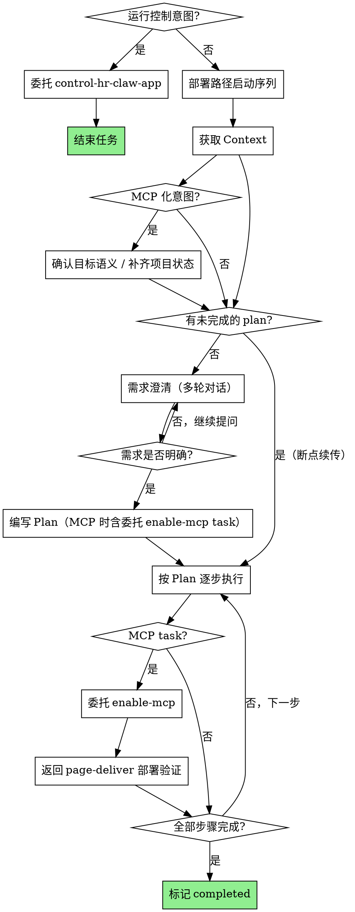

# page-deliver

帮助用户生产一个 web 应用并完成部署。

首先需要了解当前项目的上下文， 然后通过多步的需求澄清对齐需求点，根据需求编写执行计划，最后按照执行计划分步执行。

没有执行计划前， 不要做任何的代码生成和部署。

## 运行控制意图路由（最先执行）

用户手动调用 `page-deliver` skill 时，先判断是否只是要访问或控制一个已经上线的 HRClaw
应用。该判断先于部署 preflight、数仓 MCP 预检、`state init` 和 Plan。

**命中条件**：

- 用户要查询、访问或调用某个已上线的 HRClaw 应用
- 用户要通过已上线应用的现有能力执行查询或业务操作
- 用户明确表达“访问 / 控制 / 操作 / 调用某个应用”，且不涉及页面代码、部署、发布或
  `restful.json`

**不命中条件**：

- 用户要求生成、修改页面或业务代码
- 用户要求部署、发布或上线应用
- 用户要求开启 MCP、生成或修复 `restful.json`、维护 App Capability Gateway
- 用户只是要在页面中添加 AI 聊天、AI 摘要等前端能力
- 用户只是要求应用调用大模型或其他 MCP 工具完成自身功能
- 目标语义无法判断时，先按需求澄清确认，不得直接路由

**移交规则**：

1. 命中后跳过部署路径的 Node preflight 和数仓 MCP 预检，不执行 `state init`，不写
   `docs/plan.md`
2. 通过宿主 skill 调用机制调用 `control-hr-claw-app`
3. `control-hr-claw-app` 独立完成应用发现、工具契约读取和调用；其完成后本次任务结束，
   不返回 page-deliver 做部署
4. MCP 不可用、鉴权失败或应用调用失败由 `control-hr-claw-app` 按自身错误规则处理；
   page-deliver 不回退到部署流程

## 部署路径启动序列（仅未命中运行控制路由时执行）

1. `SKILL_DIR` = 本 SKILL.md 所在目录的绝对路径
2. preflight 保证 Node + npm 同时可用（按当前 OS 执行对应脚本）：
   - macOS/Linux：`${SKILL_DIR}/preflight.sh`
   - Windows：`powershell -ExecutionPolicy Bypass -File ${SKILL_DIR}/preflight.ps1`
   - ⚠️ **执行任何 `.ps1` 脚本（不仅限于 preflight.ps1）必须使用 `powershell -ExecutionPolicy Bypass -File <脚本路径>` 形式**，否则在默认 ExecutionPolicy 下会被拦截。直接 `./xxx.ps1` 或 `xxx.ps1` 一律不允许。
3. **MCP 服务预检（HARD-GATE，阻塞直到通过）**：执行 `${SKILL_DIR}/references/mcp-preflight.md` 描述的 tool 可用性检查。
   - ⚠️ 该检查不落盘，每次触发（含恢复/断点续传/重新部署）都要重新执行
   - ⚠️ 在所有"快速跳过"规则之前执行，无法绕过
4. `PD` = `${SKILL_DIR}/bin/page-deliver.js`（CLI 入口）


---

## MCP 能力供给路由（启动序列后执行）

启动序列完成后再判定 MCP 意图；不得为路由跳过 preflight 或 MCP 服务预检。

**命中条件**：

- 用户明确要求 `对当前应用开启 MCP`、`将当前应用 MCP 化`、`暴露 REST API tools`、`生成或修复 restful.json`、`维护 App Capability Gateway`
- 用户使用 `接入 Agent`、`变成智能应用` 等表达，且目标语义是让这个 page-deliver 应用或服务可被 Agent 调用

**不命中条件**：

- 用户只是要在页面中添加 AI 聊天、AI 摘要等前端能力
- 用户只是要求应用调用大模型或其他 MCP 工具完成自身功能
- 用户只是要查询、访问或调用已上线的 HRClaw 应用时，已在运行控制路由中移交
  `control-hr-claw-app`，不应进入本路由
- 目标语义无法判断时，先按需求澄清确认，不得直接路由

**路由规则**：

1. `page-deliver` 始终是主编排方，`enable-mcp` 只作为委托 skill，不能代替 `page-deliver`
2. 命中 MCP 意图后仍必须遵守 plan 门控：已有项目先获取 context 并完成 `state init`；新建项目先在阶段 2 确定 `projectId` / `projectDir` 并完成 `state init`；随后把「委托 enable-mcp」写入 `docs/plan.md`，最后才能调用 skill
3. 新建应用时，先创建应用和业务功能；混合迭代时，先完成页面或业务功能修改，再执行 MCP 化 task。若已有未完成 plan，在「迭代预览」前追加「委托 enable-mcp」task，保留既有 task 与完成状态，不得直接覆盖 plan
4. 通过宿主的 skill 调用机制调用 `enable-mcp`
5. `enable-mcp` 负责能力范围确认、元信息确认、API 路由生成、`public/restful.json` 生成和自查
6. `enable-mcp` 完成后必须返回 `page-deliver`，由 `page-deliver` 继续执行 full-deploy、预览确认和 publish 门控
7. 不新增 `needsMcp` 或 `mcpEnabled` state 字段；`public/restful.json` 是 MCP 能力的事实源
8. `page-deliver` 不复制 restful 生成逻辑，也不绕过 `enable-mcp` 的确认检查点

## Checklist

You MUST complete these items in order before taking action:

- [ ] **运行控制意图路由**：先判定是否只是访问/控制已上线 HRClaw 应用；命中时委托
  `control-hr-claw-app` 并结束任务，不执行部署 preflight、`state init` 或 Plan
- [ ] **错误处理总规则**：遇到任何阻断（CLI 返回 `status:failed` / 工具不可用 / state 不一致 / 依赖缺失 / 用户操作时序不对等）→ **先翻 `${SKILL_DIR}/references/handbook.md`** 找匹配卡片，按"给用户的话"原文输出、按"后续动作"决定下一步；handbook 没覆盖的场景才走兜底。不要自由发挥话术，不要把 stderr 截掉。
- [ ] **获取 Context**：项目目录是否明确？**无论有没有 `.deploy-state.json`，都先执行 `state init` 归一化**（不存在则创建，旧/异形结构则归一化为标准 schemaVersion=2），再据返回的 state 判断阶段
- [ ] **MCP 能力供给路由**：按「MCP 能力供给路由」规则判定是否命中；命中时必须先写入包含「委托 enable-mcp」的 plan，再通过宿主 skill 调用机制委托执行
- [ ] **判断阶段**：plan.md 是否存在？有 `[ ]` 未完成的 task 则断点续传，否则进入需求澄清
- [ ] **需求澄清**：关键变量是否已确定（needs_dw / needs_db / 页面目标）？不确定则继续提问
- [ ] **Plan 就绪**：`docs/plan.md` 是否已写入？无则按阶段 1 表生成，有则按状态走断点续传或重新规划。没有 plan 不做任何代码改动和部署
- [ ] **Plan 完整**：Plan 最后三个 Task 是否为 `迭代预览`、`Dockerfile 检查/生成`、`注册发布`？（详见 `references/writing-plans.md` → 迭代循环）
- [ ] **代码合规检查**：阶段4 全部 task 执行完、部署前，按 `${SKILL_DIR}/references/project-constraints.md` 自查并修复违规（C1 文件上传路径、C2 MongoDB 数据库名）
- [ ] **预览门控**：每次 `full-deploy` 后是否已弹出确认按钮？用户点"确认注册"前禁止执行 `anydev publish`
- [ ] **⛔ 禁止本地启动**：预览**只能**通过 `anydev full-deploy` 在 AnyDev 容器内进行。**禁止**在本地执行 `node server.js` / `npm start` / `npm run dev` / `npm run serve` / `yarn dev` / `pnpm dev` / `python app.py` / `flask run` 等任何启动命令来"预览"页面。本地启动产生的 `localhost:xxxx` 无法被外网访问，绕过了 PM2 管理与健康检查，也无法走后续 `publish` 流程。违反此条等同 `anydev full-deploy` 未执行。

---

## Process Flow



---

## 阶段 1：获取 Context

**目标**：了解当前项目状态，获取必要上下文。

**做什么**：

1. 检查项目目录是否存在、是否有 `.deploy-state.json`
2. **项目目录已明确时**，执行 `state init` 归一化（幂等：不存在则创建，旧/异形结构则归一化为标准 schemaVersion=2），并读取返回的 state：
   ```bash
   echo '{"projectDir":"<project_dir_abs>"}' | node "$PD" state init --input -
   ```
   - 已有文件里能读到 `projectId`（兼容 `project_id`）时可省略 `projectId`；否则需从入参提供
   - 只需读取当前状态时也可用 `state show`，但 `state init` 会顺带修复旧结构
3. 检查 `{project_dir}/docs/plan.md` 是否存在、是否有 `[ ]` 未完成的 task
4. 如有代码，快速浏览项目结构（`list_dir` / `read_file`）

**判断结果**：

| 状态 | 下一步 |
|------|--------|
| 无项目目录（全新项目） | → 阶段 2（新建项目，届时 `state init` 创建） |
| state=completed | → 阶段 2（功能迭代） |
| **有未完成的 plan.md**（存在 `[ ]` task） | → 阶段 4（断点续传） |
| state=in_progress 但无 plan / plan 全部 `[x]` | → 异常：state 与 plan 不同步（按全局错误处理规则处理） |
| 有代码目录但无 state（或旧/异形 state） | → `state init` 归一化后进入阶段 2（存量项目，仍须走阶段 3 生成 plan，不可跳过） |

---

## 阶段 2：需求澄清

**目标**：与用户多轮对话，明确本次任务的所有关键信息。

**做什么**：

1. 理解用户意图（做什么页面 / 改什么功能 / 部署什么项目）
2. 通过提问澄清不确定的部分（每次只问一个问题，优先提供选项）
3. 确定关键变量：
   - `needs_dw`：是否涉及 HR 数仓数据
   - `needs_db`：是否需要数据库持久化
   - 页面目标 / 受众 / 核心内容
4. 如 `needs_dw=true`，预获取数仓元数据：
   - 术语清单 + 表列表（`fetch_mcp_resource`）
   - 相关术语完整定义（`slang_query`）
   - 目标表字段结构（`fetch_mcp_resource` → `starrocks://tables/{table_code}`）
5. 确定 `project_id` 和 `project_dir`
   - `project_id` 格式：`{业务名称-kebab-case}-{YYYYMMDD}-{HHMMSS}`，时间取当前本地时间，总字符数须小于 45
     - 示例：`summer-hiking-poster-20260601-192630`（37 字符）
   - **新建项目**：`project_dir` = `{workspace}/{project_id}`（`state init` 会自动创建该目录）
   - **存量项目**：`project_dir` = 用户指定的已有目录，`project_id` 从 `.deploy-state.json` 读取
6. 执行 `state init`（**幂等**：新建则创建，已有旧/异形结构则归一化为标准 schemaVersion=2；`projectDir` 必须是绝对路径）：
   ```bash
   echo '{"projectId":"<project_id>","projectDir":"<project_dir_abs>","projectName":"<project_name>"}' | node "$PD" state init --input -
   ```
7. 把澄清结果写入 state：`state update` 必须带 `projectDir` 与 `fields`：
   ```bash
   echo '{"projectDir":"<project_dir_abs>","fields":{"needsDw":false,"needsDb":false}}' | node "$PD" state update --input -
   ```
   - `needsDw / needsDb` 是可变字段，每次需求澄清后都应写入 state

**详细流程**：→ `${SKILL_DIR}/references/step0-requirement.md`

**完成标志**：所有关键变量已确定，可以开始写 plan。

---

## 阶段 3：编写 Plan

**目标**：根据澄清后的需求，生成可执行的步骤列表。

**做什么**：

1. 读取 plan 编写规范：`${SKILL_DIR}/references/writing-plans.md`
2. `needs_dw=true` 时额外读取：`${SKILL_DIR}/references/dw-readonly-guide.md`
3. 参考 Task 清单：`${SKILL_DIR}/references/common-tasks.md`（非穷举，按需裁剪）
4. 根据需求自行决定需要哪些 task、什么顺序
5. 写入 `{project_dir}/docs/plan.md`（覆盖已有 plan）
6. 执行 `state update` 标记进行中：
   ```bash
   echo '{"projectDir":"<project_dir_abs>","fields":{"state":"in_progress"}}' | node "$PD" state update --input -
   ```

**关键原则**：
- plan 固定路径 `docs/plan.md`，每次迭代覆盖
- 每个 task 是 2-5 分钟可完成的原子操作
- plan 包含执行所需的全部信息（文件路径、代码片段、验证方式）
- 不限定 task 组合，根据实际需求裁剪

**完成标志**：plan.md 已写入，state 已更新。

---

## 阶段 4：按 Plan 执行

**目标**：逐步执行 plan 中的步骤，最终交付可访问的 URL。

**做什么**：

1. 读取 `{project_dir}/docs/plan.md`
2. 批判性 review — 有疑问先问用户
3. 找到第一个 `[ ]`（未完成）的 task，从那里开始执行
4. 每完成一个 task：用 `replace_in_file` 将 plan 中对应的 `[ ]` 改为 `[x]`
5. **代码合规检查**（全部 task 执行完、部署前）：按 `${SKILL_DIR}/references/project-constraints.md` 逐条自查并修复硬约束违规（**C1 文件上传路径**、**C2 MongoDB 数据库名**）。判断是否适用 → 扫代码定位违规 → 按文档修复算法用 `replace_in_file` / `Edit` 修复 → 跑文档自检清单逐项确认。全部约束自检全绿后方可进入迭代预览。不写检查报告文件、不调用 CLI 校验命令（纯 agent 自查自修）。
6. 全部 `[x]` 且合规检查通过后 → `state update` 标记完成：
   ```bash
   echo '{"projectDir":"<project_dir_abs>","fields":{"state":"completed"}}' | node "$PD" state update --input -
   ```

**代码生成约束**：
- 基于 `${SKILL_DIR}/assets/templates/{场景}/` 模板（static / dw-readonly / crud / dw-crud）
- 数仓调用仅限前端（`public/index.html`），禁止放在 server.js
- 所有 fetch 数仓请求含 `credentials: 'include'`
- 禁止硬编码 HR 数据
- 前端基于 CDN 引入的 Vue 3 + TDesign（禁止 import 语法、.vue 文件、构建工具）
- **响应式自适应（默认要求）**：所有生成的页面默认支持手机端/电脑端自适应，无需用户额外要求。模板已内置基线，业务填充时遵循以下约定即可：
  - 已内置响应式 CSS 基线：header 收缩、`.page-main` 内边距与字号在 ≤768px 收紧、表格用 `.table-wrap` 横向滚动、≤480px 隐藏状态徽标；`viewport` 已存在，无需重加。
  - 已内置 `useResponsive()` 助手（返回 `isMobile` ref，窗口跨 768px 断点自动更新），setup 中已声明并暴露，模板直接用 `v-if="!isMobile"` 渲染桌面内容、`v-else` 渲染手机内容。
  - 布局优先用 TDesign 响应式栅格 `<t-row>`/`<t-col>` 的 `:xs :sm :md` span；数据表格在手机端用 `isMobile` 切换为 `.mobile-card-list` 卡片列表（模板已提供样式与范式注释）；新增/编辑表单桌面端 `t-dialog`、手机端改 `t-drawer` 体验更佳。
  - 数仓图表（`dw-readonly` 模板）：`useChart` 在手机端自动降高(300px)、柱状图 x 轴标签自动旋转，无需额外处理。
- **文件上传路径约束**：若需求涉及文件上传功能，在阶段4 步骤5（代码合规检查）按 `${SKILL_DIR}/references/project-constraints.md` → **C1** 自查并修复。检查与修复方法见该文档。
- **MongoDB 数据库名约束**：若需求涉及 MongoDB（needsDb），在阶段4 步骤5（代码合规检查）按 `${SKILL_DIR}/references/project-constraints.md` → **C2** 自查并修复，禁止连接 `test` 等非业务库。检查与修复方法见该文档。
- **DB/数仓需求变更即同步 state**：迭代中若代码**新增或移除**了数据库（mongoose/`db.js`/`MONGO_URI`）或数仓访问（`queryDW`/`starrocks`），在重新 `full-deploy` 前先 `state update` 同步 `needsDb` / `needsDw`
- **⛔ 禁止本地启动预览**：生成的代码中不要添加本地启动脚本或指令。预览的唯一方式是 `anydev full-deploy`，不要写 `npm start` / `node server.js` 等本地启动命令到 plan 或代码注释中。模板 `package.json` 的 `"start": "node server.js"` 仅供容器内 PM2 调用，不是给 agent 本地执行的。

**dw-readonly 模板内置工具**（在 `public/index.html` 中已封装，直接使用）：
| 工具 | 用途 | 典型用法 |
|------|------|----------|
| `queryDW(sql, opts)` | 单次数仓查询（带超时 30s） | `const result = await queryDW('SELECT ...')` → `{data, columns, total}` |
| `queryDWWithRetry(sql, opts)` | 带重试的查询（默认重试 2 次，间隔 1s） | 用法同上，增加 `opts.retries` / `opts.retryDelay` |
| `batchQueryDW([[name, sql], ...])` | **并行**执行多个查询，任一失败不影响其他 | `const { age, level } = await batchQueryDW([...])` |
| `createDwQuery(name)` | 带状态的查询实例（loading/error/data） | `q.execute(sql)` 后可通过 `q.data` / `q.error` 获取状态 |
| `useChart(domId, opts)` | ECharts 实例管理器（init/render/dispose） | `chart.render(option)`、`chart.dispose()` |
| `buildBarOption(labels, series, extra)` | 标准柱状图 Option 工厂 | 传入 labels + series 即得完整 option |
| `buildHorizontalBarOption(labels, series, extra)` | 标准横向柱状图 Option | 同上 |
| `buildPieOption(data, extra)` | 标准环形饼图 Option | 传入 `[{name, value}]` |
| `initPage(loadDataFn)` | 页面初始化状态机（loading→done/empty/error） | `await initPage(loadData)` |
| `registerChartResize(charts)` | 窗口 resize 时自动重绘所有图表 | `registerChartResize([chart1, chart2])` |

> `needs_dw=true` 时的详细约束见 `${SKILL_DIR}/references/dw-readonly-guide.md`

**部署与上线（新流程 v5）**：

详见 `references/writing-plans.md` → **迭代循环**。简要流程：

1. **迭代预览**：执行 `anydev full-deploy`（只传 `projectDir`）→ 输出预览确认模板 → `ask_followup_question` 弹"确认注册"按钮。如用户输入文字反馈，则修改代码、在 plan 中追加新 task、重新 full-deploy、重新弹确认按钮——循环直到用户点击"确认注册"。

   ⚠️ **预览 = anydev full-deploy，不是本地启动。** 禁止用 `node server.js` / `npm start` / `npm run dev` 等本地命令"预览"。预览地址按 `references/output-templates.md` → **预览确认模板** 的占位符来源取值（优先 full-deploy 返回的 `data.previewUrl`，无则用返回的 `ip`/`port` 拼接的 AnyDev 容器地址），禁止填 `localhost`。
  ```bash
  echo '{"projectDir":"<project_dir_abs>"}' | node "$PD" anydev full-deploy --input -
  ```
2. **Dockerfile 检查/生成**（用户点确认注册后）：确保项目根目录存在合理的 Dockerfile（含 `{{PROJECT_ID}}` 占位符）和 `.dockerignore`。已有则校验修正，无则根据项目实际情况生成并**写入项目根目录**（full-deploy 阶段不再兜底生成），完成后把 projectType 持久化到 state。模板见 `${SKILL_DIR}/assets/templates/dockerfile/`。
   ```bash
   echo '{"projectDir":"<project_dir_abs>","fields":{"projectType":"<node|python>"}}' | node "$PD" state update --input -
   ```
3. **注册发布**：Dockerfile 就绪后执行 `anydev publish`（只传 `projectDir`）。成功后的输出模板见 `references/output-templates.md` → **部署输出模板**。
   ```bash
   echo '{"projectDir":"<project_dir_abs>"}' | node "$PD" anydev publish --input -
   ```
4. **收尾**：`state update` 标记完成。
   ```bash
   echo '{"projectDir":"<project_dir_abs>","fields":{"state":"completed"}}' | node "$PD" state update --input -
   ```

---

## CLI 命令速查

> 所有命令统一格式：`echo '<json>' | node $PD <topic> <subcommand> --input -`
> 每条命令的**完整输入/输出/错误码/示例**可通过 `node $PD <topic> <subcommand> --help` 查看。
> 成功输出 stdout 末行 `{"status":"success","data":...}`；失败为 `{"status":"failed","error":{"code","message","hint?"}}`。
> ⚠️ **写命令前先看当前 `--help`**。`anydev full-deploy` / `anydev publish` **只接受** `projectDir`；`anydev remote-exec` **只接受** `projectDir` + `cmd`。不要传 `skillDir`、`envInsId`、`ip`、`port` 等额外字段，否则会触发 `UNEXPECTED_INPUT`。

| 命令 | 正确入参示例 | 用途 |
|------|--------------|------|
| `state init` | `{"projectId":"<project_id>","projectDir":"<project_dir_abs>","projectName":"<project_name>"}` | 幂等获取标准 .deploy-state.json：不存在则创建，旧/异形结构则归一化为 schemaVersion=2（归一化时 projectId 可省略） |
| `state show` | `{"projectDir":"<project_dir_abs>"}` | 查看当前项目部署状态 |
| `state update` | `{"projectDir":"<project_dir_abs>","fields":{"state":"completed"}}` | 更新部署状态字段（如标记 completed） |
| `anydev full-deploy` | `{"projectDir":"<project_dir_abs>"}` | 部署代码到 AnyDev 容器（14 步），PM2 起好后可内网预览 |
| `anydev publish` | `{"projectDir":"<project_dir_abs>"}` | 预览确认后的上线：Gateway注册 + pack-upload上传 + COS归档 |
| `anydev remote-exec` | `{"projectDir":"<project_dir_abs>","cmd":"pm2 list"}` | 在已部署容器执行任意命令（自动读 state.envInsId） |
| `baseline stats` | `{}` | 读取模型基线聚合统计 |
| `inspect token` | `{"projectDir":"<project_dir_abs>"}` | 读取当前项目 Token 消耗 |
| `validate plan` | `{"planPath":"<project_dir_abs>/docs/plan.md","state":{...deployState...}}` | 只读校验 plan 完整性/场景适配度，主要给 inspector 使用 |
| `validate execution` | `{"planPath":"<project_dir_abs>/docs/plan.md","projectDir":"<project_dir_abs>"}` | 只读分析 plan 执行符合度，主要给 inspector 使用 |
| `deploy-inspector` | subagent，无 CLI 入参 | 生成部署复盘报告 |
