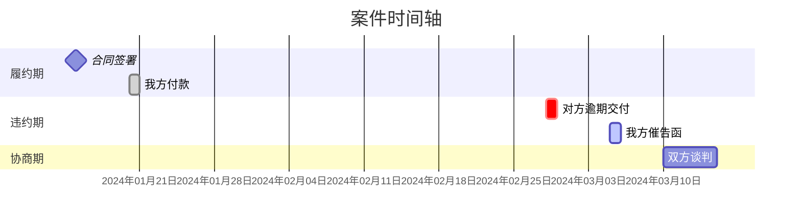

# 诉讼时间轴可视化

> **版本**：v3.1 | **日期**：2026-05-23
> **定位**：案件叙事构建器 + 可视化渲染引擎
> **核心价值**：法官看证据，律师看时间线——案件胜负往往藏在时间轴里
> **关键洞察**：时间线一清晰，争议焦点就出来了——事件之间的时间缝隙，往往就是双方争议的爆发点

---

## 触发词与路由

### 触发词（任一触发）
"时间轴"、"时间线"、"案件时间轴"、"诉讼时间线"、"案件进程图"、
"案件大事记"、"程序时间轴"、"证据时间轴"、"案件脉络"、"案件梳理"、
"可视化时间线"、"诉讼可视化"、"帮我画个时间轴"、"案件发展经过"、
"程序节点"、"案件节点梳理"、"litigation timeline"、"case chronology"

### 🎯 直播/演示模式触发（优先匹配）
"直播版时间轴"、"演示版时间轴"、"好看的时间轴"、"给我看时间轴"、
"生成时间轴"、"画一个时间轴"

> 以上触发词 → 直接走 **3.4 直播演示版**（彩色节点+竖线时间轴+右侧数据面板），
> 跳过 A4 三页打印路径。输出单页 HTML，适合屏幕共享展示。

### 适用场景
(1) 法庭提交 (2) 客户展示 (3) 案件策略规划 (4) 调解谈判 (5) 直播/公开演示

### 上下游关系
- **上游**：用户提供的案件关键日期和事件描述
- **本技能输出**：可视化时间轴（HTML/Mermaid/ASCII），标注关键节点和截止日提醒
- **与其他技能的关系**：如需期间管理、证据整理、模拟法庭等高级功能，请向用户说明"该功能需安装对应技能包，当前我仅提供时间轴生成"

---

## ⚠️ 认识论底线（全程生效，不可覆盖）

```
1. 时间轴上的每个日期必须有来源——[法院文书]/[当事人陈述]/[律师推算] 标注来源类型
2. 推算日期标注"约"并附推算依据——"判决生效日≈送达日+15日（对方未上诉）"
3. 不确定日期标注"【待确认】"——不编造日期填充时间轴
4. 截止日倒计时以"今天"为基准——今天 = 生成时间轴当日
5. 多源冲突时以法院正式文书为准——传票 > 短信 > 口头通知
6. 期间计算适用民法典第201条——起算日=触发日+1（次日开始）
7. 时间轴 ≠ 证据清单——时间轴讲"发生了什么"，证据清单讲"有什么"
8. 关键节点不可遗漏——立案/答辩/举证/开庭/判决/上诉/执行 7 个锚点必须覆盖
9. 所有法律断言必须注明依据
```

---

## 🚀 启动提示

> 本技能需要具备法律叙事能力的模型来执行事件排序和逻辑串联。

### ⛔ 强制检查点

> **用户点击确认前不得生成以下内容。** 本工作流在各步骤入口处设有强制检查点。> 🚨 **请选择时间轴类型：（1）单案时间轴 （2）多案对比时间轴 （3）程序节点时间轴 （4）证据链时间轴**

---

## 第一层：时间轴类型（4 类）

| 类型 | 用途 | 适用场景 | 输出形式 |
|:---:|------|---------|:---:|
| T1 单案时间轴 | 一个案件从头到尾 | 了解案情/汇报当事人/庭审陈述 | 纵向时间轴 |
| T2 多案对比时间轴 | 多案并行对比 | 多案管理/资源分配/冲突发现 | 横向并行轴 |
| T3 程序节点时间轴 | 法定程序+实际进程对比 | 程序合规检查/超期识别 | 双轨对照轴 |
| T4 证据链时间轴 | 关键事件+对应证据映射 | 庭审准备/证明链构建 | 事件-证据映射轴 |

---

## 第二层：事件标记系统与时间轴结构

### 2.1 事件分类标记

```
🔷 程序节点：立案/答辩/开庭/判决/上诉/执行立案
💰 财务事件：缴费/保全担保/执行回款
📄 文书送达：起诉状/举证通知/传票/判决书/裁定书
⏰ 截止日：答辩期/举证期限/上诉期/履行期限/执行时效
⚡ 突发/异常：保全/异议/延期/上诉/撤诉
📞 沟通记录：当事人沟通/法院沟通/对方沟通
🔗 外部事件：对方还款/和解谈判/新证据发现
```

### 2.2 四层结构

```
第一层 · 程序轴：立案 → 答辩 → 举证 → 开庭 → 判决 → 上诉/生效 → 执行
第二层 · 事件轴：具体事件（含日期+来源+说明）
第三层 · 证据轴：对应证据（证据编号+名称）
第四层 · 截止日轴：法定截止日+倒计时+状态
```

### 2.3 事实归类规则

- **我方行为** —— 时间轴上方标注
- **对方行为** —— 时间轴下方标注
- **争议焦点** —— 用 🔴 或 ⭐ 特殊标记突出

### 2.4 时间精度要求

- 精确到年月日（如：2024年3月15日）
- 无法确定日期时标注："月初"（1-10日）、"月中"（11-20日）、"月末"（21-31日）、"某年某月"（仅知道月份）

---

## 第三层：工作流程

### Step 1 · 数据采集

#### 1.1 从上游技能采集

```
【数据来源清单】

来源一：用户提供
  → 案件基本档案（案号+法院+当事人）
  → 已知事件和日期

来源二：对话上下文
  → 本次对话中已提及的日期和事件
  → 已确认的截止日

来源三：用户口述
  → 未录入系统的事件（当事人告知/口头沟通/非正式通知）
```

#### 1.2 事件采集模板

```
【案件事件采集卡】

案件名称：________  案号：________

请按时间顺序列出所有已知事件（从早到晚）：

序号 | 日期 | 事件 | 类型 | 来源 | 是否确定
1    | ____ | ____ | ____ | ____ | □确定 □推算 □待确认
2    | ____ | ____ | ____ | ____ | □确定 □推算 □待确认
...

已录入截止日将自动纳入——无需重复填写。
```

#### 1.3 输入材料处理建议

| 材料类型 | 处理要点 |
|---------|---------|
| **起诉状/答辩状** | 关注诉讼请求和事实理由，提取主张的时间节点，标注举证责任 |
| **证据清单** | 关联证据页码到具体事件，注意证据形成时间与事件时间的匹配 |
| **合同文书** | 签署时间/地点/主体，履约期限和关键时间节点，违约条款对应的时间条件 |
| **往来函件** | 发送时间/接收时间，函件性质（催告/通知/回复），法律效力（中断时效等） |
| **判决书/裁定书** | 提取案件事实认定的时间节点，法院对关键时间点的认定，各审级时间节点和结果 |

---

> 🔴 **CHECKPOINT · 数据完整性确认**
>
> 在进入时间轴构建前，必须逐项确认：
> - [ ] 案件基本信息完整（案号/法院/当事人/承办法官）——缺失则返回1.1重新采集
> - [ ] 至少3个已知事件可排序——不足则触发"失败模式F1：日期信息缺失"
> - [ ] 7个锚点（立案/答辩/举证/开庭/判决/上诉/执行）中至少覆盖3个——否则标注"主线缺失"
> - [ ] 无明显的时序矛盾（如开庭日在立案日之前）——有则触发"失败模式F2：事件时序矛盾"
> - [ ] 多源数据（用户提供、对话上下文、用户口述）已合并去重
>
> ⛔ **不通过不生成**：上述任一项未满足，暂停生成，向用户报告缺失项并请求补充。

---

### Step 2 · 时间轴构建

#### 2.1 T1 · 单案时间轴

```
━━━━━━━━━━━━━━━━━━━━━━━━━━━━━━━━━━━━━━━━━━━━━━━━━━━━━━━━━━
    XXX 诉 XXX XX纠纷 —— 案件时间轴
━━━━━━━━━━━━━━━━━━━━━━━━━━━━━━━━━━━━━━━━━━━━━━━━━━━━━━━━━━

案号：（XXXX）XX民初字第XX号
法院：XX人民法院 | 承办法官：XXX
当前阶段：一审——开庭前准备
时间轴生成日：2026年05月13日

═══════════════════════════════════════════════════════════
                      【程序轴】
═══════════════════════════════════════════════════════════

  2026-01-15                     2026-02-22                     2026-03-05
      🔷                              ⏰                              🔷
     立案                           举证届满                          开庭
      │                              │                              │
      ├──────────────┬───────────────┼──────────────┬───────────────┤
      │              │               │              │               │
      📄            📄              💰             📄              ⚡
   起诉状副本      举证通知         诉讼费         传票            (未知)
   送达(01/18)    送达(01/22)      缴纳(01/25)    送达(02/10)
      │              │               │              │
      ⏰             📞             📄             📞
   答辩期          与当事人          缴费凭证       对方律师
   截止(02/02)     沟通(01/22)      提交(01/26)    联系(02/15)

═══════════════════════════════════════════════════════════
                   【关键节点——从现在看】
═══════════════════════════════════════════════════════════

  ✅ 已完成（4项）
    01/15 立案——（XXXX）XX民初字第XX号
    01/22 收到举证通知——举证期限至 02/22
    01/25 缴纳诉讼费 ¥8,800——已完成
    02/02 提交答辩状——已按期提交 ✓

  🔴 今天到期（1项）
    02/22 举证期限届满 【已过期 80 天！】
          → 后果：可能已丧失举证权利
          → 补救：立即申请延期举证（法院酌情决定）

  🔷 即将到来（1项）
    03/05 上午 09:30 开庭——XX人民法院第X法庭

═══════════════════════════════════════════════════════════
                   【截止日倒计时】
═══════════════════════════════════════════════════════════

┌──────────────────┬────────────┬──────────┬────────────┐
│ 截止日           │ 日期       │ 倒计时   │ 状态       │
├──────────────────┼────────────┼──────────┼────────────┤
│ 答辩期届满       │ 2026-02-02 │ -100天   │ ✅ 已提交  │
│ 举证期限届满     │ 2026-02-22 │ -80天    │ ❌ 已过期  │
│ 开庭日期         │ 2026-03-05 │ -69天    │ ⚠️ 待核实  │
│ (判决后)上诉期   │ 待定       │ —        │ 待触发     │
│ (判决生效后)执行 │ 待定       │ —        │ 待触发     │
└──────────────────┴────────────┴──────────┴────────────┘
```

#### 2.2 T2 · 多案对比时间轴

```
━━━━━━━━━━━━━━━━━━━━━━━━━━━━━━━━━━━━━━━━━━━━━━━━━━━━━━━━━━
              多 案 时 间 轴 并 行 对 比
━━━━━━━━━━━━━━━━━━━━━━━━━━━━━━━━━━━━━━━━━━━━━━━━━━━━━━━━━━

更新日期：2026年05月13日

        2026/01    2026/02    2026/03    2026/04    2026/05    2026/06
        ├────┼────┼────┼────┼────┼────┼────┼────┼────┼────┼────┼────┤

案A      🔷        ⏰         🔷
(民初   立案      举证届满    开庭(?)
12345)  01/15     02/22      03/05
        ├─────────┬─────────┬─────────────────────────────────┤
        阶段：举证         阶段：开庭前                       阶段：?

案B               🔷                   ⏰         🔷
(民初            立案                 举证届满    开庭
23456)           02/01                03/15      04/20
                 ├───────────────────┬───────────┬───────────┤
                 阶段：举证                         阶段：待开庭

═══════════════════════════════════════════════════════════
                   【冲突检测】
═══════════════════════════════════════════════════════════

  ⚠️ 开庭冲突检测 + 截止日重叠检测
  ⚠️ 本月关注：各案当前阶段+最近截止日
```

#### 2.3 T3 · 程序节点时间轴（双轨对照）

```
━━━━━━━━━━━━━━━━━━━━━━━━━━━━━━━━━━━━━━━━━━━━━━━━━━━━━━━━━━
         程 序 双 轨 对 照 轴（法定 vs 实际）
━━━━━━━━━━━━━━━━━━━━━━━━━━━━━━━━━━━━━━━━━━━━━━━━━━━━━━━━━━

【法定程序】                    【实际进程】

立案之日起 7 日内                2026-01-15 立案
送达起诉状副本                  2026-01-18 送达 ✓（3天内，合规）
│                              │
答辩期 15日                     答辩期实际：2026-01-18→02-02
(收到起诉状次日+15日)          2026-02-02 提交答辩状 ✓（按期）
│                              │
举证期限 ≥ 15日                 举证期限实际：2026-01-22→02-22
(法院指定)                     2026-02-22 届满
│                              │
开庭日                          开庭日：法院通知 2026-03-05
(法院指定，传票载明)            ⚠️ 状态未知——日期已过

═══════════════════════════════════════════════════════════
                   【程序异常标记】
═══════════════════════════════════════════════════════════

  ⚠️ 超期项 → 程序瑕疵识别 → 可能成为上诉理由
```

#### 2.4 T4 · 证据链时间轴

```
━━━━━━━━━━━━━━━━━━━━━━━━━━━━━━━━━━━━━━━━━━━━━━━━━━━━━━━━━━
         证 据 链 时 间 轴（事件→证据映射）
━━━━━━━━━━━━━━━━━━━━━━━━━━━━━━━━━━━━━━━━━━━━━━━━━━━━━━━━━━

2025-06-01  合同签订
            ├─ [S01] 《XX合同》原件
            └─ [DZ01] 签约现场照片

2025-08-15  第一笔款项支付（¥100,000）
            ├─ [S02] 银行转账凭证
            └─ [DZ02] 对方确认收款的微信截图

2025-12-01  对方违约——未按期交付
            ├─ [S03] 我方催告函+邮寄凭证
            ├─ [DZ03] 对方回复"再等等"的微信记录
            └─ [DZ04] 通话录音（XX月XX日电话）

═══════════════════════════════════════════════════════════
                   【证明链分析】
═══════════════════════════════════════════════════════════

  待证事实 1：合同关系成立
  证据链：S01→DZ01  完整性：✅ 完整

  待证事实 2：我方已付款
  证据链：S02→DZ02  完整性：✅ 完整

  待证事实 3：对方违约
  证据链：S03→DZ03→DZ04  完整性：⚠️ 基本完整——建议补充违约后果量化证据

═══════════════════════════════════════════════════════════
                   【证据缺口提示】
═══════════════════════════════════════════════════════════

  ⚠️ 违约造成的损失金额尚未量化
  ⚠️ 2025年6月至8月间无证据覆盖
```

---

> 🔴 **CHECKPOINT · 渲染前结构审核**
>
> 在进入可视化渲染前，必须逐项确认：
> - [ ] 时间轴结构完整（程序轴/事件轴/证据轴/截止日轴四层已覆盖目标层）
> - [ ] 所有推算日期已标注"约"+依据，所有不确定日期已标注"【待确认】"
> - [ ] 截止日倒计时以生成日为基准，期间计算适用"起算日=触发日+1"
> - [ ] 多案情况：已做开庭冲突检测 + 案件名称/案号无混淆
> - [ ] 事件数≤25个（超过则触发"失败模式F4：节点过密"的自动精简策略）
> - [ ] 用户已确认时间轴结构无误——未确认则暂停渲染
>
> ⛔ **不通过不渲染**：上述任一项未满足，暂停渲染，返回Step 2修正。连续2次不通过则降级为纯表格输出。

---

### Step 3 · 可视化渲染输出

#### 3.1 Mermaid 甘特图格式（电子展示）



> 详细 Mermaid 模式参考：`references/mermaid-patterns.md`

#### 3.2 ASCII 时间轴格式（备用）

```
                              我方行为              时间轴               对方行为
    ────────────────────────────────────────────────────────────────────────────────────────
    2024-01-15  [📄] 签署《买卖合同》                              ←─────────────────────────
                      │
    2024-01-20  [💰] 支付首期款 50万元                              ←─────────────────────────
                      │
    2024-02-28                                                       ─────────────────→ [⚠️] 逾期交付
                      │
    2024-03-05  [📢] 发送催告函                                    ←─────────────────────────
                      │
    2024-06-10  [⚖️] 向法院起诉                                    ←─────────────────────────
    ────────────────────────────────────────────────────────────────────────────────────────
    图例：📄合同  ✍️签署  💰付款  ⚠️违约  📢通知  ⚖️诉讼  🔴争议焦点
```

#### 3.3 HTML 时间轴格式（推荐，支持 A4 打印）

创建可直接打印的 HTML 文件，包含三页完整布局。详见参考文件 `references/html-template.md`。

##### 色彩编码规范

| 法律阶段 | 推荐颜色 | RGB | HEX |
|---------|---------|------|------|
| 履约期 | 天蓝 | 135, 206, 250 | #87CEEB |
| 违约期 | 柔和珊瑚红 | 255, 127, 80 | #FF7F50 |
| 协商期 | 淡黄 | 255, 255, 224 | #FFFFE0 |
| 诉讼期 | 淡紫 | 221, 160, 221 | #DDA0DD |
| 复审期 | 金色 | 255, 215, 0 | #FFD700 |

##### A4 三页打印布局

**第1页：时间轴图谱**
- 标题：案件名称 + "时间轴图谱"（标题最多两行，长标题使用 `<br>` 换行）
- 案件基本信息：案号、案由、关键标识
- 完整时间轴：所有事件按时间顺序排列，每个阶段独立分组，使用颜色区分
- 字号：标题18pt，正文10-11pt | 边距：1.2cm
- 每页底部标注"第 1 页 / 共 3 页"

**第2页：事件明细表**
- 标题：案件名称 + "事件明细表"
- 法律阶段划分表：阶段、时间区间、状态、时长
- 完整事件明细表：

| 序号 | 时间 | 事件 | 证据 | 法律意义 | 主体 |
|:---:|:---:|:---|:---:|:---|:---:|
| 1 | 2024-01-15 | 签署《买卖合同》 | 附件1页3-5 | 确立合同关系 | 双方 |
| 2 | 2024-01-20 | 我方支付首期款50万元 | 附件2页8 | 履行付款义务 | 我方 |
| 3 | 2024-02-28 | 对方逾期交付货物 | 附件3页12 | 构成违约行为 | 对方 |

- 字号：标题18pt，表格正文9-10pt | 事件明细表建议最多12-15项

**第3页：综合分析**
- 标题：案件名称 + "综合分析"
- 争议焦点提炼（最多5个）：🔴 核心争议焦点 + ⭐ 辅助争议点，每个列明我方主张/对方主张/法院认定
- 证据链完整性：列出所有证据材料及状态（最多15项）
- 案件结果分析 + 案件总结
- 使用双栏布局优化空间利用

##### CSS 页面设置

```css
@page {
    size: A4 portrait;
    margin: 1.2cm;
}

.page {
    width: 210mm;
    min-height: 297mm;
    padding: 1.2cm;
    page-break-after: always;
}

.page:last-child {
    page-break-after: avoid;
}

@media print {
    body {
        background: #fff;
    }
    .page {
        margin: 0;
        box-shadow: none;
    }
}
```

**字号规范**：主标题（h1）18pt | 二级标题（h2）14pt | 三级标题（h3）12pt | 正文 10-11pt | 表格内容 9-10pt | 小字号/备注 8-9pt

**打印方法**：
1. 双击打开 HTML 文件
2. `Ctrl + P` 打开打印对话框 → 纸张 A4 / 边距默认 / 纵向 / 取消"页眉和页脚"
3. 点击打印，或选择"另存为 PDF"

#### 3.4 直播演示版 HTML 格式（⭐ 直播/演示优先使用）

> 🎯 **触发**："直播版时间轴""演示版时间轴""好看的时间轴""给我看时间轴""生成时间轴""画一个时间轴"

**输出方式**：使用 `show_widget` 工具在对话中直接渲染内联可视化，而非生成文件。

- 渲染材料：彩色节点 + 竖线时间轴 + 右侧数据面板 + 关键数据 + 争议焦点
- 布局：顶部案件标题 + 左侧时间轴 + 右侧数据面板
- 阶段颜色：履约(绿)、违约(珊瑚)、准备(蓝)、诉讼(紫)
- 事件数：8~13个，超过则合并
- 参考模板：`references/live-demo-template.html`（仅作为样式参考，实际用 `show_widget` 输出）

**关键规则**：
- 字体：标题 15px/500，正文 13px/400，细节 11px/400
- 卡片最大宽度 860px，圆角 12px
- 底部图例 + 生成信息
- 同日前多事件合并为一条事件卡片
- 禁止写入文件后再 `present_files` 打开——直接在对话中渲染

> 注意：直播演示时，观众看到的是 AI 在对话中实时生成时间轴，而非打开预存文件。必须用 `show_widget` 工具。

---


### Step 4 · 输出与联动

#### 4.1 输出格式

```
【输出物清单】

1. 时间轴可视化（Markdown/HTML）—— 核心输出
2. 关键节点摘要（≤10条）—— 用于汇报/庭审陈述
3. 异常/风险提示表 —— 超期/遗漏/冲突
4. (可选) 当事人版时间轴 —— 去术语化+大白话版本
```

#### 4.2 联动规则

```
【时间轴→行动建议】

┌──────────────────┬────────────────────────────────┐
│ 时间轴发现        │ 建议动作                        │
├──────────────────┼────────────────────────────────┤
│ 截止日已过期      │ 标注风险，提醒律师评估后果        │
├──────────────────┼────────────────────────────────┤
│ 程序超期          │ 标注异常，提醒律师核查            │
├──────────────────┼────────────────────────────────┤
│ 开庭日将至        │ 高亮提醒，列出准备事项            │
├──────────────────┼────────────────────────────────┤
│ 证据链有缺口      │ 标注缺失，提醒补充证据            │
├──────────────────┼────────────────────────────────┤
│ 上诉期将至        │ 标注截止日，提醒上诉              │
├──────────────────┼────────────────────────────────┤
│ 履行期届满        │ 标注节点，提醒可申请强制执行      │
├──────────────────┼────────────────────────────────┤
│ 多案开庭冲突      │ 提醒律师→申请延期/协调           │
├──────────────────┼────────────────────────────────┤
│ 保全即将到期      │ 标注截止日，提醒续期              │
└──────────────────┴────────────────────────────────┘
```

### 输出产物

生成以下内容：
- `timeline`：时间轴主体（HTML/Mermaid/ASCII）
- `key_events`：关键节点摘要列表
- `anomalies`：异常/风险列表
  - viz.generated_at（生成时间戳）
```

---

## ⚡ 质量自检（输出前强制·🔴 CHECKPOINT）

> 🔴 **CHECKPOINT · 最终交付审核**
>
> 以下检查项必须在交付前逐项通过。任一项未通过，标记对应失败模式编号（F1-F7）并执行修复流程。

```
【时间轴质量自检】

□ 7 个锚点已覆盖（立案/答辩/举证/开庭/判决/上诉/执行）
□ 每个日期标注来源类型——[文书]/[口述]/[推算]
□ 推算日期标注"约"+"推算依据"
□ 不确定日期标注"【待确认】"
□ 截止日倒计时以生成日为基准计算正确
□ 期间计算适用"起算日 = 触发日 + 1"规则
□ 多案时间轴无案件混淆——各案独立
□ 程序双轨轴"法定 vs 实际"已对照
□ 证据链时间轴"事件→证据"映射完整
□ 已过期截止日前置+红色标记
□ 异常/风险已列出+给出处理建议
□ 开庭冲突已检测

【可视化渲染追加】
□ 色彩编码符合规范（柔和专业/黑白打印可读）
□ HTML 三页布局完整（时间轴/事件明细/综合分析各独立不跨页）
□ 每页有页码标注
□ 字号适合 A4 打印（不小于 9pt）
□ 边距合理（1.2cm）
```

---

## 失败模式与异常处理

> 本技能内置7种常见失败模式。触发时按"一线修复→仍失败兜底"两级处理，避免卡死在异常路径。

### 失败模式速查表

| 编号 | 触发条件 | 典型症状 | 一线修复 | 仍失败兜底 |
|:---:|---------|---------|---------|----------|
| F1 | 日期信息缺失 | 事件采集卡中≥30%条目日期为空或有"【待确认】"标记 | 推算规则："立案日+答辩期15日→答辩届满日"、"判决日+15日→上诉届满日"；推算结果标注"约"+"推算依据" | 缺失事件标注"⚠️ 信息缺失"，降级为不完整时间轴（仅展示已知事件），在输出顶部附加"数据缺失声明" |
| F2 | 事件时序矛盾 | 两个或以上事件的时间顺序存在逻辑冲突（如开庭日在立案日之前、判决日在上诉日之后） | 以法院正式文书（传票/判决书）的日期为准重新排序，冲突事件旁标注⚡"冲突：[来源A] vs [来源B]" | 矛盾事件拆为两条平行时间线展示，分别在标题注明来源，附注："待法院/当事人核实" |
| F3 | 关键截止日遗漏 | 7个锚点中≥2个缺失（常见于立案日/开庭日/上诉届满日缺失） | 自动检测缺失锚点，提示用户补充 | 缺失锚点处标注"⚠️ 锚点缺失"，用红色虚线占位，在"异常提示表"中单独列出 |
| F4 | 时间轴节点过密 | 同一日期堆积>5个事件，或全部事件数>25个 | (1) 同类事件合并（如"收到A材料"+"收到B材料"→"收到N份材料"）；(2) 展开日视图（为该日期单独生成子时间轴） | 降级为纯表格形式（事件明细表），放弃图形化时间轴渲染 |
| F5 | 数据不完整 | 用户提供的信息不足，无法构建完整时间轴 | 切换至口述模式：请用户手动填写已知事件；标注来源为[口述] | 仅生成框架轴：展示7锚点骨架+标注"数据待补充"，告知用户补充后可重新生成 |
| F6 | HTML渲染异常 | 生成的HTML页面出现格式断裂（如表格跨页截断、颜色丢失、页码错位） | (1) 检查CSS @page规则完整性；(2) 回退至最小CSS（仅保留A4尺寸+基本字体）；(3) 重试渲染 | 降级为纯ASCII文本输出（3.2格式），告知用户可手动使用HTML模板自行排版 |
| F7 | 多案日期重叠/混淆 | 多案对比时两个案件的日期高度重叠（如两案开庭日同天，或案件A事件被错归到案件B） | 重叠日期用不同线型（实线vs虚线）或不同颜色区分；案件名称/案号在每个节点标注 | 拆分为多个独立单案时间轴（每个案件一个），放弃对比视图 |

### 通用兜底规则

```
当以上所有修复策略均无效时：
1. 输出可用的最佳部分（而非空白或报错）
2. 在输出顶部附加"生成状态说明"，明确标注哪些部分不完整、哪些数据缺失、使用了哪些修复策略
3. 告知用户：完整时间轴需补充哪些信息后方可生成
4. 记录失败模式编号（F1-F7），供后续技能迭代参考
```

### 异常信号识别指南

| 异常信号 | 含义 | 立即动作 |
|---------|------|---------|
| 倒计时显示负数（如"已过期80天"） | 截止日已过，可能存在权利丧失风险 | 提醒律师评估补救方案 |
| 连续2个以上锚点缺失 | 案件基本信息严重不足 | 暂停时间轴生成，提示用户补充 |
| 事件间隔>90天无记录 | 可能存在未录入的重要事件 | 追问用户该时间段是否有遗漏 |
| 开庭日已过但状态未知 | 庭审可能已在未记录的情况下完成 | 提示用户核实庭审状态 |

---

## 常见情况快速处理

| 你说 | 处理 |
|------|------|
| "帮我画个案子的时间轴" | T1→采集数据→构建单案时间轴 |
| "我有3个案在跑，帮我梳理" | T2→多案并行对比→冲突检测 |
| "程序有没有超期的风险" | T3→法定vs实际双轨对比→异常标记 |
| "开庭时怎么讲清楚事情经过" | T4→证据链时间轴→庭审叙事线索 |
| "把时间轴弄得当事人能看懂" | 去术语化版本→大白话+关键日期标注 |
| "这个案子的节点全不全" | 7锚点检查→遗漏补充→完整性报告 |
| "要打印出来交法庭" | HTML 格式→A4三页布局→打印/导出PDF |

---

## 与其他功能的配合

时间轴可配合以下功能使用（需安装对应技能包）：
- 强制执行（已内置）：履行期届满→提醒申请强制执行
- 如需期间管理、证据整理、模拟法庭、判决分析等高级功能，请向用户说明"该功能需安装对应技能包，当前我仅提供时间轴可视化"

---

## 📦 输出物清单

| 输出物 | 格式 | 命名规则 |
|--------|:---:|---------|
| 单案时间轴 | Markdown | `{案件名}_时间轴_{日期}.md` |
| 多案对比时间轴 | Markdown | `多案时间轴_{日期}.md` |
| 程序双轨对照轴 | Markdown | `{案件名}_程序对照_{日期}.md` |
| 证据链时间轴 | Markdown | `{案件名}_证据链_{日期}.md` |
| 关键节点摘要卡 | .docx | `{案件名}_关键节点_{日期}.docx` |
| A4打印版时间轴 | HTML | `{案件名}_时间轴_{日期}.html` |

---

## 📁 参考文件

| 文件 | 用途 |
|------|------|
| `references/mermaid-patterns.md` | Mermaid 甘特图详细模式参考 |
| `references/html-template.md` | HTML 打印模板参考 |
| `references/icon-system.md` | 图标系统完整说明 |

---

## ⚠️ 注意事项

1. **时间轴是叙事工具，也是争议发现工具**：时间轴帮助理解案件脉络，事件之间的时间间隙往往藏着一审没有充分展开的争议焦点——做完时间轴后，回头看看"时间缝隙里有没有故事"
2. **推算日期必须诚实标注**：不要为了让时间轴"好看"而把推算日期写成确定日期
3. **当事人陈述≠事实**：来源于当事人陈述的日期标注[口述]，与[文书]区分
4. **期间计算从次日起算**：民法典第201条——开始的当日不计入，从次日开始
5. **倒计时以"今天"为基准**：每次重新生成时间轴时更新倒计时
6. **开庭冲突检测不可省**：多案时间轴的附加价值——发现人脑容易忽略的日期重叠
7. **程序双轨对比是合规工具**：法定程序 vs 实际进程——超期是程序瑕疵，可能成为上诉理由
8. **证据链时间轴服务于证明链**：不是为了好看——是为了检验"待证事实是否有证据支撑"
9. **色彩柔和专业**：确保黑白打印时仍可区分（图标辅助），重点节点使用边框或背景色突出
10. **A4三页完整性**：第1页时间轴/第2页明细表/第3页综合分析各自独立不跨页

---

## 反例与黑名单（不要做）

> 以下行为会破坏时间轴的可信度与专业度。生成过程中发现以下模式时，自动拦截并提示修正。

| # | 禁止行为 | 为什么不允许 | 正确做法 |
|:-:|---------|-------------|---------|
| 1 | **不要编造日期填充空白** | 伪造日期=伪造证据，违反法律认识论底线规则3 | 缺失日期标注"【待确认】"或推算标注"约"+依据；宁缺毋滥 |
| 2 | **不要把当事人陈述当做确定事实** | 当事人陈述≠事实，标注来源才能让法官/对方区分哪些日期无争议、哪些有争议——[口述]与[文书]混用会削弱时间轴的证明价值 | 来源于当事人陈述的日期统一标注[口述]，与[文书]严格区分 |
| 3 | **不要把推算日期写成确定日期** | 推算日期具有不确定性，写成确定日期会在庭审中被对方攻击"时间轴不实" | 推算日期一律标注"约"并附推算依据，如："约2024-03-15（立案日+60日举证期）" |
| 4 | **不要忽略时间缝隙** | 最重要的事件往往藏在时间缝隙里——两个事件间隔>30天无记录，可能就是争议爆发的窗口期 | 事件间隔>30天标注"⚠️ 时间缝隙：{天数}天无记录"，追问用户是否遗漏关键事件 |
| 5 | **不要省略截止日倒计时** | 截止日是时间轴最有"行动驱动"价值的元素——只写日期不写倒计时，用户无法判断紧迫度 | 每个截止日旁标注："⏰ 还剩X天"或"❌ 已过期X天"或"✅ 已完成" |
| 6 | **不要用颜色作为唯一的区分手段** | 黑白打印/色盲读者无法依赖颜色区分，仅靠颜色区分会导致信息丢失 | 颜色+图标+文字三重编码；确保黑白打印时靠图标/线型仍可区分 |
| 7 | **不要在未确认时间轴结构前就开始渲染** | 用户可能在渲染完成后才提出修改，导致返工浪费——结构错误比样式错误更难修正 | 渲染前通过CHECKPOINT确认：事件顺序/节点分类/截止日表述 三项无误后再生成HTML |
