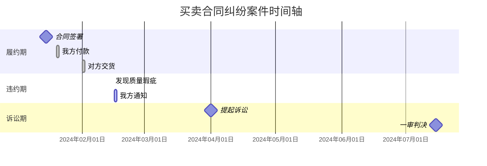
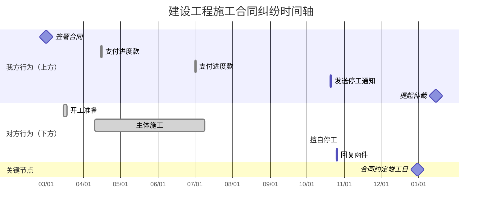
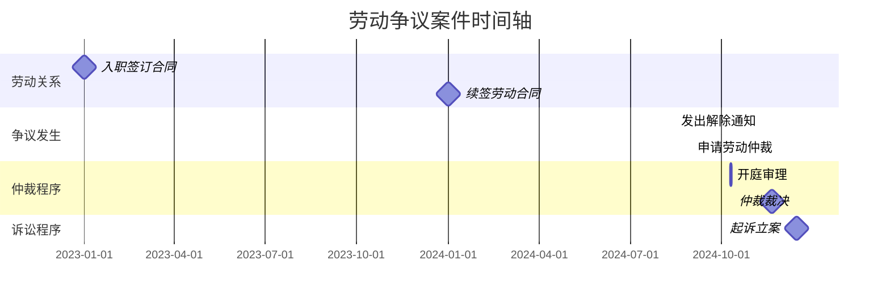
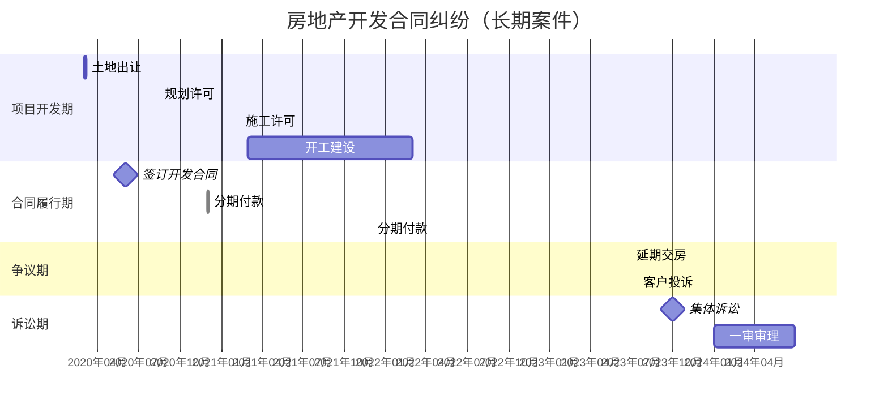
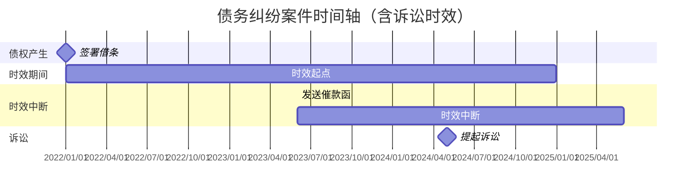
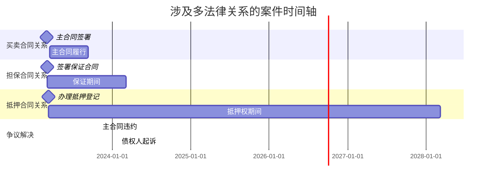

# Mermaid 时间轴图表模式

## 基础甘特图模式

### 单线时间轴（简单案件）



### 双向时间轴（复杂案件）



## 分区着色模式

### 使用 CSS 自定义颜色

```mermaid
gantt
    title 案件时间轴（分区着色）
    dateFormat  YYYY-MM-DD
    axisFormat  %Y/%m/%d

    section 履约期（天蓝）
    style 履约期（天蓝） fill:#87CEEB,stroke:#4682B4,color:#000
    合同签署      :milestone, s1, 2024-01-10, 0d
    我方付款      :s2, 2024-01-15, 1d

    section 违约期（珊瑚红）
    style 违约期（珊瑚红） fill:#FF7F50,stroke:#CD5C5C,color:#000
    对方违约      :crit, b1, 2024-03-01, 0d

    section 协商期（淡黄）
    style 协商期（淡黄） fill:#FFFFE0,stroke:#DAA520,color:#000
    双方谈判      :n1, 2024-03-10, 7d

    section 诉讼期（淡紫）
    style 诉讼期（淡紫） fill:#DDA0DD,stroke:#9932CC,color:#000
    立案受理      :milestone, l1, 2024-06-01, 0d
```

## 里程碑标记模式



## 长期案件展示模式



## ASCII 时间轴进阶模式

### 带证据标记的 ASCII 时间轴

```
                                      我方行为                时间轴                对方行为
    ─────────────────────────────────────────────────────────────────────────────────────────────
    2024-01-15  [📄] 签署《股权转让协议》                            ←──────────────────────────
                       │ 证据：合同原件 p.3-8
    2024-01-20  [💰] 支付转让款 500万元                              ←──────────────────────────
                       │ 证据：银行转账凭证 p.12
                       │
    2024-03-01                                                       ─────────────────→ [⚠️] 未办理工商变更登记
                       │ 争议：股权变更登记义务主体
    2024-03-15  [📢] 发送律师函催告                                 ←──────────────────────────
                       │ 证据：律师函及快递单 p.15-17
                       │
    2024-04-20                                                       ─────────────────→ [📄] 回复函（主张我方资料不全）
                       │ 证据：回复函 p.18-19
                       │
    2024-06-10  [⚖️] 向北京市朝阳区法院起诉                          ←──────────────────────────
                       │ 证据：受理通知书 p.21
                       │
    2024-09-01  [📋] 开庭审理                                        ←──────────────────────────
                       │ 证据：庭审笔录 p.25-30
    ─────────────────────────────────────────────────────────────────────────────────────────────

    图例：
    📄 合同/协议     ✍️ 签署      💰 付款     📦 交货
    ⚠️ 违约/瑕疵     📢 通知/催告  💬 协商    ⚖️ 诉讼
    📋 判决/裁决     🔴 争议焦点   ⭐ 关键节点

    证据说明：p. 表示附件页码
```

### 分区 ASCII 时间轴

```
    ═══════════════════════════════════════════════════════════════════════════════════════════
    【履约期】2024-01-15 ~ 2024-02-28                                        阶段颜色：天蓝
    ───────────────────────────────────────────────────────────────────────────────────────────
    2024-01-15  [📄] 签署采购合同（我方）
                       │
    2024-01-20  [💰] 支付预付款 30%（我方）
                       │
    2024-02-15  [📦] 对方发货
                       │
    2024-02-20  [✍️] 我方签收确认
    ───────────────────────────────────────────────────────────────────────────────────────────

    ═══════════════════════════════════════════════════════════════════════════════════════════
    【违约期】2024-02-21 ~ 2024-03-10                                        阶段颜色：珊瑚红
    ───────────────────────────────────────────────────────────────────────────────────────────
    2024-02-22  [⚠️] 🔴 发现货物质量问题（数量短缺20%）
                       │ 争议焦点：货物短缺责任认定
    2024-02-25  [📢] 发送质量异议通知（我方）
                       │
    2024-03-01  [📄] 对方回复（主张我方验收时未提异议）
    ───────────────────────────────────────────────────────────────────────────────────────────

    ═══════════════════════════════════════════════════════════════════════════════════════════
    【协商期】2024-03-11 ~ 2024-05-30                                        阶段颜色：淡黄
    ───────────────────────────────────────────────────────────────────────────────────────────
    2024-03-15  [💬] 双方首次协商会议
                       │
    2024-04-01  [📄] 对方提出补货方案
                       │
    2024-04-15  [📢] 我方拒绝方案，要求退货退款
                       │
    2024-05-20  [💬] 协商无果，拟提起诉讼
    ───────────────────────────────────────────────────────────────────────────────────────────

    ═══════════════════════════════════════════════════════════════════════════════════════════
    【诉讼期】2024-06-01 ~ 今                                              阶段颜色：淡紫
    ───────────────────────────────────────────────────────────────────────────────────────────
    2024-06-05  [⚖️] 向法院提交起诉状（我方）
                       │
    2024-06-15  [📋] 法院立案受理
                       │
    2024-08-20  [📋] 第一次开庭审理
                       │
    [待定]      [📋] 一审判决
    ───────────────────────────────────────────────────────────────────────────────────────────
```

## 时间轴与事件表对照模式

### 时间轴输出模板

```mermaid
gantt
    title {{案件名称}}时间轴
    dateFormat  YYYY-MM-DD
    axisFormat  %Y年%m月%d日

    section {{法律阶段1}}
    {{事件1}}      :{{样式}}, {{ID}}, {{日期}}, {{持续时间}}

    section {{法律阶段2}}
    {{事件2}}      :{{样式}}, {{ID}}, {{日期}}, {{持续时间}}
```

### 事件明细表模板

| 序号 | 时间 | 事件 | 证据页码 | 法律意义 | 主体 |
|:---:|:---:|:---|:---:|:---|:---:|
| 1 | {{日期}} | {{事件描述}} | {{页码}} | {{法律意义}} | 我方/对方 |

## 特殊标注模式

### 诉讼时效中断标记



### 多线程案件展示



## 颜色代码参考

| 用途 | 颜色名称 | Hex代码 | RGB | 适用场景 |
|-----|---------|---------|-----|---------|
| 履约正常 | 天蓝 | #87CEEB | 135,206,250 | 合同履行、正常付款 |
| 违约警示 | 珊瑚红 | #FF7F50 | 255,127,80 | 违约、瑕疵、逾期 |
| 协商过程 | 淡黄 | #FFFFE0 | 255,255,224 | 谈判、沟通、调解 |
| 诉讼程序 | 淡紫 | #DDA0DD | 221,160,221 | 起诉、仲裁、判决 |
| 里程碑 | 金色 | #FFD700 | 255,215,0 | 关键节点、重要日期 |
| 争议焦点 | 绯红 | #DC143C | 220,20,60 | 争议、冲突、辩论 |

## 打印布局建议

### A4 纵向布局（适合标准打印）

- 最大时间跨度：建议 12-18 个月
- 事件密度：每页 8-12 个事件
- 图例位置：右下角，字号 8pt

### A4 横向布局（适合长时间跨度）

- 最大时间跨度：建议 24-36 个月
- 事件密度：每页 15-20 个事件
- 图例位置：底部居中，字号 8pt

### 多页输出

第一页：
```
[标题]
[时间轴第一部分]
[图例]
（续下页）
```

后续页：
```
[案件名称] - 时间轴（第X页/共Y页）
[时间轴续页]
```
